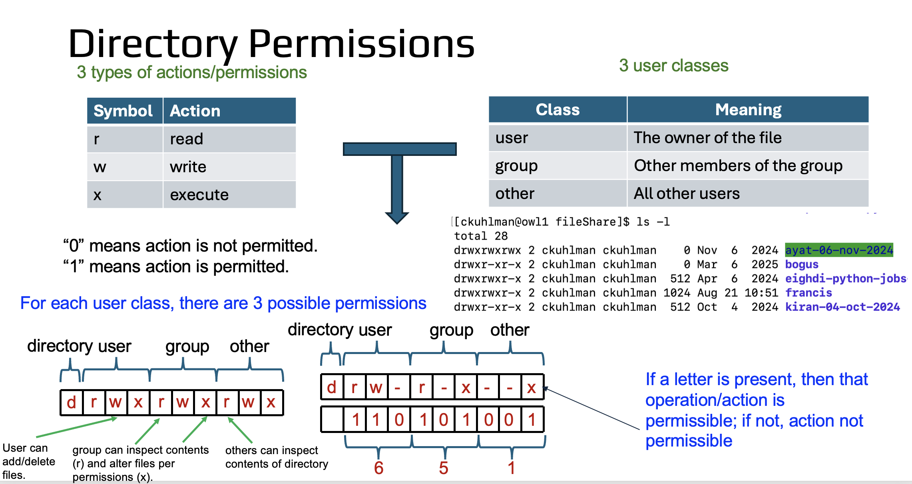

# Data Management 

## Storage Options on ARC


|Filesystem|Purpose|Capacity|Notes|
|-|-|-|-|
|`/home`|Just getting started. Personal files, environments|640GB||
|`/projects`|Long term, shared, group storage| 50TB per PI| Package data|
|`/scratch`|Staging files and running jobs|no strict limits|90-day autodeletion|
|`/localscratch`|Drives on compute nodes|varies|Fastest i/o by far (20-600x)|

>[!WARNING]
> ARC storage systems do not have backups! ARC storage systems have layers of built-in redundancy and some limited recovery capacity with internal "snapshotting", but data owners are responsible for ensuring preservation of important data by keeping multiple copies in separate, safe locations.

### Tools for inspection
`quota`
```bash
[brownm12@tinkercliffs2 ~]$ quota
Warning: quota values are not updated in real time and may take a few hours to refresh.
USER             FILESYS/SET                          DATA (GB)    QUOTA (GB)  FILES      QUOTA      NOTE
brownm12         /home                                334.5        640         -          -

brownm12         /projects/mabrownlab                 33.0         25000       1336899    10485760
brownm12         /projects/nml_cf_test                0.0          50000       6          10485760
brownm12         /projects/randomj                    254.0        50000       32039      10485760
brownm12         /projects/suzieq                     38.0         50000       3328       10485760
```

`du` "disk usage"
Summary report of storage used at each top level directory:
```
[brownm12@tinkercliffs2 ~]$ du --max-depth=1 -h /scratch/brownm12
13M	/scratch/brownm12/FCS
194G	/scratch/brownm12/Microglia_SC
613M	/scratch/brownm12/antismash
143M	/scratch/brownm12/dtafti
1.0K	/scratch/brownm12/env
512	/scratch/brownm12/gpu-burn
486K	/scratch/brownm12/gpuburn
42K	/scratch/brownm12/gpuid
512	/scratch/brownm12/nccl-tests
512	/scratch/brownm12/patchelf
1.2G	/scratch/brownm12/sking07
512	/scratch/brownm12/useful_scripts
6.9T	/scratch/brownm12
```

Count of inodes at each top-level directory
```
[brownm12@tinkercliffs2 ~]$ du --max-depth=1 --inodes /scratch/brownm12
7	/scratch/brownm12/FCS
54	/scratch/brownm12/Microglia_SC
5458	/scratch/brownm12/antismash
8	/scratch/brownm12/dtafti
5	/scratch/brownm12/env
3	/scratch/brownm12/gpu-burn
34	/scratch/brownm12/gpuburn
51	/scratch/brownm12/gpuid
3	/scratch/brownm12/nccl-tests
3	/scratch/brownm12/patchelf
5	/scratch/brownm12/sking07
3	/scratch/brownm12/useful_scripts
5642	/scratch/brownm12
```


## Permissions and ownership


> [!NOTE] 
> Write permission on a directory provides capability add/delete any and all files contained there.

> [!NOTE]
> Write permission on a file provides capability to change the contents, including emptying them.