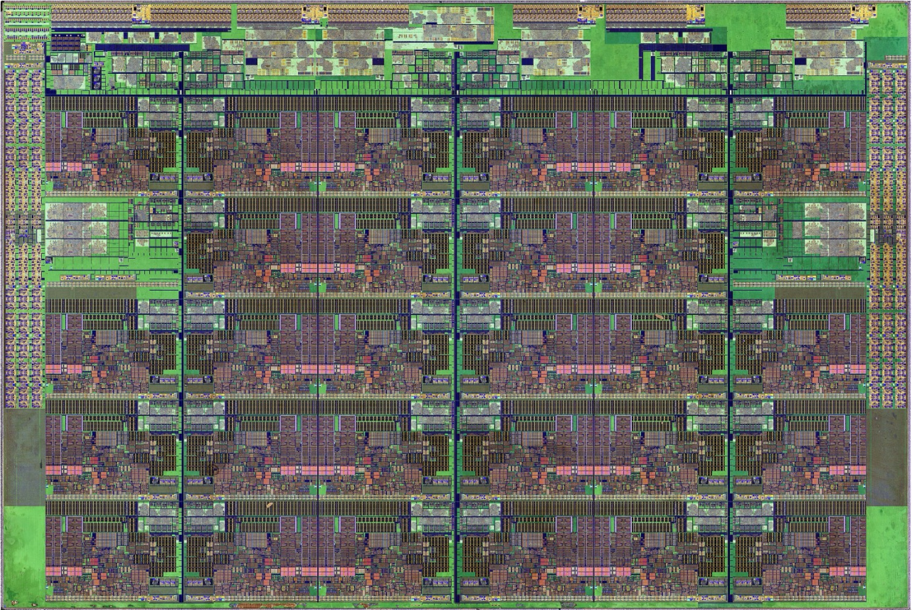
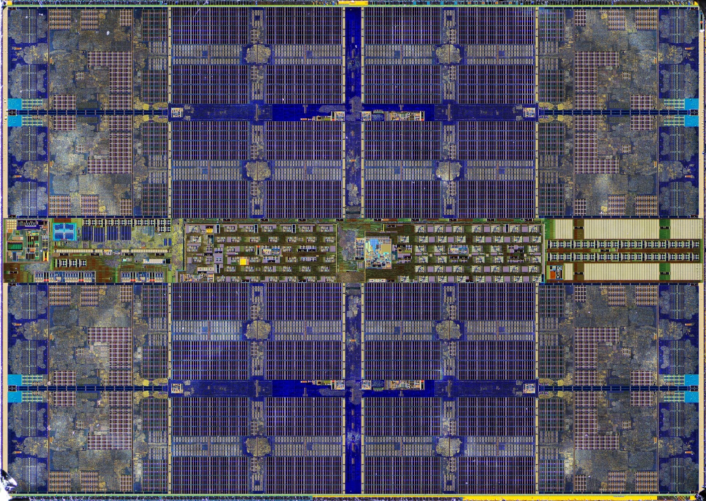
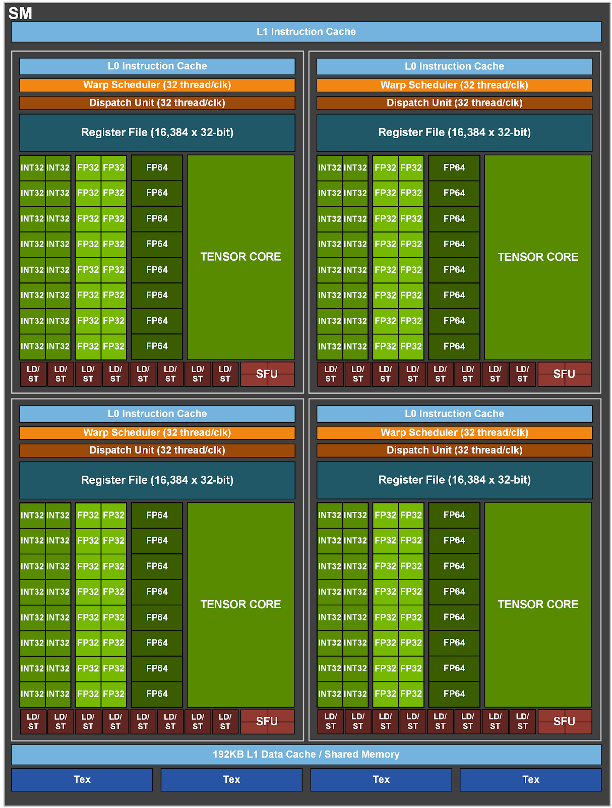
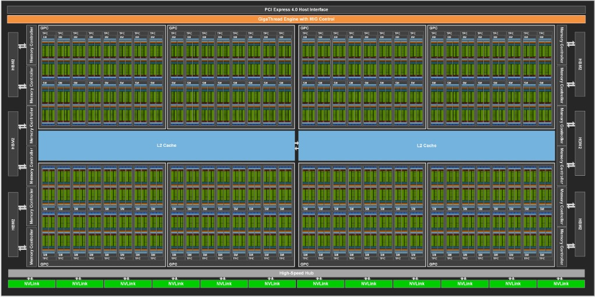

# Welcome to the ARC "GPU Essentials" Workshop

## Outline
0. (10 min) [Welcome](./0-intro.md)
1. (20 min) [ARC Cluster GPU Offerings and Comparisons](./1-arc_gpus.md)
2. (25 min) [Inspection and Interfacing with GPUs](./2-Interactions.md)
3. (10 min) Break
3. (25 min) [Programming with GPUs](./3-Programming.md)
4. (25 min) [Parallelization with GPUs](./4-Parallelization.md)

## Why are we using GPUs for scientific computing?

GPUs were originally created to accelerate graphics processing. This task often reduces to streaming large volumes of data through the accelerator and performing matrix operations on vectorized data. The human threshhold for detected visual changes is only 30 Hz, which is extraordinarily slow in computer terms. But even fast CPUs struggled to keep up with the continuous volumes of input data.

By recognizing the the graphics processing workload is very much "single-instruction, multiple-data" (SIMD), early developers designed add-on devices which grouped together very simplified (and thus cheap and efficient) components to work in locked synchonization to handle this problem.

In the 2000's PC display resolutions crept up from 800x600 to 1024x768 to 1600x1200. This trend was both enabled by GPUs and also pushed GPUs to grow in capability and performance.

### Recent CPU specs and capabilities
This image exposes some of the architectural components of an Intel "Skylake" CPU processor. These were released around 2015 and the model in the image shows 28 CPU cores. These CPU are growing in internal parallelism, but also have to serve the full spectrum of computational.

| **CPU**            | **Year** | **Clock (MHz)** | **Process (nm)** | **Max Cores** | **AVX?** | **GFLOPs Theoretical** | **Watts** | **GF/W** | **Watts/Rack (est. peak)** |
|:-------------------|:--------:|----------------:|-----------------:|--------------:|:-------:|-----------------------:|----------:|--------:|---------------------------:|
| Sandy Bridge       | 2011     | 2300            | 32                | 8             | AVX2    | 73.6                   | 95        | 0.77    | 6 175                      |
| Haswell            | 2014     | 2600            | 22                | 18            | AVX2    | 187.2                  | 175       | 1.07    | 11 375                     |
| Skylake            | 2015     | 2100            | 14                | 28            | AVX512  | 470.4                  | 173       | 2.72    | 20 760                     |
| Zen 2 “Rome”       | 2019     | 2600            | 7                 | 64            | AVX2    | 665.6                  | 225       | 2.96    | 27 000                     |
| Zen 4 “Genoa”      | 2022     | 3800            | 5                 | 48            | AVX512  | 1 459.2                | 290       | 5.03    | 34 800                     |

## Conceptual GPU Architecture
Nvidia GA100 architecture: 
"The NVIDIA GA100 GPU is composed of multiple GPU Processing Clusters (GPCs), Texture Processing Clusters (TPCs), Streaming Multiprocessors (SMs), and HBM2 memory controllers."
 - 52.4 billion transistors
 - 7 GPCs, 7 or 8 TPCs/GPC, 2 SMs/TPC, up to 16 SMs/GPC, 108 SMs
 - 64 FP32 CUDA Cores/SM, 6912 FP32 CUDA Cores per GPU
 - 4 Third-generation Tensor Cores/SM, 432 Third-generation Tensor Cores per GPU
 - 5 HBM2 stacks, 10 512-bit Memory Controllers

## What problems run well on GPUs?
The short answer is "anything that requires huge amounts vectorized calculations". In particular, these fields have broad adoption of GPUs in their calculations:
 - Artificial Intelligence (AI): specifically machine learning and LLMs.
 - Computational chemistry and molecular dynamics

Some others are integrating GPUs but not universally:
 - finite elements (broad applications in CFD, geosciences, mechanics, and more)

There are some problems whose structure makes it difficult to run efficiently on GPUs:
 - serialized or iterative problems which lack scale internal to each step
 - problems whose solution paths are difficult to predict (e.g., graph analytics)