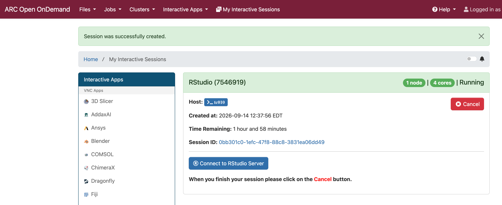

# Using Open OnDemand (OOD) on ARC Clusters

## ARC Resources and Mechanisms for Assistance

A <a href="https://docs.arc.vt.edu/all-help.html" target="_blank">listing</a> of all ways to get help from VT ARC and access to information, and links to those resources, are provided.  Examples:
- ARC Docs (documentation) pages
- attend office hours
- submit help tickets (for errors, problems, or request a consultation)
- obtain listings of workshops (and video recordings and notes files)
- view video tutorials
- run example codes
- understand overall cluster status and performance, as well as those of your jobs, via dashboards
- more

## Background and Motivation

Open OnDemand (OOD) is an interface layer and supporting infrastructure
that serves as a wrapper around much of the cluster software used 
conventionally through terminal windows.
This wrapper is UI-based, which can make a lot of cluster operations
more accessible to users who do not have appreciable levels of 
terminal window and command line usage experience.

It can make some activities---like running applications that have a user
interface component---much easier.

It can also make other activities much more cumbersome and non-scalable.

We will give examples as we go through the workshop.

## Skills to Acquire

1. An understanding of ODD, its context, and when to use and not to use it.
2. How to perform basic operations for file and directory creation, modification, and management.
3. How to obtain terminal windows with OOD to operate at the command line.
4. How to submit interactive jobs and perform work on clusters, particularly those that involve UIs.

Note that if any of these is true:

1. you need to perform a lot of file and directory management operations (see item #2);
2. you need to perform only command line operations (see item #3);
3. you need to work with interactive and/or batch jobs, but you need no user interface
(see item #4)

then we 
recommend that you use terminal windows and the command line
to complete your work and do not use OOD.

## Prerequisites

1. An ARC account.
2. An association with a Virginia Tech Faculty member or similar
who can provide you with an account so that you can submit and
run jobs.
3. Cisco VPN to reach ARC clusters if/when you are off campus.

## Open OnDemand Overview

#### Ever-Changing Nature of OOD

OOD on VT Clusters is evolving rapidly.
New applications are routinely introduced
and new help/assistance features are being added.
Hence, it might be that descriptions here are a little
different from those you view in OOD.
We work to keep these workshops up to date,
but the changes can be rapid.

#### High Level View of OOD

Some tasks, like those involving remote desktops
and Jupyter notebooks for Python development,
are vastly more easily done through OOD.

Essentually, every task you can do from the command line
can be done through OOD because OOD has as one of its
options to provide terminal screens.

However, we recommend that for many/most tasks, the 
terminal screen is still most efficient, because
using a terminal screen through OOD adds another software
layer (i.e., OOD) into the process of executing commands.

## Outline

- [OOD Context](./1-context.md)
- [Accessing OOD](./2-access-ood.md)
- [Navigating Directories and Files](./3-directories-files.md)
- [Viewing Active Jobs on Clusters](./4-active_job.md)
- [Obtaining a Cluster Shell (Terminal)](./5-cluster-shell.md)
- Interactive Apps:
    - [Running Jupyter notebooks](./jupyter.md)
    - [Running Visual Studio Code](./vs-code.md)
    - [Running Matlab](./matlab.md)
    - [Running RStudio](./R-studio.md)
    - [Running Remote Desktop](./remote-desktop.md)
    - [Running LLM Chatbot](./llm-chatgpt.md)

## Relinquishing Resources When Done With an OOD Job

This will be mentioned in different individual lessons, 
but because it is such a major issue---wasting ARC resources---we
also present it here.

> [!NOTE]
> Over all ARC systems, not `Cancel`ing (i.e., giving back) OOD resources when you
> are done with them is a HUGE source of wasted resources.

> [!NOTE]
> This is a waste of resources for you and for all users.

This screen shows the `cancel` button that is to be clicked when you are
done with your work and have saved your files.

[OOD screen and canceling job](./figures/canceling-job/cancel-job.png)

### Next
[OOD Context](./1-context.md)
