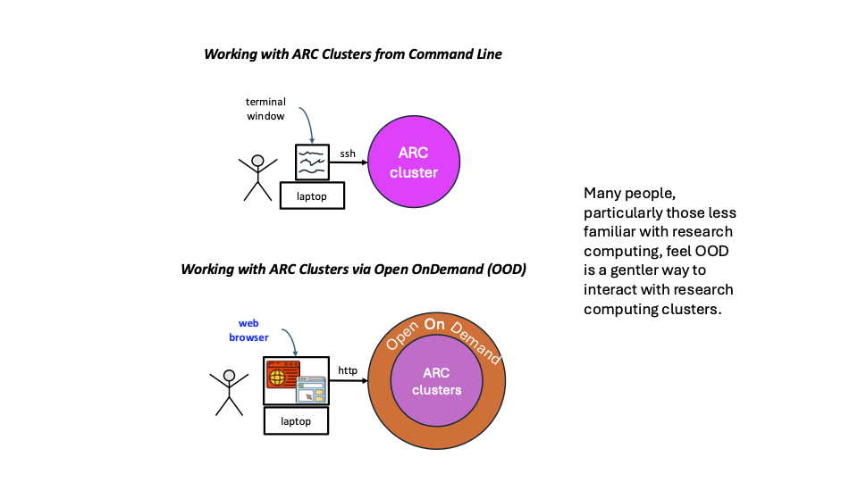
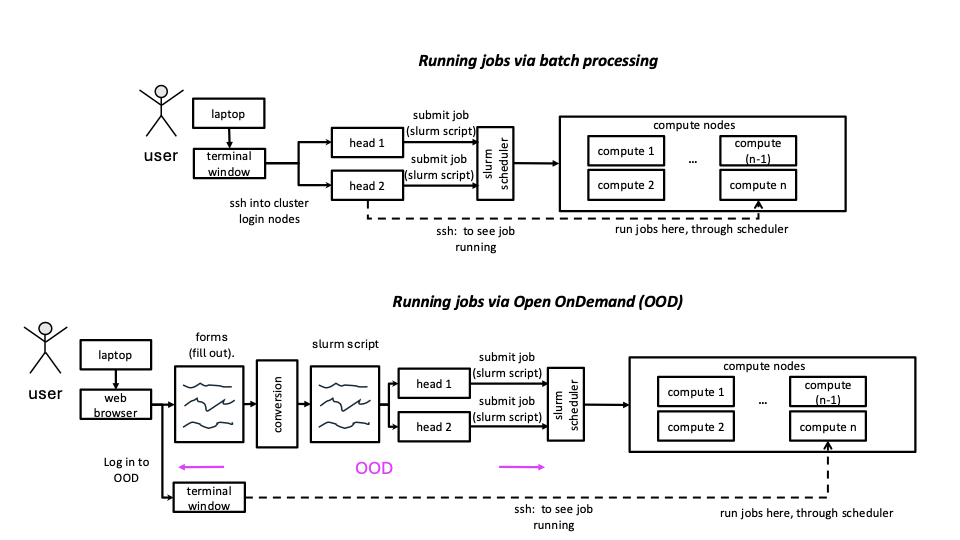

# Background & Motivation

#### Link Back To Main

[Back to Main Page](./0-main.md)

## Overview

### Conceptual View

This 30000-ft conceptual view is intended to convey the basic idea in the
text on the right.

[ood conceptual view](./figures/ood-files-n-jobs/ood-vs-cl-conceptual.pdf)

Ways to use OOD:
1. File management and transfer.
2. Job creation, editing, and management (submission and monitoring).
3. Shell access
4. Interactive apps

You can upload and download files; create, edit, submit, and monitor jobs; run GUI applications; and connect via SSH, all via a web broswer, with no client software to install and nothing to configure.

There are postives and negatives in using OOD.

### Positives

- Open OnDemand (OOD) is a software application (web portal) that enables users to 
  access ARC clusters and perform work on them.
- Requires no client-side installations.
- It is an alternative to ssh’ing (secure shelling) into a head node of a cluster using a terminal (screen).
- [You can also access terminal screens from within OOD.]
- Users that are somewhat inexperienced in working with clusters from the command line;
  OOD places a slightly lesser burden on users in utilizing the clusters.
- That said, sophisticated users use OOD.
- A strong use case for OOD is a mechanism to expose user interfaces (UIs) such as Rstudio and Matlab.

### Limitations

- Most users who do significant computing on ARC clusters will still 
need to (and want to) learn how to use the clusters from the command line.
- This is because the command line offers scalability that OOD does not;
scalability in terms of numbers of operations that a user can perform in a given amount of time.
- For example, using OOD, a user often submits one job at a time.
- However, if you need to run 100, 1000, 10000, or more jobs, 
then this OOD approach is impractical and one often writes scripts to automate job creation and submission.
In this case, many users `ssh` into a cluster using terminal windows.

## Example Comparison:  OOD vs. terminal window and ssh

In the figure below we contrast running (slurm) jobs using sbatch scripts with slurm via
- manual generation of an sbatch script
- automatic generation an sbatch script through OOD.

[Operational Model:  OOD vs. CL for Slurm Jobs](./figures/ood-vs-cl/operational-model-ood-vs-cl-slurm.pdf)

This is an example where you can do the same thing---submit a slurm job---with both
(1) the terminal window and ssh'ing into a cluster, and
(2) using OOD.

Other things are more useful to do with OOD and still other things are more
useful to do with terminal windows.

### Next
[Accessing OOD](./2-access-ood.md)

