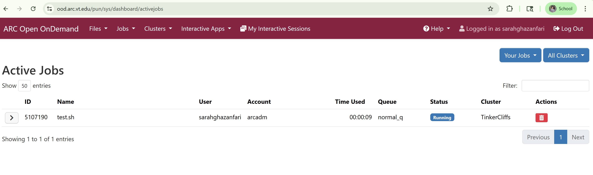

# Viewing Jobs

On command bar at top of the landing page, click `Jobs` and then click `Active Jobs`. You will see a screen like the one below.

### Back

[OOD Context](./3-directories-files.md)

### Next
[Obtaining a Cluster Shell (Terminal)](./5-cluster-shell.md)

