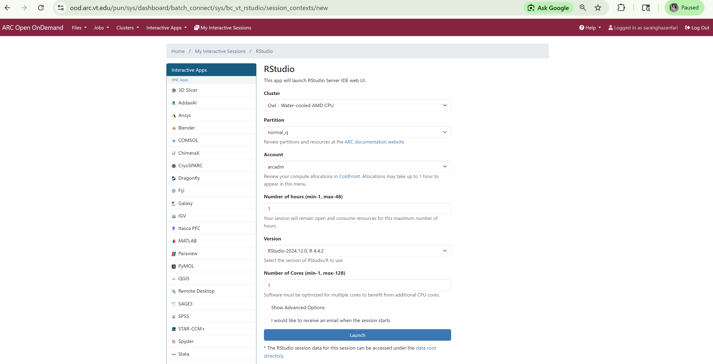
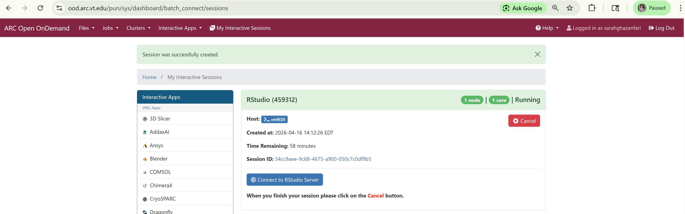
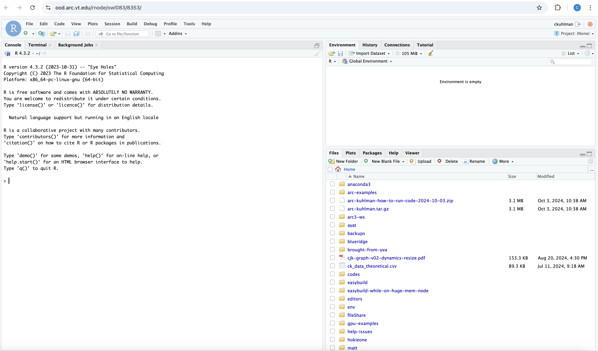
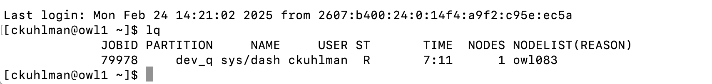

# R-Studio

#### Link Back To Main

[Back to Main Page](./main-ood.md)

## Launching R Studio

On command bar at top of the landing page, click `Interactive Apps` and 
then select `RStudio`.

Fill out the form in an analogous fashion to that shown below.
Note:  you will need a different account from `arcadm` which
is an administrator account.

After clicking the `Launch` button,
you will see an information screen.
This is a transient screen while Slurm is trying to find 
resources for you to run on via `salloc`.
Then you will see a screen with
the compute node on which you are running (see `Host`).
You will also see a `Connect to RStudio Server` button.
Click that.

Give it some time to pull up the app.

Then you will see the familiar R studio UI.

## Running R Studio

This is where you will be directed, the landing page.

[Rstudio UI](./figures/rstudio/r-studio-ui.pdf)

As an aside, note that if you `ssh` into the cluster and issue
`squeue -u <username>` then you will get a response similar to the
one below.
That is, it will not say R studio as the app, but rather `sys/dash`.

[Rstudio Squeue](./figures/rstudio/r-studio-squeue.pdf)

In the R studio console, you can specify `getwd()` to see your
current directory, and use
`setwd()` to set a new working directory for this session.

On the lower right pane, you can click the ellipsis (...) on the far right
and specify a directory to change to, such as `/projects`.
Then you can navigate to a working directory, like this one:

~~~bash
/projects/kuhlman-project-storage/workshops/y2025/2025-03-xx/ood/on-owl/rstudio
~~~

where there is a file called _data-for-mean.csv_ with ten values in one
column whose mean we wish to computer.

~~~bash
col1
1
2
3
4
5
6
7
8
9
10
~~~

In the console of R studio we enter each of these commands in turn:

~~~R
## Set/change the working directory.
setwd("/projects/kuhlman-project-storage/workshops/y2025/2025-03-xx/ood/on-owl/rstudio")

## Read in the data from file.
dfm=read.csv('data-for-mean.csv') 
  
## Compute the mean.
result <- mean(dfm$col1) 
  
## Print the mean.
print(result) 
~~~

And the result of 5.5 should be printed.

You can continue at will with other analyses.

## Ending an R studio Session

- Go to the browser window running R studio.
- Click `File` and `Quit Session`.
- You will get notice that the Rstudio session has ended.
- Close the browser tab containing R studio.
- **Go back to the browser tab above, look for the R-studio card that has the red `Cancel` button, and
  click that to end the session.**
    - It is imperative that you click the `Cancel` button when you are finished.
    - _**If you do not click the `Cancel` button, then the resources allocated to you
      by Slurm to run your R task will remain with you, and since you are done,
      those RESOURCES WILL SIT IDLE UNTIL YOUR SELECTED TIME HAS EXPIRED 
      BECAUSE NO ONE CAN USE THEM.**_

> [!NOTE]
> Over all ARC systems, not `Cancel`ing (i.e., giving back) OOD resources when you
> are done with them is a HUGE source of wasted resources.

> [!NOTE]
> This is a waste of resources for you and for all users.

