# Running Jupyter Notebooks

#### Link Back To Main

[Back to Main Page](./main-ood.md)

## Launching Jupyter

On command bar at top of the landing page, click `Interactive Apps` and 
then select `Jupyter`.

Fill out the form in an analogous fashion to that shown below.
Note:  you will need a different account from `arcadm` which
is an administrator account.

Also, the figure immediately below does not show the entire screen.
All fields below those shown here on the form are to be empty/blank.

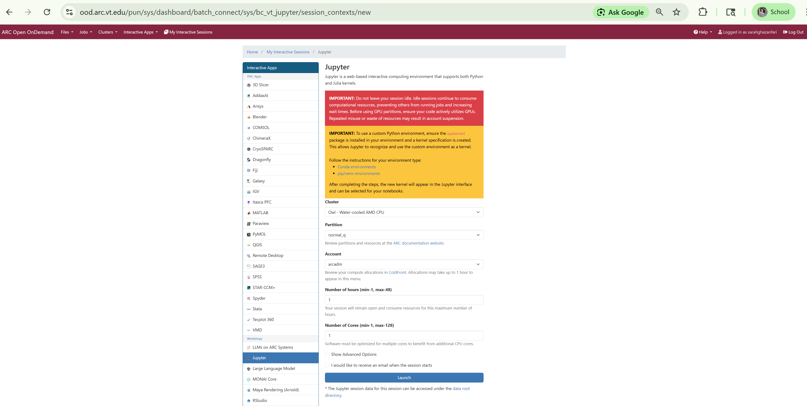

When resources are allocated, you will get a screen like this:

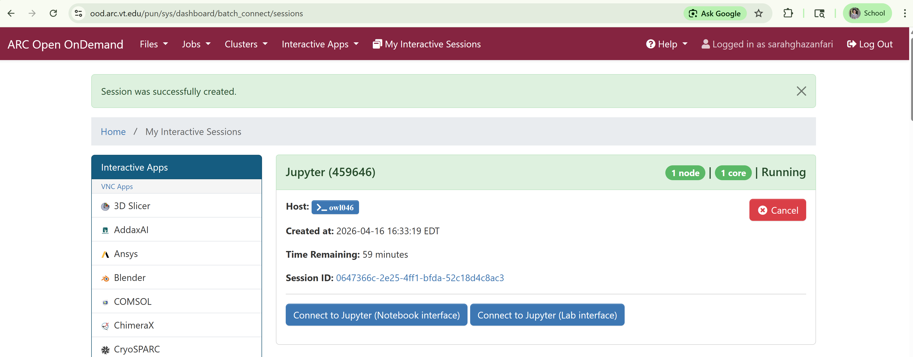

## Running Jupyter Notebooks

Click "Connect to Jupyter" on the previous screen.

You will see this screen as the root or landing page of Jupyter:

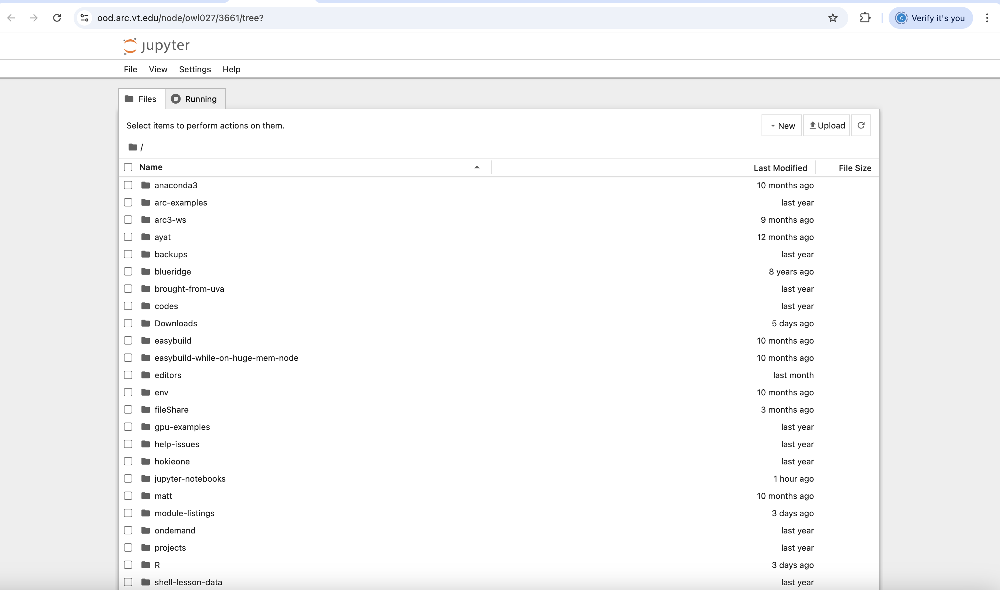

You are on the "Files" tab.

Note that as we go through this example, we show screen captures, but they are not
all from the same web app tab.
Rather, having multiple tabs active is a big benefit of OOD.

Remaining on the "Files" tab, the "New" drop down list on the right 
near the top enables you to create a new:

1. directory
2. file
3. python-based jupyter notebook
4. julia-based jupyter notebook
5. terminal window
6. console

Next to this list, you can upload files.

You can go to the "Running" tab and see that nothing is running.

You can work on a notebook in one of three ways:

1. you can migrate to a directory on the "Files" tab and find
an *.ipynb file and double-click it to open it.
2. you can click "New" and then either "julia" or "python" to 
create a new notebook.
3. you can upload a notebook.

We will double-click on the directory "jupyter-notebooks" and then see
the "python" and "julia" directories.
Click on "python".

You will see a screen like the one below; it may have notebook files *.ipynb
in it or not, depending on your activity level and how you have
arranged your file system.

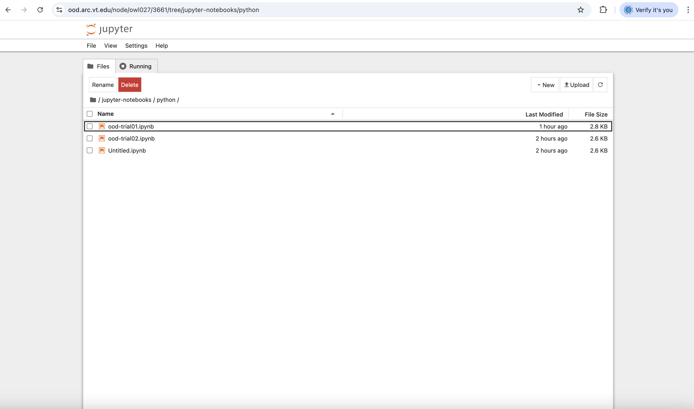

We will create a new notebook, because the other two options for
working on a notebook involve simply double-clicking the notebook
from within this file structure.

Click "New" and "Python" (all of the operations for this python
notebook are the same for constructing a julia notebook---you
just select "julia" instead of "python").

You will see this screen:  a new notebook.

You add commands just like for any jupyter notebook.

Useful commands include:

1. change between text and command cell type:  `Run`->`Cell Type->`Code` or `Markdown`.
Also, below the command bar, there is a short-cut drop-down list for `Code` or `Markdown`.
1. executing a cell:  `shift` + `return`.
2. save file:  `File`->`Save Notebook` or `Save Notebook As ...`
3. exit the notebook:  `File`->`Close and Shut Down Notebook`.
4. get back in to a notebook:  go to the "Files" tab and traverse to the 
directory where you notebook resides, and double-click it.
See two figures down.
1. close out jupyter notebooks:
    A. Click `File`->`Shutdown`
    B. Go to the screen that is the second one from the top on this 
episode and click the red `Cancel` button for `Jupyter for Python and Julia`.

A notebook with two markdown lines and four python statements is given below:

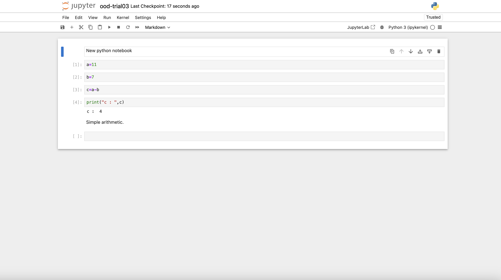

To open an existing notebook, double-click on the desired notebook in the screen below.
You will see a screen similar to the one above.

From there, you can go back to the "Home" tab and click "Running" and it will show
that this notebook is currently running.

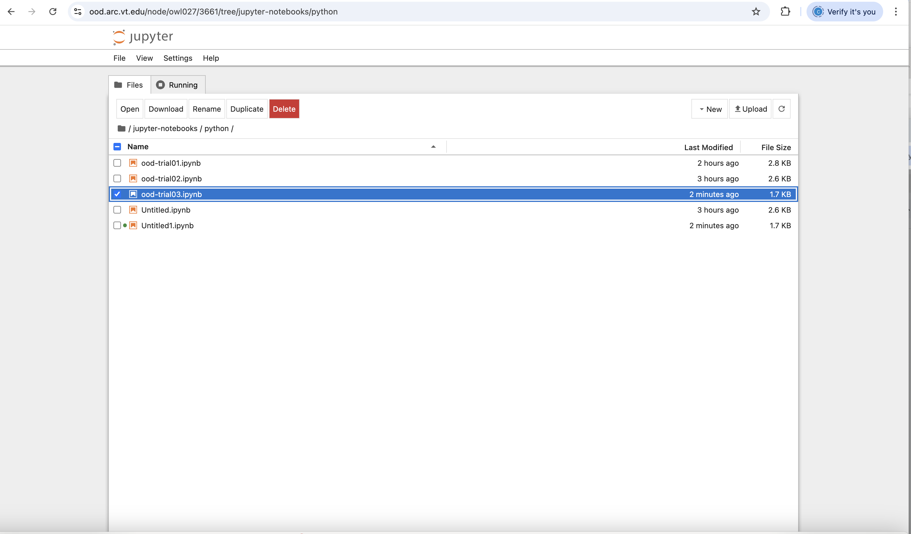

Cleaning up, i.e., shutting down, executing kernels that you are done with
is easy and useful to keep your work space tidy.
An iteration:  I open a notebook, make changes, save the notebook,
and delete the screen (tab).
I can repeat this process for other notebooks.
Then I go to the "Running" tab and I can click, under the "kernel"
heading, "Shut Down All", and this will shut down all active kernels.
(In the screen below, there is only one active kernel and one notebook;
often, there can be many of each hierarchically arranged.
Just make sure you have saved and closed down the notebooks before you
shut down the kernels.)
Then I can repeat more iterations.

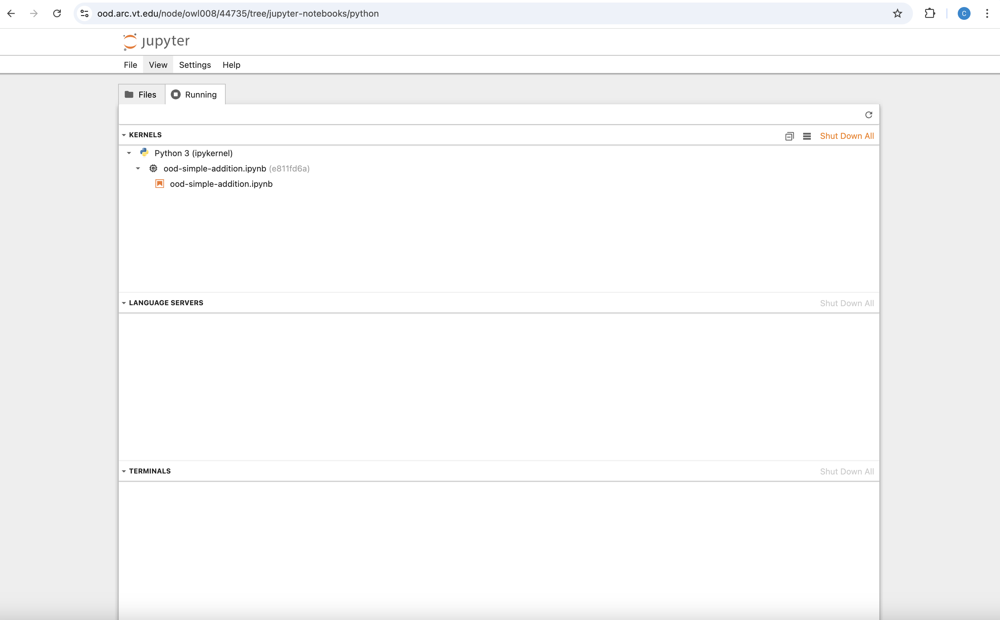

## Cooperative Work on Multiple OOD Windows

Say you have created a notebook, but you want to move it to a 
different directory to preserve your intended structure.
The jupyter windows are not really well-suited for this operation.
But we can easily do it in a terminal window.

One goes back to the landing page for OOD, shown again below.

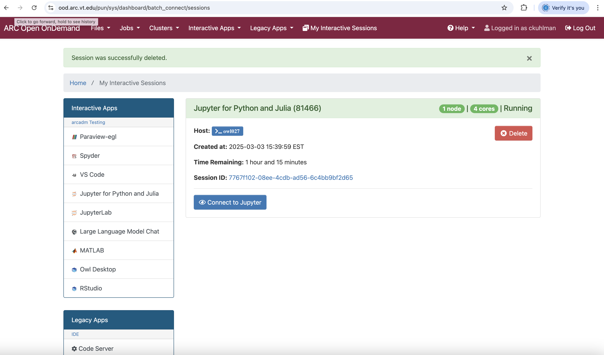

Click on `Clusters`->`Owl Shell Access` and you have a screen like the one
below.
You simply navigate to the notebook, which the "Files"
tab can show you, and then perform your move operation
as you would with any terminal session.

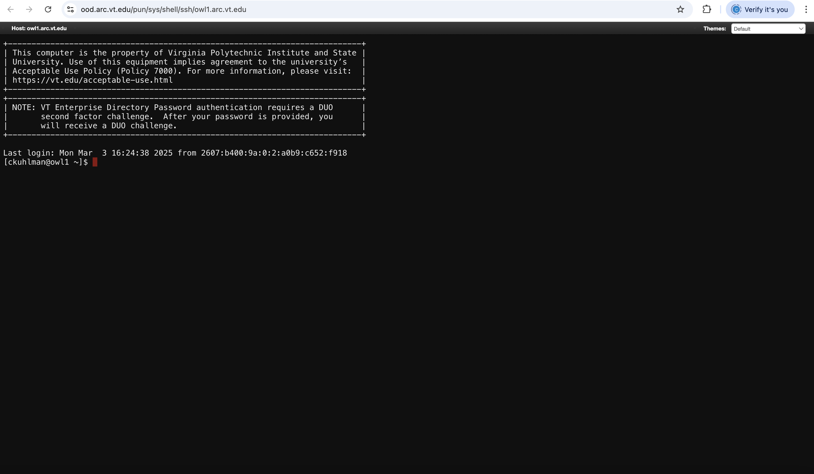

You can also accomplish a move by going back to the landing page for OOD
and then clicking `Files` and then either `Home` or `Projects` depending
on where your notebooks are located, navigate to the appropriate
directory, and use the `Copy/Move` operation as we did in a previous
episode.

## Creating Conda Virtual Environment for Use in Jupyter

The above are the mechanics for using Jupyter within OOD.

The question is, for real work, one needs virtual environments (VEs)
customized for a particular job.
So we need to create virtual environments with ipykernel in them so
that these VEs can be used within OOD and Jupyter notebooks.

We cover this process here.

We will build a VE from the command line.

The commands are below.  Only the commands.
Paths and names of VEs are specific to this user.

We have an entire workshop on how to build virtual environments:
both conda virtual environments (CVEs) and pip-venv-based 
virtual environments (VEs).

There are some rules you must abide by.

1.  Whatever cluster you are going to run Jupyter on via OOD,
you must use the same cluster to BUILD the virtual environment.
2.  Whatever partition on a cluster you are going to run Jupyter on via OOD,
you must use the same partition on the same cluster to BUILD the virtual environment.

We are using Owl below.

~~~bash
# Acquire resources.
salloc --account=<account>  --partition=normal_q    --nodes=1 --ntasks-per-node=1 --cpus-per-task=2 --time=2:00:00

# Go onto compute node that salloc returns.
# In this case, salloc returned Owl compute node 84.
ssh owl084

# List modules.
module list

# Load Miniforge to create VE.
module reset
module load Miniforge3

# Create VE.
conda create -p ~/env/owl/normal_q/py312_mf_jupyter_networkx

# Activate VE.
source activate ~/env/owl/normal_q/py312_mf_jupyter_networkx

# Install packages.
# Will have to answer yes [y] many times.
conda install python=3.12
# Check python version, should be 3.12.
python --version
conda install pandas
conda install matplotlib
# Always try to do 'pip install' after all 'conda install'.
pip install networkx
# Now install the jupyter notebook kernel.
# A couple of lines down is "(networkx)".  You should use a name
# that is meaningful to you so that you can identify it.
pip install ipykernel
jupyter kernelspec list
python -m ipykernel install --name networkx  --display-name "Python (networkx)" --user

# All done with building VE.  Deactivate the VE.
conda deactivate

# Now get back in and test simply:  load packages.
# Use the python interpreter.
# Each import should give NO feedback; successful 
# loads will give no error message, so that is what we want to see.
source activate ~/env/owl/normal_q/py312_mf_jupyter_networkx
python
import matplotlib
import pandas
import networkx
exit()

# All done with building VE.  Deactivate the VE.
conda deactivate

# Get off of compute node.
exit

# Now back on login node of the ARC cluster.

# See what slurm job is our salloc command above.
squeue -u <username>

# Release resources.
scancel <job ID of the salloc command>

~~~

## Using a Virtual Environment with Jupyter via OOD

Now we go back to OOD.
Click `Interactive Apps` and `Jupyter for Python and Julia`.
Fill out the screen below (split into two here because
we could not get the entire screen in one capture; there
is some overlap in the screens).

In the field `Conda Environment (Only Python)`,
you want to specify the root of the Conda Virtual Environment (CVE).
It is the full path including the directory such that a subdirectory
is `bin`. 
This is the same specification as when, from the command line,
we activate a CVE, per the commands above.

The "partition" field must be filled with the same partition that
you used to create the VE.  In this case, it is the "normal_q" partition.

Part 1
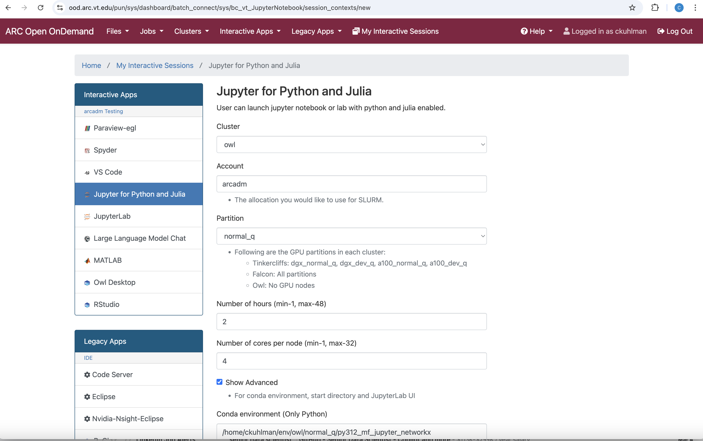

Part 2
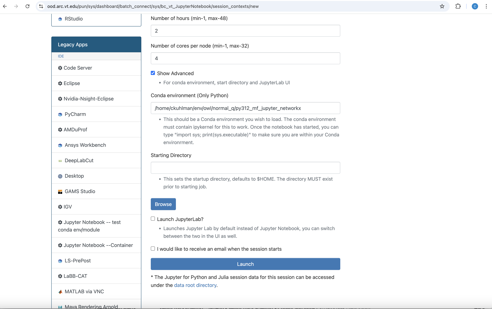

Note that the queue specified here, `normal_q` matches the partition used to
create the CVE, and `Owl` matches the cluster on which the CVE was made.
You should use some naming convention for your CVEs (and all VEs).
The path and file, created by the user is: `~/env/owl/normal_q/py312_mf_jupyter_networkx`.
This means that the CVE was built on the `owl` cluster, using a compute node on the 
`normal_q`. 
The CVE uses python 3.12 and the CVE was built with Miniforge3 (`mf`), so
this is how we know it is a CVE and not some other type of VE.
It was made to be run with `jupyter` and contains as a central
package `networkx`.

With all clusters sharing the same disk mount, it is imparative in your work to
label things clearly.

Click the `Launch` button.
You will wait for the `Connect to Jupyter` to appear and connect just as you did above
by clicking that button.
Now we are going to create a new Jupyter notebook with python.

As before, we are on the `Files` tab.
Go to the directory `jupyter-notebooks` and double-click that.
Then double-click `python`.
You will see a screen sort of like the one below.
Click on `New` at the right and you will see a new option:  `Python (networkx)`.
Select that.

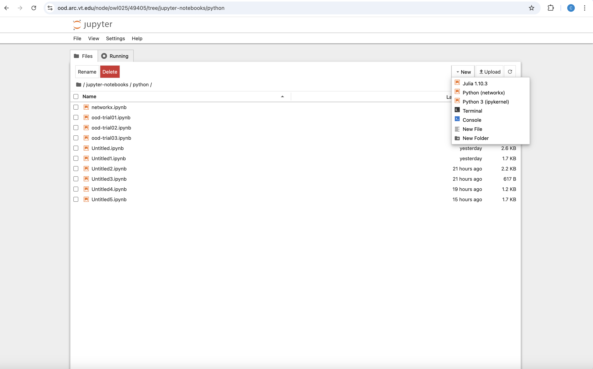

You will be presented with a new notebook like below.

You can fill it out as shown below.  We are using NetworkX heavily here.

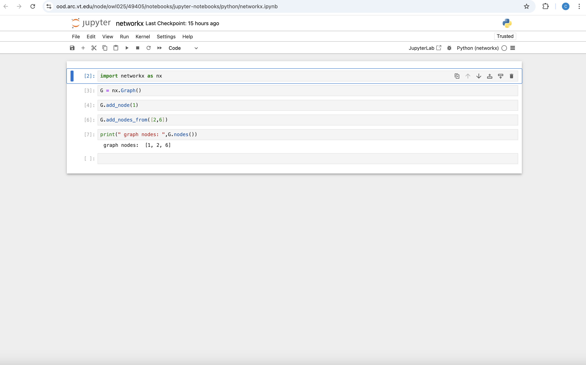

At this point, you can save the notebook using `File`->`Save Notebook As ...`.
You can continue adding to this notebook as you would any other.

## Ending a Jupyter Notebook Session

- Go to the browser window running Jupyter.
- _**SAVE YOUR WORK.**_
- Close/delete the browser window (tab) containing Jupyter.
- **Go back to the browser tab above, look for the Jupyter card 
  (you may have many cards) that has the red `Cancel` button and
  click that to end the session.**
    - It is imperative that you click the `Cancel` button when you are finished.
    - _**If you do not click the `Cancel` button, then the resources allocated to you
      by Slurm to run your R task will remain with you, and since you are done,
      those RESOURCES WILL SIT IDLE UNTIL YOUR SELECTED TIME HAS EXPIRED 
      BECAUSE NO ONE CAN USE THEM.**_

> [!NOTE]
> Over all ARC systems, not `Cancel`ing (i.e., giving back) OOD resources when you
> are done with them is a HUGE source of wasted resources.

> [!NOTE]
> This is a waste of resources for you and for all users.

