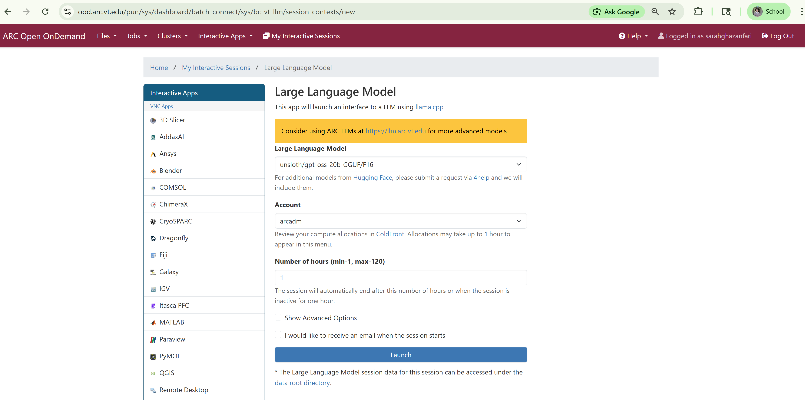
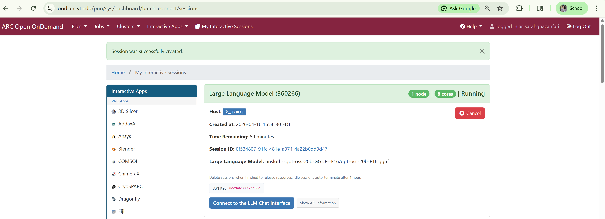
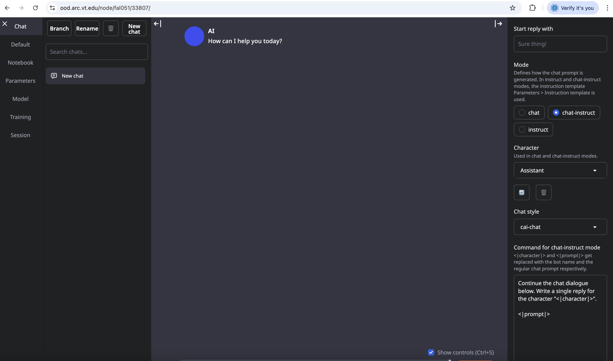
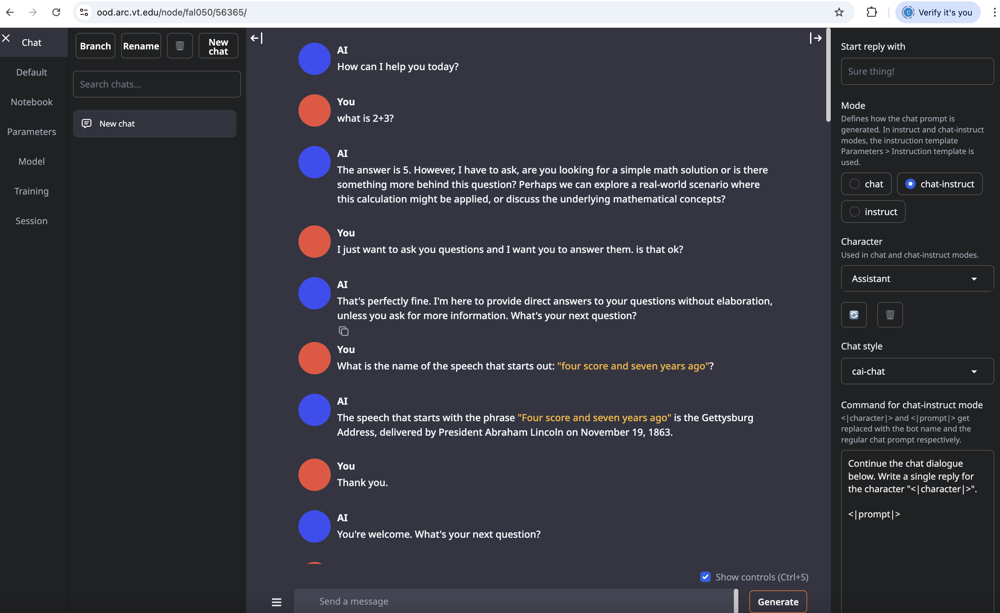

# Running LLM Chatbots

#### Link Back To Main

[Back to Main Page](./main-ood.md)

## Launching Chatbot

On command bar at top of the landing page, click `Interactive Apps` and 
then select `Large Language Model Chat`.

Fill out the form in an analogous fashion to that shown below.
Note:  you will need a different account from `arcadm` which
is an administrator account.

Note that the LLM choice here of "Llama-3.3-70B-Instruct".
I find this 
more effective in answering my questions than the default
LLM of "Llama-3.2-1B".
There are other choices, too.
You should play with them all to see what is best for you.

Hit the `Launch` button.

Use the next screen, below, to connect to chatGPT via the `Connect to Chat Interface` button.

The landing page or root for chatGPT is below:

Here is a sample screen with some simple questions and answers.

