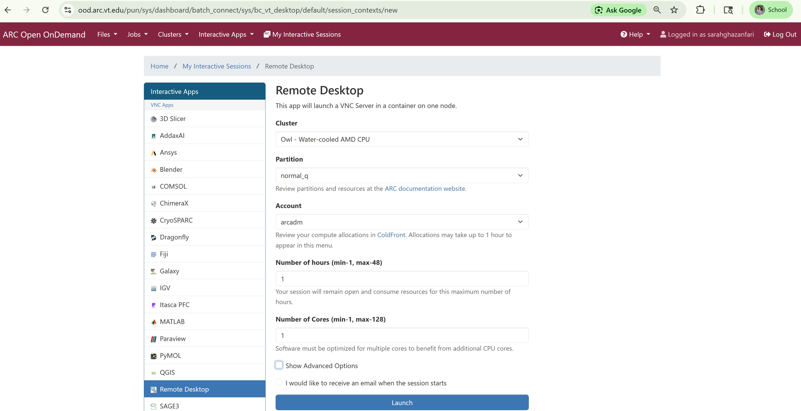
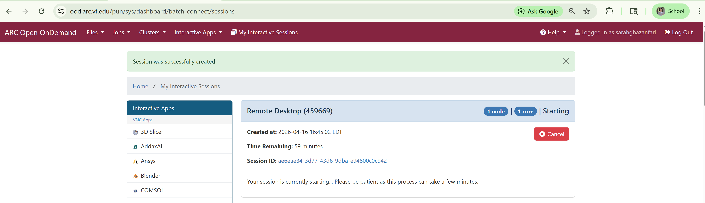
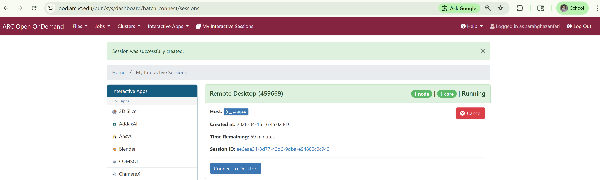
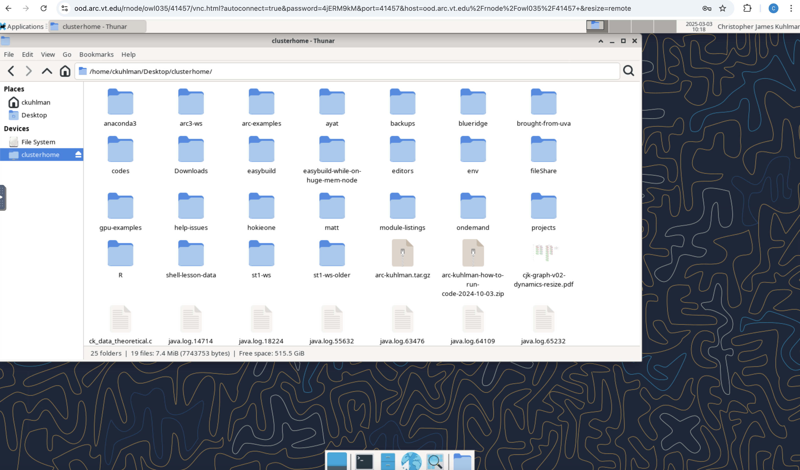
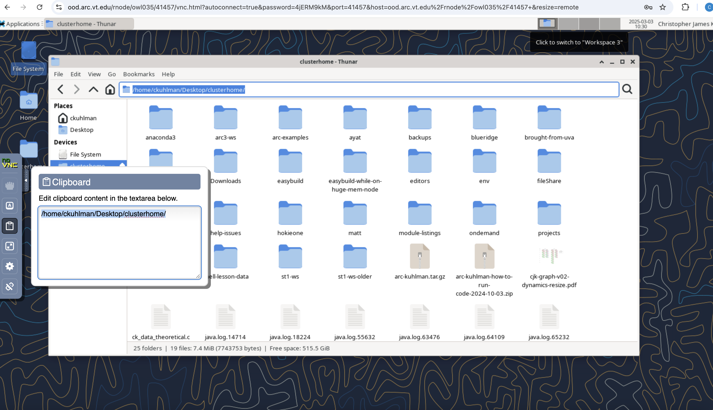
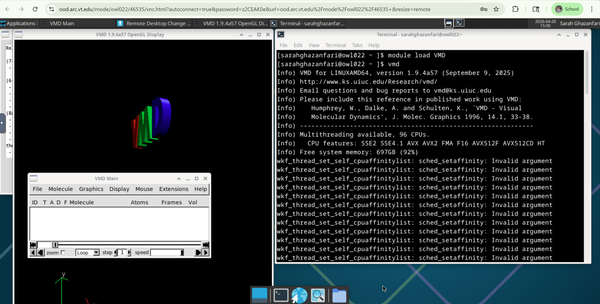

# Running Remote Desktop


#### Link Back To Main

[Back to Main Page](./main-ood.md)

## Launching Remote Desktop

On command bar at top of the landing page, click `Interactive Apps` and 
then select `Remote Desktop`.

Fill out the form in an analogous fashion to that shown below.
Note:  you will need a different account from `arcadm` which
is an administrator account.




Clicking on _Launch_ in above screen will start the request for system resources on Owl.
You will be given this screen.





When resources have been provided, the screen below will show the compute node you are running on.
In this case, one is running on compute node owl035.





Click "Connect to Desktop" to go to the Remote Desktop, which will take you 
to the screen below.


## Workspaces

Look at the above figure, just above the desktop pane itself, but below the 
URL.
Sort of "right of center" there are four small rectangles of different shades
of tan/gray.
You will see four workspaces that you can toggle among.


## Filesystem


If you click on the FileSystem Icon and navigate into it, you will notice a difference
between this and the filesystem you see by ssh'ing from a terminal window without OOD.

Specifically, in the latter case, you will be put at your $HOME directory, which is 
`/home/<username>`.
However, on the Remote Desktop, to get to your home directory, you must go to:
`/home/ckuhlman/Desktop/clusterhome/`.
See the figure below.



Also, note that in copying the path in the Owl Filesystem view of the last screen,
on a Mac, you have to `cmd-c` and then look in the clipboard at the 
right middle of the screen (expand the small novnc tab with left-heading arrow)
and select the third icon down (clipboard) to see the text you want to copy.
See the figure below.
Highlight this text and click `cmd-c` again to put the text in the clipboard
that you can then paste into another document (say, on your laptop).
This was gone over in detail for pasting things into Matlab in
another episode here.





You can click `View` -> `List View` to change from thumbnail view to a list of files
and directories.
Also, you can double-click on a file to open it (e.g., for editing) or 
you can double-click on a directory to see its subdirectories and files.

You can open as many Filesystem windows as you desire.


## Terminal Window

If you open a terminal window by clicking on the icon at the bottom of the desktop,
you will be given a terminal window.
You will be placed at `/home/<username>` but you will have to go to
`/home/ckuhlman/Desktop/clusterhome/`, as above, to get to your directories
and files under `/home/<username>` through a standard terminal window.

## Terminal Window for Running Scripts and Other

The terminal window specified above in the previous section should not
be used for running scripts.
Instead you should go to `Applications`->`Other`->`Node Terminal` 
to obtain a terminal in which you can run scripts and do other work.
See screen below.
(This has to do with how the container that contains the Remote Desktop is
configured so that it will work.)


## Web Browser

You can pull up a web browser, Firefox, at the bottom of the Remote Desktop so that
you are looking at a browser with a browser.
Again, to copy and paste text, you must use the novnc clipboard to the left middle of
the screen.

Detailed instructions for copying and pasting in a noVNC environment
are given in the [Running Matlab](./matlab.md) page.


## Applications

You can find applications in two places:

1. The "Applications" tab at the top left, above the desktop pane.
2. In the icons at the bottom center of the desktop, "Application Finder". 

## Launching GUI-Based Applications on Remote Desktop

Once you are connected to the Remote Desktop session, you can launch applications that have graphical user interfaces (GUIs) directly from a terminal window.

To do this:

1) Open a Node Terminal (Applications → Other → Node Terminal).
2) Load the required module(s) for the application.
3) Run the application command.

For example, to launch VMD (Visual Molecular Dynamics):
```
module load VMD
vmd
```


After entering the `vmd` command, the GUI window will appear on your Remote Desktop.

**Notes on Modules**

- Most GUI applications on the cluster require you to `module load` before running them.
- Modules set up the environment variables, libraries, and paths needed for the software to run correctly.

**Using Mesa for Graphics Support**

In some cases, GUI applications may not launch correctly or may display rendering issues. When this happens, you may need to load the `Mesa` module:
```
module load Mesa
```
Then load and run your application again:
```
module load VMD
vmd
```
**What is Mesa?**
Mesa is an open-source software implementation of OpenGL. It provides software-based rendering, which is useful when hardware graphics acceleration (GPU) is unavailable or not properly configured on the compute node. This ensures that GUI applications can still display properly in the Remote Desktop environment.

**General Tips**
- Always use the Node Terminal for running applications.
- If an application fails to launch, check:
  - That the correct module is loaded
  - Whether additional dependencies (like mesa) are required
-Some applications may take a few seconds to display their GUI after launching.

## Ending a Remote Desktop Session

- Go to the browser window running Remote Desktop.
- Close/delete the browser window (tab) containing Remote Desktop.
- **Go back to the browser tab above, look for the Remote Desktop card 
  (you may have many cards) that has the red `Cancel` button and
  click that to end the session.**
    - It is imperative that you click the `Cancel` button when you are finished.
    - _**If you do not click the `Cancel` button, then the resources allocated to you
      by Slurm to run your R task will remain with you, and since you are done,
      those RESOURCES WILL SIT IDLE UNTIL YOUR SELECTED TIME HAS EXPIRED 
      BECAUSE NO ONE CAN USE THEM.**_


> [!NOTE]
> Over all ARC systems, not `Cancel`ing (i.e., giving back) OOD resources when you
> are done with them is a HUGE source of wasted resources.

> [!NOTE]
> This is a waste of resources for you and for all users.


