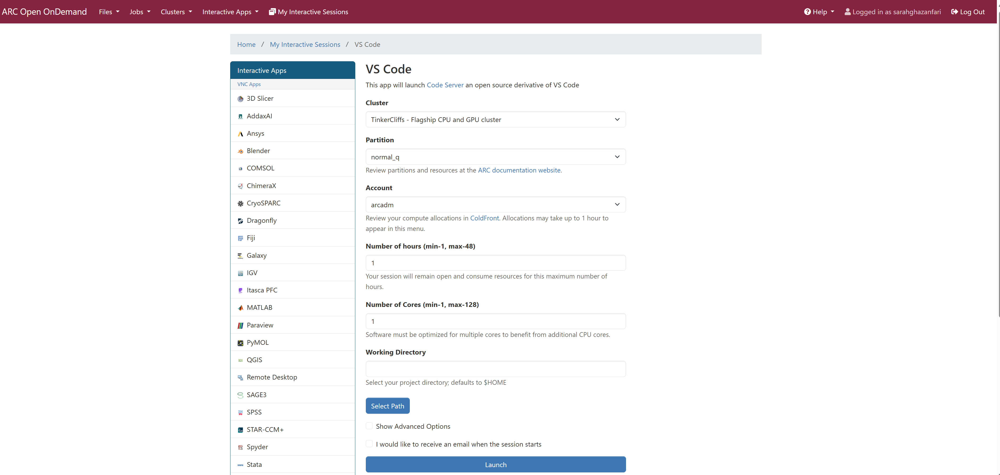
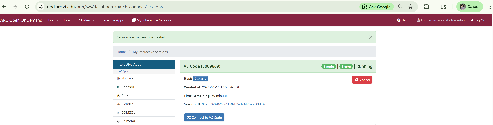
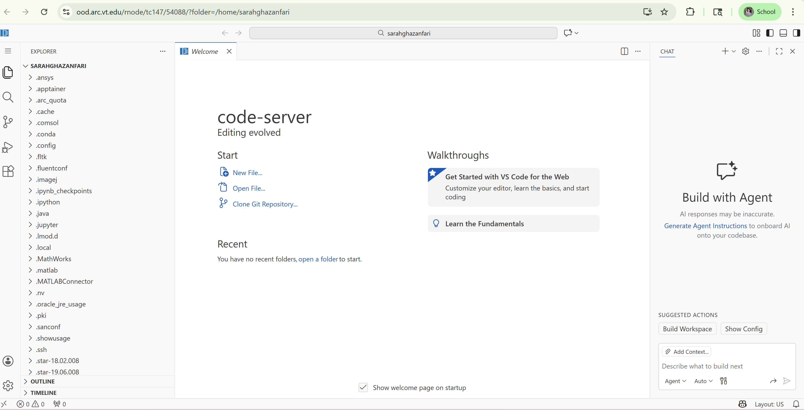

# Running VS Code

#### Link Back To Main

[Back to Main Page](./main-ood.md)

## Launching VS Code on OOD

On command bar at top of the landing page, click `Interactive Apps` and 
then select `VS Code`.

Fill out the form in an analogous fashion to that shown below.
Note:  you will need a different account from `arcadm` which
is an administrator account.

Clicking on _Launch_ in above screen will start the request for system resources on Tinkercliffs.
You will be given this screen.

When resources have been provided, the screen below will show the compute node you are running on.
In this case, one is running on compute node tc147.

Click "Connect to VS Code" to go to the Remote Desktop, which will take you 
to the screen below.

## Using VS Code Outside of OOD

There are two options.

#### Option 1:  Running VS Code on HEAD Nodes of Clusters

You can use VS Code on cluster _HEAD_ nodes
when developing source code or bash scripts
in some programming language.

Specifics for this use case are:

1. You use VS Code to construct source code.
2. You _**CANNOT**_ use any plugins, including no AI plugins.
3. YOU _**CANNOT**_ debug your code.
4. You _**CANNOT**_ run your code.

An entire workshop on how to do this is [here](https://drive.google.com/file/d/1MNW_qvnOkavxhtZLvNzP6bqYbdfgdgJf/view?usp=sharing).  

#### Option 2:  Running VS Code on COMPUTE Nodes of Clusters

You can use VS Code on cluster _COMPUTE_ nodes
for virtually any valid purpose.

Specifics for this use case are:

1. You _**CAN**_ use VS Code to construct source code.
2. You _**CAN**_ use any plugins, including no AI plugins.
3. YOU _**CAN**_ debug your code.
4. You _**CAN**_ run your code.

An entire workshop on how to do this is [here](https://github.com/AdvancedResearchComputing/Workshops/tree/main/running_vs_code_on_compute_nodes).

