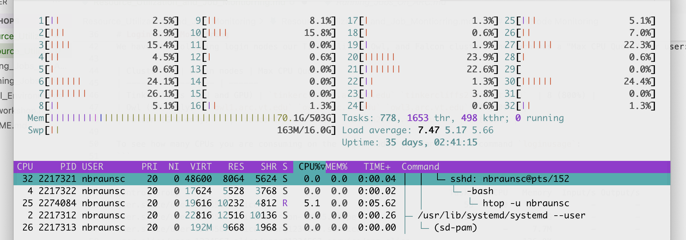

# Resource Utilization and Job Monitoring

February 13, 2026

Nicole Braunscheidel\
Computational Scientist (ARC)\
Email: nbraunsc@vt.edu

## Logistics
Please sign in: [https://docs.google.com/document/d/1mgWPL9hWIozxv62IS1EdXLolL4Jk9cjbu8w4VyJX4Zo/edit?usp=sharing](https://docs.google.com/document/d/1mgWPL9hWIozxv62IS1EdXLolL4Jk9cjbu8w4VyJX4Zo/edit?usp=sharing)

Feedback form: [https://forms.gle/oa1BrfZGhLEmbbzF9](https://forms.gle/oa1BrfZGhLEmbbzF9)

General Comments:
- Informal workshop so please feel free to interrupt me or use the chat for questions!
- This document in both PDF and HTML format is uploaded in Files on the Canvas site or you can also access it here: [https://github.com/AdvancedResearchComputing/Workshops/blob/main/Running_Jobs_on_ARC/Running_Jobs_On_ARC.md](https://github.com/AdvancedResearchComputing/Workshops/blob/main/Running_Jobs_on_ARC/Running_Jobs_On_ARC.md)
- We have a lot of short video tutorials (I will eventually record this workshop without attendees): [https://docs.arc.vt.edu/usage/video.html#video](https://docs.arc.vt.edu/usage/video.html#video)
- If you want to follow along, make sure you are connected to VT network (VPN if off campus) and have an ARC account

Useful links:
- ARC's documentation site: [https://docs.arc.vt.edu/](https://docs.arc.vt.edu/)
- GitHub Examples: [https://github.com/AdvancedResearchComputing/examples](https://github.com/AdvancedResearchComputing/examples)
- Office Hours: [https://arc.vt.edu/about/office-hours.html](https://arc.vt.edu/about/office-hours.html)
- 4Help: [https://arc.vt.edu/help](https://arc.vt.edu/help)
- Job scheduling and monitoring: [https://docs.arc.vt.edu/usage/job_scheduling.html](https://docs.arc.vt.edu/usage/job_scheduling.html)

## Outline of this Workshop
1. [Login node monitoring](#login-node-monitoring) (`loginusage`, `htop`)
2. [Job monitoring](#job-monitoring) (`seff`, `scontrol`, `sacct`, `showjobusage`)
3. [GPU performance monitoring](#gpu-performance-monitoring) (`gpumon`, `nvidia-smi`)
4. [Dashboards](#dashboards---grafana) (`getjobutil`) 

If you want to follow along, make sure you are connected to eduroam or the Cisco VPN and that you have an ARC account.

# Login Node Monitoring
A login node is used to gain access to ARC clusters but **SHOULD NOT** be used to run any software or calculations.

## Acceptable uses of login nodes:
- File management (e.g., create a new directories/folders, changing permissions, moving files around within ARC)
- Moving files between local computer and remote-ARC clusters (e.g., using rsync and scp) [https://docs.arc.vt.edu/usage/data_transfer.html](https://docs.arc.vt.edu/usage/data_transfer.html)
- Requesting compute resources through batch or interactive jobs (e.g. sbatch and interact): Documentation page [https://docs.arc.vt.edu/usage/job_scheduling.html](https://docs.arc.vt.edu/usage/job_scheduling.html), Workshop material "Running Jobs on ARC Systems" [https://github.com/AdvancedResearchComputing/Workshops/blob/main/Running_Jobs_on_ARC/Running_Jobs_On_ARC.md](https://github.com/AdvancedResearchComputing/Workshops/blob/main/Running_Jobs_on_ARC/Running_Jobs_On_ARC.md)

## Unacceptable uses of login nodes (misuse):
- Running code (Python, Matlab, R, etc.)
- Running code through VS Code without requesting compute resources
- Running AI Extensions through VS Code (remote connections only)

## Gray Area (somewhere in-between):
- Compiling source code
- Building small virtual environments

We have the following login nodes on our Tinkercliffs, Owl, and Falcon clusters and each has a "Max CPU Quota" per user:

| Cluster    | Login nodes | Max CPU Quota | 
| -------- | ------- | ------
| Tinkercliffs (CPU and GPU) | `tinkercliffs1.arc.vt.edu` `tinkercliffs2.arc.vt.edu`  | 8 (800%) |
| Owl (CPU-only) | `owl1.arc.vt.edu` `owl2.arc.vt.edu` `owl3.arc.vt.edu`| 4 (400%) |
| Falcon (GPU-only)    | `falcon1.arc.vt.edu` `falcon2.arc.vt.edu`    | 2 (200%) |

To see how many CPUs you are consuming on the login node, you can use the command `loginusage`:
```
johndoe@falcon1:~$ loginusage

Control Group                                                       Tasks   %CPU   Memory  Input/s Output/s
user.slice/user-1234567.slice                                          53  185.0    28.3G        -        -
user.slice/user-1234567.slice/session-12345.scope                      51  185.0    28.3G        -        -
user.slice/user-1234567.slice/user@1234567.service                      2      -     7.7M        -        -
user.slice/user-1234567.slice/user@1234567.service/app.slice            -      -   136.0K        -        -
user.slice/user-1234567.slice/user@1234567.service/init.scope           2      -     4.5M        -        -

USER     PID    %CPU S THCNT STIME  ELAPSED    TIME     COMMAND
johndoe  111222  0.0 S     1 Feb09  1-05:40:11 00:00:00 sh /home/johndoe/.vscode-server/cli/s
johndoe  333444 59.1 D    11 Feb09  1-05:40:11 17:32:20  \_ /home/johndoe/.vscode-server/cli/
johndoe  555666 28.4 D    12 Feb09  1-05:39:44 08:25:40      \_ /home/johndoe/.vscode-server/
johndoe  122334  0.0 S     1 Feb09  1-05:39:43 00:00:00      |   \_ /bin/bash --init-file /home/johndoe/
johndoe  087661 28.5 D    13 Feb09  1-04:00:41 08:00:06      \_ /home/johndoe/.vscode-server/
johndoe  234534 25.1 D    13 Feb09  1-04:00:41 07:02:06      \_ /home/johndoe.vscode-server/
johndoe  545333  0.0 S     1 Feb09  1-05:40:16 00:00:31 /usr/lib/systemd/systemd --user
johndoe  345444  0.0 S     1 Feb09  1-05:40:16 00:00:00  \_ (sd-pam)
johndoe@falcon1:~$
```
You can see that the user is running VS Code on the login node and using almost 2 full CPUs (200%). This is dangerously close to the Max CPU Quota per user on Falcon and this user could potentially get locked out of the Falcon cluster since there are no available resources for them to make an ssh connection.

These cases are when we try to notify users (in an educational, helpful way) this is happening and assist with helping them stop these processes that are running on the login node and move them to a compute node.

Another tool you can use is `htop -u $USER`:

```
htop -u $USER
```


# Job Monitoring
Inspecting your jobs is a create way to optimize the amount of resources you request for future jobs and to make sure your current jobs are actively using the compute resources that have been allocated.

A general tool you can use is `sacct` which is a slurm command that queries the slurm database. Slurm documentation can help [https://slurm.schedmd.com/sacct.html](https://slurm.schedmd.com/sacct.html). There are a lot of options for what you want `sacct` to look for and how you would like the output. To see the available fields you can run the following:
```
sacct --help
```
or 
```
sacct --helpformat
```
The default `sacct` will show something like the following:
```
nbraunsc@tinkercliffs1:~$ sacct
JobID           JobName  Partition    Account  AllocCPUS      State ExitCode
------------ ---------- ---------- ---------- ---------- ---------- --------
4574632      hello-wor+   normal_q     arcadm          1 OUT_OF_ME+    0:125
4574632.bat+      batch                arcadm          1 OUT_OF_ME+    0:125
4574632.ext+     extern                arcadm          1  COMPLETED      0:0
4574752      hello-wor+   normal_q     arcadm          1 OUT_OF_ME+    0:125
4574752.bat+      batch                arcadm          1 OUT_OF_ME+    0:125
4574752.ext+     extern                arcadm          1  COMPLETED      0:0
4574752.0          bash                arcadm          1  COMPLETED      0:0
4574752.1          bash                arcadm          1     FAILED    127:0
4574752.2          bash                arcadm          1  COMPLETED      0:0
```
This will show multiple lines per job like the `.batch`, `.extern`, and the `.0` lines. 

A useful command to see all the jobs you have submitted in the last month with a single line per job (`-X`) with the output (`-o`) in the format of jobid, start (start time of job), state, and what the allocated resources were for that job:
```
sacct -u $USER --start=YEAR-Month-Day -X -o jobid,start,state,alloctres%45
```
```
nbraunsc@owl1:~$ sacct -u $USER --start=2026-01-01 -X -o jobid,start,state,alloctres%45
JobID                      Start      State                                     AllocTRES
------------ ------------------- ---------- ---------------------------------------------
259410       2026-01-08T15:54:54  COMPLETED              billing=2,cpu=1,mem=7928M,node=1
259421       2026-01-08T16:31:19  COMPLETED             billing=9,cpu=4,mem=31712M,node=1
259424       2026-01-08T16:34:02  COMPLETED             billing=9,cpu=4,mem=31712M,node=1
259426       2026-01-08T16:34:59  COMPLETED             billing=9,cpu=4,mem=31712M,node=1
259430       2026-01-08T16:41:43  COMPLETED             billing=9,cpu=4,mem=31712M,node=1
259432       2026-01-08T16:43:58  COMPLETED              billing=2,cpu=1,mem=7928M,node=1
290856       2026-01-30T10:11:51 CANCELLED+            billing=19,cpu=8,mem=63424M,node=1
290971       2026-01-30T12:07:15    TIMEOUT            billing=19,cpu=8,mem=63424M,node=1
291219       2026-01-30T13:53:09    TIMEOUT            billing=19,cpu=8,mem=63424M,node=1
291344       2026-01-30T14:58:19    TIMEOUT            billing=19,cpu=8,mem=63424M,node=1
293155       2026-02-02T13:29:18    TIMEOUT              billing=2,cpu=1,mem=7928M,node=1
295541       2026-02-03T13:44:54 CANCELLED+            billing=19,cpu=8,mem=63424M,node=1
295603       2026-02-03T14:39:41 CANCELLED+            billing=19,cpu=8,mem=63424M,node=1
299333       2026-02-06T12:50:47     FAILED            billing=19,cpu=8,mem=63424M,node=1
299334       2026-02-06T12:52:48 CANCELLED+            billing=19,cpu=8,mem=63424M,node=1
```
Note: The `%45` for allocated resources is just increasing the number of character it will show You might have to increase `%45` depending on how long the output is.

## Active jobs (i.e. jobs that are currently running)
You can use the command `showjobusage JOBID` to inspect real-time usage.
```
nbraunsc@owl1:~$ showjobusage 308759
JOBID:     308759
JOBNAME:   diamond_pw2wan_test
USER:      nbraunsc
ACCOUNT:   arcadm
JOBSTATE:  RUNNING
RUNTIME:   00:00:05
TIMELIMIT: 04:15:00
NODES:     1
CPUS:      1
MEM (MB):  7928
GPUS:      0

NODE                  CPUS   MEM (MB)  GPUS GPU IDX (SLURM)
-------------------- -----  --------- ----- ---------------
owl009                   1       7928     0

        PID     CPU   MEM (MB)  GPU IDX CMD
    -------  ------  ---------  ------- --------------------------------
    3187341     2.3      13.72          prterun -np 1 -x OMP_NUM_THREADS=1 pw.x -input diamond.scf -npool 1
    3187680    23.6     251.01          pw.x -input diamond.scf -npool 1

         CPU UTIL  CPU UTIL (%)     MEM UTIL (MB)  MEM UTIL (%)
    -------------  ------------  ----------------  ------------
         32 / 100        31.90%        251 / 7928         3.17%


    WARNING: 7928 MB allocated but utilization is low (3.17%)
```
Note: CPU UTIL is multiplied 100 to form a percent so this shows that only 1 CPU (8GB) was requested and only about 32% of that CPU was used and only 3.2% of the 8GB memory was used. 

You can also use `scontrol`. Again there are various options for what you would like `scontrol` to do so remember you can also run:
```
scontrol -h
```
A useful command string with `scontrol` is the following:
```
scontrol show job -d JOBID
```
The output looks something like the following:
```
 JobId=4574632 JobName=hello-world
    UserId=nbraunsc(7325324) GroupId=nbraunsc(7325324) MCS_label=N/A
    Priority=1418 Nice=0 Account=arcadm QOS=tc_normal_base
    JobState=RUNNING Reason=None Dependency=(null)
    Requeue=1 Restarts=0 BatchFlag=1 Reboot=0 ExitCode=0:0
    DerivedExitCode=0:0
    RunTime=00:00:03 TimeLimit=00:10:00 TimeMin=N/A
    SubmitTime=2026-02-12T12:44:20 EligibleTime=2026-02-12T12:44:20
    AccrueTime=2026-02-12T12:44:20
    StartTime=2026-02-12T12:44:21 EndTime=2026-02-12T12:54:21 Deadline=N/A
    SuspendTime=None SecsPreSuspend=0 LastSchedEval=2026-02-12T12:44:21 Scheduler=Main
    Partition=normal_q AllocNode:Sid=tinkercliffs1:357848
    ReqNodeList=(null) ExcNodeList=(null)
    NodeList=tc017
    BatchHost=tc017
    NumNodes=1 NumCPUs=1 NumTasks=1 CPUs/Task=1 ReqB:S:C:T=0:0:*:*
    ReqTRES=cpu=1,mem=10M,node=1,billing=1
    AllocTRES=cpu=1,mem=10M,node=1,billing=1
    Socks/Node=* NtasksPerN:B:S:C=1:0:*:* CoreSpec=*
    JOB_GRES=(null)
    Nodes=tc017 CPU_IDs=1 Mem=10 GRES=
    MinCPUsNode=1 MinMemoryNode=10M MinTmpDiskNode=0
    Features=amd DelayBoot=00:00:00
    OverSubscribe=OK Contiguous=0 Licenses=(null) Network=(null)
    Command=/home/nbraunsc/workshops/hello_world.slurm
    WorkDir=/home/nbraunsc/workshops
    StdErr=/home/nbraunsc/workshops/slurm-4574632.out
    StdIn=/dev/null
    StdOut=/home/nbraunsc/workshops/slurm-4574632.out
    TresPerTask=cpu=1
```

You can also add `scontrol show job -d $SLURM_JOB_ID` in your batch script to print out the information in the slurm oputput file. This can help later when you are trying to remember how many resources you requested verses how many were used. This can also provide additional details if a job fails that we can't access after a job fails. 


This will show the cpu ids and gpu indexes that are being used for this job. You can then use these to monitor using either with `htop` or the dashboards (explained in more detail later in this workshop).

## Finished/completed jobs
You can use the `seff` command to inspect the amount of resources that your job used.

```
nbraunsc@owl1:~/helptickets/quantum_espresso/300K$ seff 171204
Job ID: 171204
Cluster: owl
User/Group: nbraunsc/nbraunsc
State: FAILED (exit code 1)
Nodes: 1
Cores per node: 14
CPU Utilized: 1-19:09:00
CPU Efficiency: 99.28% of 1-19:27:44 core-walltime
Job Wall-clock time: 03:06:16
Memory Utilized: 196.37 GB
Memory Efficiency: 78.55% of 250.00 GB
```
Note: You can't use the `showjobusage` or `scontrol` on finished jobs. You may however use the `sacct` to look at finished jobs. 

You may also use the dashboards for finished jobs.

# GPU Performance Monitoring
We have two clusters (Tinkercliffs and Falcon), that have various types of GPUs.
Tinkercliffs has A100 and H200 GPUs while Falcon has L40s, A30, V100, and T4 GPUs. 
You can see the full list and additional details on our documentation page [https://docs.arc.vt.edu/resources/compute.html](https://docs.arc.vt.edu/resources/compute.html).

Our GPUs are in high-demand, so making sure you are properly using them is extremely important. 

```
nbraunsc@tinkercliffs1:~$ showjobusage 4XXXXXX
JOBID:     4XXXXXX
JOBNAME:   h200_workshop.sh
USER:      janedoe
ACCOUNT:   janedoe
JOBSTATE:  RUNNING
RUNTIME:   04:56:09
TIMELIMIT: 1-00:00:00
NODES:     1
CPUS:      8
MEM (MB):  256896
GPUS:      2

NODE                  CPUS   MEM (MB)  GPUS GPU IDX (SLURM)
-------------------- -----  --------- ----- ---------------
tc-xe001                 8     256896     2             3,4

        PID     CPU   MEM (MB)  GPU IDX CMD
    -------  ------  ---------  ------- --------------------------------
    310XXXX     0.0     580.04      3,4 python allocate_memory.py --all --memory 1.0
    332XXXX     0.0       9.16          -bash
    315XXXX     0.0     228.48          python molecular_dynamics/evaluate_checkpoints.py 
    314XXXX     0.0       5.63          tmux new-session -s keep
    313XXXX     0.0       9.21          -bash
    312XXXX     0.0       9.21          -bash
    341XXXX     0.0     298.24          python molecular_dynamics/evaluate_checkpoints.py
    342XXXX     0.0       3.94          tmux attach -t keep
    354XXXX    99.0    1975.64      3,4 python molecular_dynamics/evaluate.py --model_folder /projects/a...

         CPU UTIL  CPU UTIL (%)     MEM UTIL (MB)  MEM UTIL (%)
    -------------  ------------  ----------------  ------------
         99 / 800        12.39%    35444 / 256896        13.80%


    GPU    MEM UTIL (MB)  MEM UTIL (%)  GPU UTIL (%)
    ---  ---------------  ------------  ------------
      3    5331 / 143771         3.00%            0%
      4    2271 / 143771         1.00%            1%

    WARNING: 8 CPU(s) allocated but utilization is low (0.00%)
    WARNING: 256896 MB allocated but utilization is low (1.65%)
    WARNING: GPU IDX 3 (per nvidia-smi) low utilization (0%)
    WARNING: GPU IDX 4 (per nvidia-smi) low utilization (0%)
```

To inspect using `nvidia-smi`, you must ssh into that node that you have been allocated resources.
```
nbraunsc@tinkercliffs1:~$ ssh tc-xe001
nbraunsc@tc-xe001:~$ nvidia-smi
Thu Feb 12 13:43:04 2026
+-----------------------------------------------------------------------------------------+
| NVIDIA-SMI 580.105.08             Driver Version: 580.105.08     CUDA Version: 13.0     |
+-----------------------------------------+------------------------+----------------------+
| GPU  Name                 Persistence-M | Bus-Id          Disp.A | Volatile Uncorr. ECC |
| Fan  Temp   Perf          Pwr:Usage/Cap |           Memory-Usage | GPU-Util  Compute M. |
|                                         |                        |               MIG M. |
|=========================================+========================+======================|
|   0  NVIDIA H200                    On  |   00000000:19:00.0 Off |                    0 |
| N/A   53C    P0            178W /  700W |    3941MiB / 143771MiB |     16%      Default |
|                                         |                        |             Disabled |
+-----------------------------------------+------------------------+----------------------+
|   1  NVIDIA H200                    On  |   00000000:3B:00.0 Off |                    0 |
| N/A   61C    P0            579W /  700W |  133201MiB / 143771MiB |     94%      Default |
|                                         |                        |             Disabled |
+-----------------------------------------+------------------------+----------------------+
|   2  NVIDIA H200                    On  |   00000000:4C:00.0 Off |                    0 |
| N/A   64C    P0            591W /  700W |  133201MiB / 143771MiB |     95%      Default |
|                                         |                        |             Disabled |
+-----------------------------------------+------------------------+----------------------+
|   3  NVIDIA H200                    On  |   00000000:5D:00.0 Off |                    0 |
| N/A   77C    P0            548W /  700W |   12641MiB / 143771MiB |    100%      Default |
|                                         |                        |             Disabled |
+-----------------------------------------+------------------------+----------------------+
|   4  NVIDIA H200                    On  |   00000000:9B:00.0 Off |                    0 |
| N/A   56C    P0            136W /  700W |    2271MiB / 143771MiB |      0%      Default |
|                                         |                        |             Disabled |
+-----------------------------------------+------------------------+----------------------+
|   5  NVIDIA H200                    On  |   00000000:BB:00.0 Off |                    0 |
| N/A   65C    P0            577W /  700W |  133201MiB / 143771MiB |     94%      Default |
|                                         |                        |             Disabled |
+-----------------------------------------+------------------------+----------------------+
|   6  NVIDIA H200                    On  |   00000000:CB:00.0 Off |                    0 |
| N/A   68C    P0            587W /  700W |  133201MiB / 143771MiB |     95%      Default |
|                                         |                        |             Disabled |
+-----------------------------------------+------------------------+----------------------+
|   7  NVIDIA H200                    On  |   00000000:DB:00.0 Off |                    0 |
| N/A   38C    P0             77W /  700W |       0MiB / 143771MiB |      0%      Default |
|                                         |                        |             Disabled |
+-----------------------------------------+------------------------+----------------------+

+-----------------------------------------------------------------------------------------+
| Processes:                                                                              |
|  GPU   GI   CI              PID   Type   Process name                        GPU Memory |
|        ID   ID                                                               Usage      |
|=========================================================================================|
|    0   N/A  N/A         3446290      C   python                                 3932MiB |
|    1   N/A  N/A         3412541      C   ray::ray_math_ppl                     13319... |
|    2   N/A  N/A         3412543      C   ray::ray_math_ppl                     13319... |
|    3   N/A  N/A         3160599      C   python                                 1542MiB |
|    3   N/A  N/A         3460502      C   python                                11084MiB |
|    4   N/A  N/A         3160599      C   python                                 1542MiB |
|    4   N/A  N/A         3460502      C   python                                  714MiB |
|    5   N/A  N/A         3412546      C   ray::ray_math_ppl                     13319... |
|    6   N/A  N/A         3412548      C   ray::ray_math_ppl                     13319... |
+-----------------------------------------------------------------------------------------+
```
Just like all other commands that we have shown so far, there are many options for what you would like nvidia-smi to show. We have created a useful script called `gpumon` that gathers some important metrics.
`gpumon` must also be run once you are on the compute node. 
```
nbraunsc@tc-xe001:~$ gpumon
timestamp, name, pci.bus_id, temperature.gpu, utilization.gpu [%], utilization.memory [%], memory.used [MiB]
2026/02/12 15:30:35.110, NVIDIA H200, 00000000:5D:00.0, 56, 6 %, 1 %, 20747 MiB
2026/02/12 15:30:35.119, NVIDIA H200, 00000000:9B:00.0, 60, 97 %, 21 %, 9453 MiB
2026/02/12 15:30:36.181, NVIDIA H200, 00000000:5D:00.0, 68, 100 %, 22 %, 20755 MiB
2026/02/12 15:30:36.189, NVIDIA H200, 00000000:9B:00.0, 46, 0 %, 0 %, 9457 MiB
2026/02/12 15:30:37.247, NVIDIA H200, 00000000:5D:00.0, 56, 6 %, 1 %, 20755 MiB
2026/02/12 15:30:37.254, NVIDIA H200, 00000000:9B:00.0, 60, 95 %, 22 %, 9457 MiB
2026/02/12 15:30:38.312, NVIDIA H200, 00000000:5D:00.0, 68, 99 %, 24 %, 20755 MiB
2026/02/12 15:30:38.319, NVIDIA H200, 00000000:9B:00.0, 46, 0 %, 0 %, 9457 MiB
2026/02/12 15:30:39.379, NVIDIA H200, 00000000:5D:00.0, 56, 3 %, 0 %, 20755 MiB
2026/02/12 15:30:39.387, NVIDIA H200, 00000000:9B:00.0, 59, 94 %, 23 %, 9457 MiB
2026/02/12 15:30:40.446, NVIDIA H200, 00000000:5D:00.0, 68, 100 %, 24 %, 20733 MiB
2026/02/12 15:30:40.454, NVIDIA H200, 00000000:9B:00.0, 47, 0 %, 0 %, 9447 MiB
2026/02/12 15:30:41.514, NVIDIA H200, 00000000:5D:00.0, 56, 3 %, 0 %, 20733 MiB
2026/02/12 15:30:41.523, NVIDIA H200, 00000000:9B:00.0, 60, 94 %, 23 %, 9447 MiB
```
To stop this output, run `ctrl+c` to cancel the process.

If you are curious what exactly `gpumon` is running you can run the following commands in the terminal:
```
which gpumon
```
Followed by:
```
cat /apps/common/useful_scripts/gpumon
```
The output would look something like this:
```
nbraunsc@tc-xe001:~$ which gpumon
/apps/common/useful_scripts/gpumon
nbraunsc@tc-xe001:~$ cat /apps/common/useful_scripts/gpumon
#!/bin/bash
nvidia-smi --query-gpu=timestamp,name,pci.bus_id,temperature.gpu,utilization.gpu,utilization.memory,memory.used --format=csv -lms 1000
```
You can also add this `gpumon` into your batch script itself if you would like to monitor the gpu utilization over the full job. To do this, add the following line in your batch script before the software/code is executed in the script:
```
gpumon > gpu_monitoring.txt &
```
This will create a file named `gpu_monitoring.txt` in the directory that you submitted your batch job and store all the output from `gpumon` in that file. This file can get pretty large though, so I would advise only doing this for short wall-timed jobs. Make sure that you don't forget the `&` symbol at the end of this line, or else you batch job will not continue to execute the remaining contents of the batch script.

# Dashboards - Grafana

[https://dashboard.arc.vt.edu/dashboards](https://dashboard.arc.vt.edu/dashboards)


Use the command `getjobutilurl JOBID`
```
nbraunsc@tinkercliffs1:~$ getjobutilurl 4XXXXXX
RUNNING
JE=now
tc-xe001: https://dashboard.arc.vt.edu/d/cej08t3a14lq8c/arc-cluster-node-efficiency?var-interval=1m&orgId=1&from=2026-02-12T12:28:53.000Z&to=now.000Z&timezone=browser&var-datasource=prometheus-tc&var-hostname=tc-xe001
```