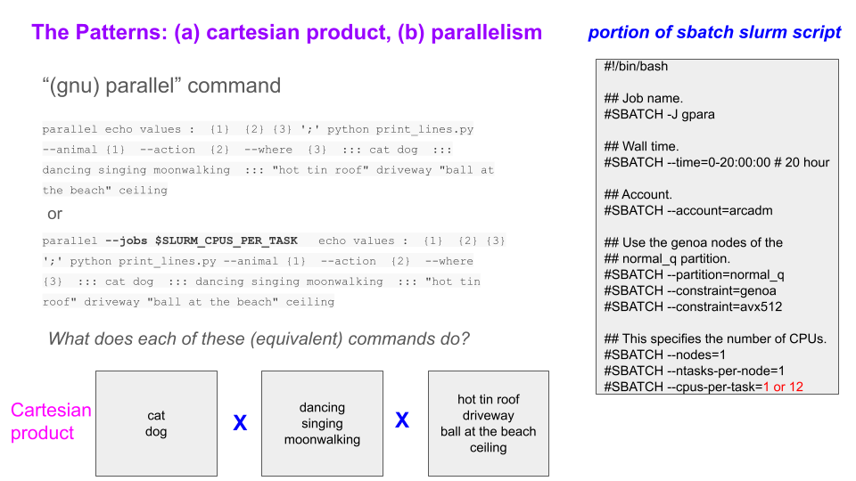

# GNU Parallel Tool

#### Link Back To Main

[Back to Main Page](../concurrency-main.md)

#### TODO:  More Examples

More information to be incorporated into this document from Kuhlman's other md pages.


-----------------------------

-----------------------------


## Motivation

There is a limit on the number of jobs that you can submit
to different partitions (i.e., queues) on the ARC clusters.

The current limit is 1000 submitted jobs (jobs queued and jobs running, combined).

This limit is not hard to reach:
roughly 10,000 quite large jobs can be submitted and run overnight
if a cluster is not heavily used.


Ideally one would submit all 10000 jobs
(each slurm job is a separate slurm script and a single
"sbatch" invocation) at one time and let
slurm handle execution of these and other users' jobs.
But the above limit prevents this.

What can be done?

One can "pack" jobs into one `sbatch` submission to slurm.

How can this be done?

There are several ways to do this.

These ways are the subjects of this workshop.

We note that there is also a limit on the maximum number of steps
that can be executed in slurm jobs, and this issue will also
appear in these notes.

There is also an issue of wall-clock time.
A standard job is allowed to run for a maximum of seven days.
So it does not matter how many code executions that you pack into one
sbatch slurm job submission, they will run for at most seven days
(this time is an input field in a slurm sbatch script, but you
cannot go over seven days, equals 168 hours).


## Use of GNU parallel

#### Patterns With GNU Parallel

Patterns are code designs and implementations that are used over and over
again for different types of problems.


Examples: for `parallel`.
1. Use `parallel` to run the same code with many different inputs.
    - Especially tailored for Cartesian products of all input variable values.
    - And doing these computations concurrently.
2. Use `parallel` in conjuction with the `#SBATCH` switch `--cpus-per-task` in the sbatch Slurm script
   to run multiple instances of a code concurrently.
    - Running a code multiple times in parallel has obvious advantages, like running your collection of jobs faster.
    - However, running concurrently may not always be desirable/possible.  Examples follow.
         - Suppose each run takes almost all of a compute node's memory.
           Then running two or more batch jobs concurrently on one compute node may be impossible.
         - Suppose each run takes almost all cores of a compute node.
           Then running two or more batch jobs concurrently on the same compute node may be impossible.
         - Suppose you have to run many jobs using `parallel` and the code you are running is a serial code.
           (Examples are below.)
           Then it may be beneficial to run each each of these many `parallel` batch jobs with one core
           each so that Slurm can run many of your jobs simultaneously.
           (An analogous thing has happened to me many times.)
    - So while concurrency is very often very good, it is not necessarily good for all cases.


### Example 1:  How Requested Job Resources Affect Degree of Parallelism

We are going to run five invocations where we wait/sleep for 1, 2, 3, 4, and 5 seconds.
That is all each code does:  wait.
We run these as slurm batch jobs.

Two cases:
- case 1: we run these five invocations in parallel using gnu parallel.
- case 2: we force gnu parallel to run each of these invocations
serially, i.e., with no parallelism.

These cases are done to record the execution time and demonstrate the power
of gnu parallel.

The main command in each file is the one with `parallel`.
Also, within that command, you see `--jobs` switch; this
controls the number of cores (cpus) applied to the executions.
In the first case, we use five cores, one for each value of 1, 2, 3, 4, and 5.
In the second case, we use one core for all of the values 1 through 5,
which makes the execution serial in this case.

Note also that we have to tell slurm how many cpus/cores we want to
use in each job.
Hence, the values for `#SBATCH --cpus-per-task` is the same as the
argument for `--jobs` in the `parallel` command.


Case 1 slurm script, named _sbatch.short.slurm_:


```bash
#!/bin/bash


# Job name.
#SBATCH --job-name short

## Account.
#SBATCH --account arcadm

## Time.
#SBATCH --time 00:10:00

## Partition.
#SBATCH --partition normal_q

## Num compute nodes, executing tasks, compute cores.
## The first three lines are applied per job array task (jat).
## These resources are NOT cumulative over all of the jats.
#SBATCH --nodes=1
#SBATCH --ntasks-per-node=1
#SBATCH --cpus-per-task=5

## Slurm output and error files.
## For job arrays.
#SBATCH --output  gp.short.%j.out
#SBATCH --error  gp.short.%j.err


echo "date: `date`"
echo "hostname: $HOSTNAME"; echo

# Write details of the job's resources.
echo -e "\nChecking job details ..."
scontrol show job --details $SLURM_JOB_ID

# No modules need be loaded.
# No virtual environments need be activated.

# The job.
parallel --jobs 5 sleep {}';' echo {} done ::: 5 4 3 1 2
```

Submit this job:

```bash
sbatch sbatch.short.slurm
```

The output from the job is below:

The output is below.  The execution time is 7 seconds.

```
[ckuhlman@owl1 gnu-parallel]$ sacct -j 104976 --format=jobid,jobname,elapsed,ncpus,ntasks,state
JobID           JobName    Elapsed      NCPUS   NTasks      State
------------ ---------- ---------- ---------- -------- ----------
104976            short   00:00:07          5           COMPLETED
104976.batch      batch   00:00:07          5        1  COMPLETED
104976.exte+     extern   00:00:07          5        1  COMPLETED
```

Note again our objective:  to run many executions of a code with one
sbatch slurm script.
Here, we ran five executions with one slurm script.


### Exercise 2 GNU Parallel

Copy the file _sbatch.short.slurm_ and call the copy _sbatch.long.slurm_.

In file _sbatch.long.slurm_, delete this line `#SBATCH --cpus-per-task=5` and insert this
line `#SBATCH --cpus-per-task=1`.

You may also want to change the names of the output and error files
in:
1. `#SBATCH --output`
2. `#SBATCH --error`

Submit this job:

```bash
sbatch sbatch.long.slurm
```

The output from the job is below:

The output is below.  The execution time is 7 seconds.

```
[ckuhlman@owl1 gnu-parallel]$ sacct -j 104978 --format=jobid,jobname,elapsed,ncpus,ntasks,state
JobID           JobName    Elapsed      NCPUS   NTasks      State
------------ ---------- ---------- ---------- -------- ----------
104978             long   00:00:17          1           COMPLETED
104978.batch      batch   00:00:17          1        1  COMPLETED
104978.exte+     extern   00:00:17          1        1  COMPLETED
```

The execution time is now 17 seconds (your values will probably vary).

What happened?

In the first job, `#SBATCH --cpus-per-task=5` means that five CPUs
are provided to the job and so each of the five executions runs in
parallel.
In the second job, `#SBATCH --cpus-per-task=1` means that there is
only one CPU provided by slurm, so each of the five executions have
to line up, serially, to execute.
So the job takes longer to run.

The point to understand is that the resources for the job have to
match up with how you want GNU parallel to perform.


 ### Example 3:  GNU Parallel

 We demonstrate how Cartesian products of inputs are handled
 efficiently.

 The codes below implement the ideas in the graphic immediately below:


[patterns1and2](figures/slide-1-parallel-n-srun.pdf)



 We have three files below:

 1. An sbatch slurm script (in file 1, _sbatch.fast.03.slurm_)
    calls a run script (in file 2, _run.03_).
 2. The run script (file 2) calls the python code (file 3, _print_lines.py_).
 3. The python code simply prints the command line arguments (CLAs).
 4. Note the efficiency in the run script file _run.03_ in
    iterating through the Cartesian product of input arguments.

 _sbatch.fast.03.slurm_

```bash
#!/bin/bash

#SBATCH -J para

## Wall time.
#SBATCH --time=0-20:00:00 # 20 hour

## Account.
#SBATCH --account=arcadm

## Use the genoa nodes of the normal_q partition.
#SBATCH --partition=normal_q
#SBATCH --constraint="genoa&avx512"

## This specifies the number of CPUs.
#SBATCH --nodes=1
#SBATCH --ntasks-per-node=1
#SBATCH --cpus-per-task=12


## Slurm output and error files.
#SBATCH --output para.parallel.job.%j.out
#SBATCH --error  para.parallel.job.%j.err

echo "date: `date`"
echo "hostname: $HOSTNAME"; echo

# Write details of the job's resources.
echo -e "\nChecking job details ..."
scontrol show job --details $SLURM_JOB_ID

# Load modules.
module load Python/3.12.3-GCCcore-13.3.0

# No venvs.

# Code to execute.
sh run.03
```

The run script called by the above sbatch script, 
_run.03_:

```bash
parallel echo values :  {1}  {2} {3} ';' python print_lines.py --animal {1}  --action  {2}  --where  {3}  ::: cat dog  ::: dancing singing moonwalking  ::: "hot tin roof" driveway "ball at the beach" ceiling
```

And here you see that the three variables have these values:

1. variable 1:  cat, dog.
2. variable 2:  dancing, singing, moonwalking.
3. variable 3:  hot tin roof, driveway, ball at the beach, ceiling.


The python code that prints the CLAs, _print_lines.py_:

```python
# Code to demo gnu-parallel.

## Print a sentence.

#from tabulate import tabulate
## import statistics
from itertools import chain
#simport igraph as ig
import time
import argparse


# ==================================
# Functions.

# ----------------------------------
def getClas():
    """
    Get command line arguments.
    :param:  None.
    :return: args.
    """

    ## ---------------------------
    ## Parse command line.
    ## try:
    parser = argparse.ArgumentParser()
    parser.add_argument('--animal', type=str, dest='animal', required=True,
                        help='Thing doing something.')

    parser.add_argument('--action', type=str, dest='action', required=True,
                        help='Thing that the animal does.')

    parser.add_argument('--where', type=str, dest='where', required=True,
                        help='Location of where animal does its thing.')

    args = parser.parse_args()

    ## except:
    ##     print("  Error in parsing command line arguments for this execution.")
    ##     exit(1)

    return(args)


# ==================================
# Main code.
def main():
    """
    Processing.
    """

    ## Get start time.
    beginTime=time.time()

    # Read CLAs.
    args = getClas()

    # Assign variables.
    animal=args.animal
    action=args.action
    where=args.where


    my_line = "\nA " + animal + " " + action + " on a " + where
    print(my_line+"\n")

    ## Get end time.
    ## Compute execution time.
    endTime=time.time()
    deltaTime=endTime-beginTime
    dtHours = (float)(deltaTime)/3600.0

    # Sleep for 3 seconds.
    # Because otherwise code is so fast that little jitter will affect.
    time.sleep(3)

    endString="Total execution time: " + str(deltaTime) + " (s) ; " + \
                str( dtHours  )  + " (hr)\n"

    return deltaTime


## Code start.
## =======================================
if __name__ == "__main__":
    ## Driver.
    duration = main()
    dur_hours = (float)(duration)/3600.0
    print("    total execution duration (s, hr): ",duration,dur_hours)
    print (" ----- good termination -----")


```

#### Submit the Job

Execute the code by submitting the batch script as follows:

```bash
sbatch sbatch.fast.03.slurm
```

#### Getting Execution Time

While the job runs, we can construct a new file that contains
a powerful command _sacct_.  Call the file _run.timing.sh_:

```bash
## $1 is the slurm job id.

sacct -j $1 --format=jobid,jobname,elapsed,ncpus,ntasks,state
```


We can understand the execution by using the script _run.timing.sh_, running
it only after the job has completed.

It is invoked:

```bash
sh run.timing.sh <SLURM_JOB_ID>
```

It will print the execution time (under heading "elapsed").

#### Output

Again note our objective:  here, we ran 24 instances of a code within
one sbatch slurm script.

Here is the job output:

Partial output for the "fast" run is here (there are 24 [=2x3x4] total jobs run in output below):
    
```
date: Thu Oct 23 08:51:32 AM EDT 2025
hostname: owl003


Checking job details ...
JobId=182362 JobName=para
   UserId=ckuhlman(1344122) GroupId=ckuhlman(1344122) MCS_label=N/A
   Priority=1014 Nice=0 Account=arcadm QOS=owl_normal_base
   JobState=RUNNING Reason=None Dependency=(null)
   Requeue=1 Restarts=0 BatchFlag=1 Reboot=0 ExitCode=0:0
   DerivedExitCode=0:0
   RunTime=00:00:00 TimeLimit=20:00:00 TimeMin=N/A
   SubmitTime=2025-10-23T08:51:31 EligibleTime=2025-10-23T08:51:31
   AccrueTime=2025-10-23T08:51:31
   StartTime=2025-10-23T08:51:32 EndTime=2025-10-24T04:51:32 Deadline=N/A
   SuspendTime=None SecsPreSuspend=0 LastSchedEval=2025-10-23T08:51:32 Scheduler=Main
   Partition=normal_q AllocNode:Sid=owl1:2943902
   ReqNodeList=(null) ExcNodeList=(null)
   NodeList=owl003
   BatchHost=owl003
   NumNodes=1 NumCPUs=12 NumTasks=1 CPUs/Task=12 ReqB:S:C:T=0:0:*:*
   ReqTRES=cpu=12,mem=95136M,node=1,billing=23
   AllocTRES=cpu=12,mem=95136M,node=1,billing=23
   Socks/Node=* NtasksPerN:B:S:C=1:0:*:* CoreSpec=*
   JOB_GRES=(null)
     Nodes=owl003 CPU_IDs=0-11 Mem=95136 GRES=
   MinCPUsNode=12 MinMemoryCPU=7928M MinTmpDiskNode=0
   Features=avx512 DelayBoot=00:00:00
   OverSubscribe=OK Contiguous=0 Licenses=(null) Network=(null)
   Command=/projects/kuhlman-project-storage/workshops/y2025/2025-10/parallel-01/gnu-parallel/ex-02-b/sbatch.fast.03.slurm
   WorkDir=/projects/kuhlman-project-storage/workshops/y2025/2025-10/parallel-01/gnu-parallel/ex-02-b
   StdErr=/projects/kuhlman-project-storage/workshops/y2025/2025-10/parallel-01/gnu-parallel/ex-02-b/para.parallel.job.182362.err
   StdIn=/dev/null
   StdOut=/projects/kuhlman-project-storage/workshops/y2025/2025-10/parallel-01/gnu-parallel/ex-02-b/para.parallel.job.182362.out
   TresPerTask=cpu=12


values : cat dancing ball at the beach

A cat dancing on a ball at the beach

    total execution duration (s, hr):  0.046469688415527344 1.2908246782090928e-05
 ----- good termination -----
values : cat dancing hot tin roof

A cat dancing on a hot tin roof

    total execution duration (s, hr):  0.04614734649658203 1.2818707360161676e-05
 ----- good termination -----
values : cat dancing driveway

A cat dancing on a driveway

    total execution duration (s, hr):  0.04434823989868164 1.2318955527411567e-05
 ----- good termination -----
values : cat dancing ceiling

A cat dancing on a ceiling

    total execution duration (s, hr):  0.046462297439575195 1.2906193733215332e-05
 ----- good termination -----
values : cat singing hot tin roof

A cat singing on a hot tin roof

    total execution duration (s, hr):  0.04643058776855469 1.2897385491265191e-05
 ----- good termination -----
values : cat singing driveway

A cat singing on a driveway

    total execution duration (s, hr):  0.04463005065917969 1.239723629421658e-05
 ----- good termination -----
values : cat singing ball at the beach

A cat singing on a ball at the beach

    total execution duration (s, hr):  0.047464847564697266 1.3184679879082574e-05
 ----- good termination -----
values : cat singing ceiling

A cat singing on a ceiling

    total execution duration (s, hr):  0.04658246040344238 1.2939572334289551e-05
 ----- good termination -----
values : cat moonwalking hot tin roof

A cat moonwalking on a hot tin roof

    total execution duration (s, hr):  0.0466458797454834 1.2957188818189833e-05
 ----- good termination -----
values : cat moonwalking driveway

A cat moonwalking on a driveway

    total execution duration (s, hr):  0.046486616134643555 1.2912948926289877e-05
 ----- good termination -----
values : cat moonwalking ball at the beach

A cat moonwalking on a ball at the beach

    total execution duration (s, hr):  0.04537534713745117 1.2604263093736436e-05
 ----- good termination -----
values : cat moonwalking ceiling

A cat moonwalking on a ceiling

    total execution duration (s, hr):  0.046894073486328125 1.3026131523980035e-05
 ----- good termination -----
```

We will use bash scripting to implement an approach identical to the one here.
We will do this below.
Note how much more cumbersome it is.

### Example 4:  GNU Parallel

Make another example from Example 3 above:

1. Copy the file _sbatch.fast.03.slurm_ and call it _sbatch.fast.03.slurm_
2. Delete the line `#SBATCH --cpus-per-task=12` and in its place insert
   `#SBATCH --cpus-per-task=1`.
3. You may also want to change the names of the output and error files
in:
   - `#SBATCH --output`
   - `#SBATCH --error`
4. Submit this job by typing `sbatch sbatch_slow.03.slurm`
5. When it completes, you can see the execution time by 
   typing `sh run.timing.sh <SLURM_JOB_ID>`.


