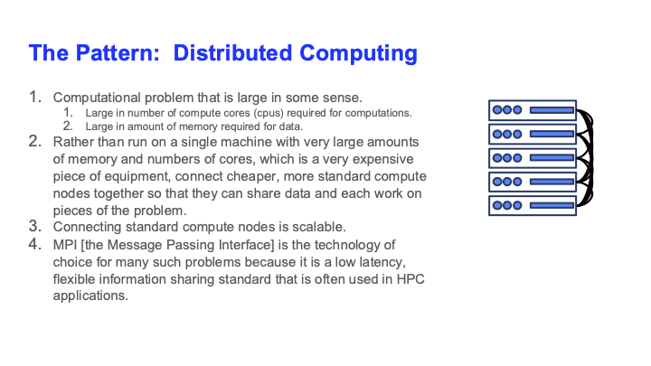

# MPI Pattern

#### Link Back To Main

[Back to Main Page](../concurrency-main.md)

## Pattern

[pattern1](figures/slide-1-mpi-pattern.pdf)

## Process Patterns

This describes the way MPI processes behave in relation to each other.

1. Master-worker. The master takes a leadership role,
such as computing values on the fly to determine what
(computations) the other (worker) processes should do next.
The master may also do computations or may perform other operations to 
support the worker processes.
2. Peer-group.  There is no leader.  All MPI process perform computations
and communicate with a subset of their peers.

## Communication Patterns Within MPI

There are many different ways to communicate among a group of cooperating processes (i.e., MPI processes).

Some of these are:

1. point-to-point communication:  one process sends data to another, specified MPI process.
2. blocking send/receive:  send data but block wait until information received by receiver, who is also blocking.
3. Non-blocking send/receive:  processes issue send and receive operations, but then continue processing other statements..
4. Broadcast:  one process sends to many others.
4. scatter-gather to root:  all processes receive a chunk of data from one sending process.
6. All gather:  everyone gets all data from all other processes.
7. Several more.

## Other

There is a lot more, a lot more, to MPI.  One has to get into it (i.e., into the details) to see what it can do.

## Invoking MPI

One reason to provide examples for MPICH, Open MPI, Intel MPI is because the invocations are different.

1. Open MPI uses `srun`.
2. MPICH uses `mpiexec`.
3. Intel uses `mpirun`.

These choices are according to manuals.
You may be able to launch MPI with a different code/script.

## Different Implementations

A word about implementations.  This is crude, high-level overview.  You can google these and obtain more nuanced responses.
All implementations are of high quality and they all get used in practice.
The information below may be dated, and even if it is current now, it will be dated in the future.
The best thing to do is google the implementations for features and comparisons.
We try to keep this up to date, but things change.
This may vary; is a subjective personal view:  the documentation for these implementations is pretty good.
A point of variation is often the types of interconnects that the implementations support.

### OpenMPI

This is the best open-source MPI version of broad applicability.
It tends to trail MPICH just a little in the implementation of new standards features.

### MPICH

This is considered a very high quality reference implemntation.
There are many derivative implementations that use MPICH as a starting point.

### MVAPICH

This is a derivative of MPICH for InfiniBand (IB) interconnect; is produced by one vendor, Mellanox.
This is built and maintained by Ohio State University.

### Intel MPI

Vendor-tuned (by Intel) for use on their hardware.
Also supports IB.
Also a derivative of MPICH.

