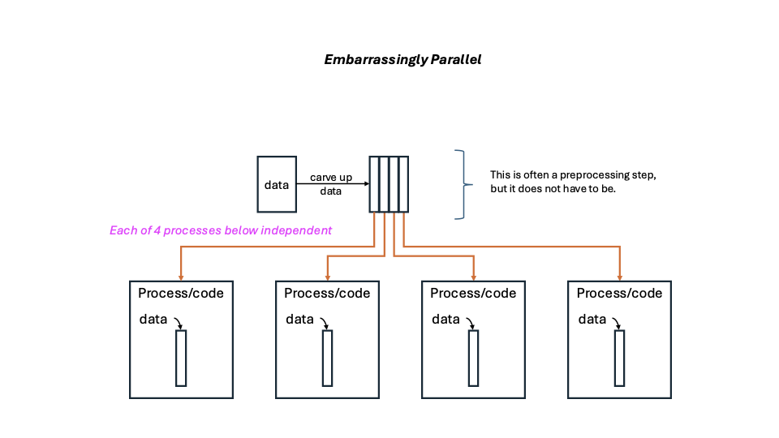
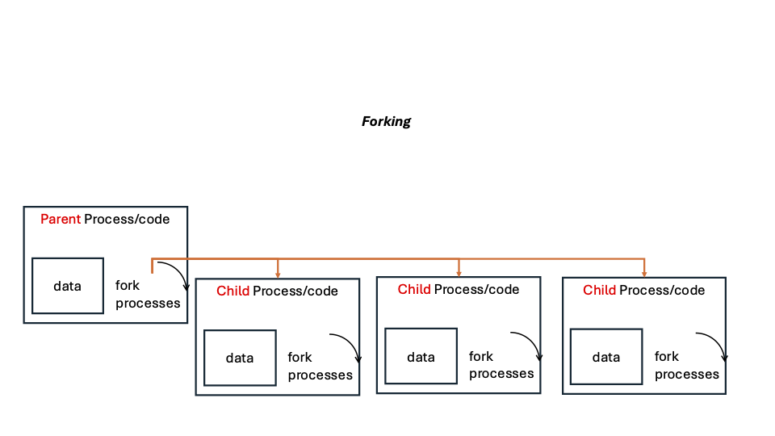
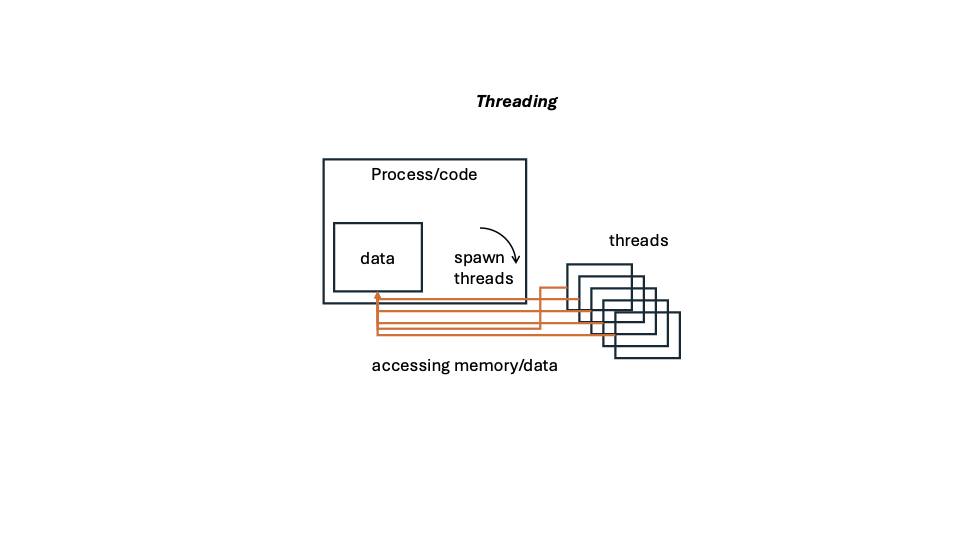
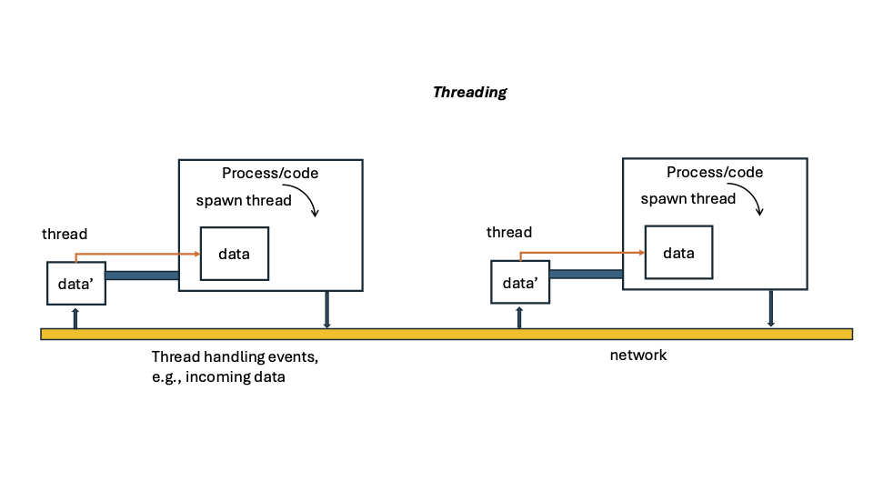
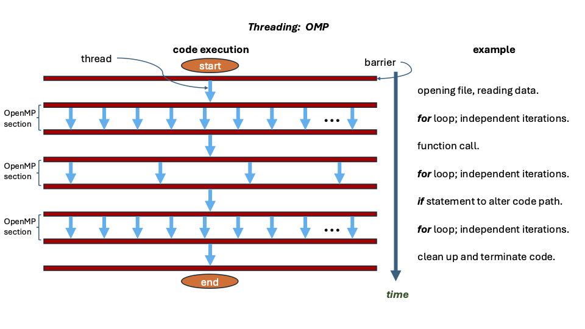
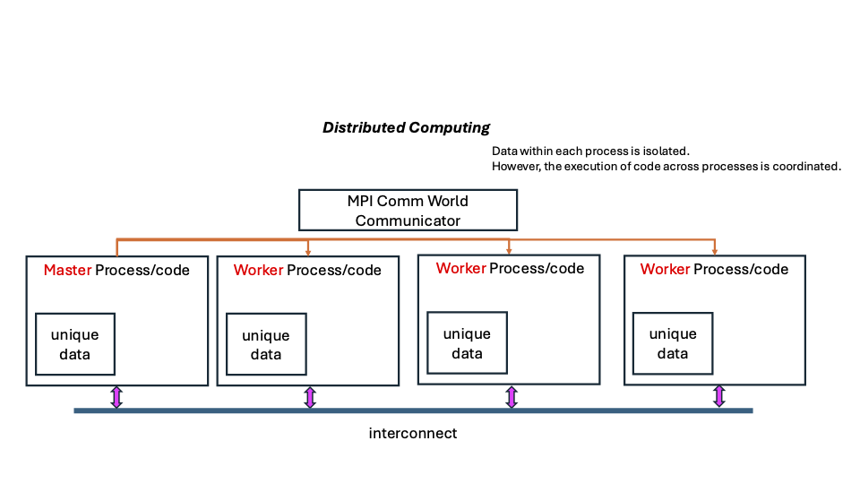
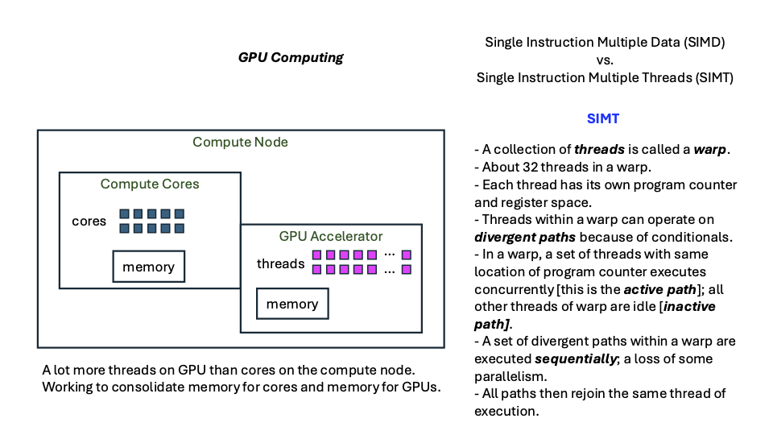

# Concurrency Paradigms:  Concepts

## Link Back To Main

[Back to Main Page](../concurrency-main.md)

## Embarrassingly Parallel

For embarrassingly parallel:

1. Each process runs in its own address space; it has its own code segment and data segment.
2. Usually, the user, as a preprocessing step, paritions the data.
3. This way, each process operates on one partition of the data.
4. All running processes are completely independent.
5. Therefore, processes can run in any order (including simultaneously).

[embarrassingly parallel concept](figures/concept-embarrassingly-parallel.pdf)

## Forking

For forking:

1. There is a original process running.  This is the parent process.
2. A process makes a copy of itself.  This copy is a child process.
3. This copied process, once it starts executing, is a completely independent process
from the parent process.
4. The parent and child are related in that the starting point of the child process
is the state of the parent process at the time of forking.
But from this point, the two processes are independent.
5. By "independent," we mean the two processes have their own code segment and data segment.
6. Therefore, specifically, the two processes do not share memory.
So updating a variable in one process will not affect the same variable in another process.

Two processes, that are "independent" can share data using
such mechanisms as linux/unix shm (e.g., https://man7.org/linux/man-pages/man7/shm_overview.7.html)
but this is a very low-level operation and must be done quite carefully.
This is beyond the scope of this workshop.

In C/C++ environments, one uses a `fork()` command.
It is POSIX.
One needs header files `<unistd. h>` and `<sys/types. h>`.

In python, the multiprocessing package is used.

[forking concept](figures/concept-forking.pdf)

## Threading

Characteristics of threading are:

1. A parent process starts running.
2. It spawns one or more threads.
3. These threads run in the same address space as the parent process.
4. Thus, all threads have access to the same process memory as the parent process.
This means that any thread can update (change) variable values and the
parent process and all other threads will see these variable value changes.
5. This typically necessitates some sort of semaphore or locking mechanism
in the code so that there are no race conditions, e.g., where multiple 
processes try to update a variable at the same time.
A code acquires the semaphore, changes the variable value(s), and releases the semaphore.
This is often called a "critical section."
6. Threads run concurrently (as long as there is a sufficient number of cores (cpus)
to run all threads at the same time (which is what you want; otherwise you get a lot
of context switches in the cores).
7. Typically, one requests as many cores (cpus) as the sum of number of threads + 1,
where the "+1" is for the parent process.  Call this number x.
8. If the number of cores is less than this number x, then your code's execution
will have more context switches because the cores will time-slice so that
a single core can execute the code of more than one thread. 
9. Threads often execute the same code, but on different data.  But there are 
important exceptions to this.
10. When all threads only read from the same memory (no writing to that memory), then
each thread can read from the common memory without regard for other threads.
11. If one or more threads can change the data, then you must work in the world
of locks, mutexs (mutual exclusion), semaphores, etc., such that one thread gets 
"access" to the data, modifies the data, and then returns its access privileges 
before other threads can obtain the access privilege, read the data or write to the data.
12.  If there are data dependencies, then the concept of barriers is important.
Barriers essentially do this:  all threads must reach a barrier and wait for
all other threads to get there, before ANY thread can then proceed with further
calculations.  It is a way for threads to "progress together."
Barriers slow down execution.

Threading can be implemented with several programming languages.
These include C, C++, and Java.
In C and C++ one can use pthreads (short for POSIX threads).
Java has an SDK-provided thread class that is inherited to effect threading.

A library, called OpenMP, is used in conjunction with
C, C++, and Fortran to implement threading.
Its main purpose is to enable `for` loops to be parallelized so that, if say
a loop has to be run 1000 times, and there is no dependence among iterations
(e.g., updating an array of values), then if you used OpenMP with 100 threads
and if you had enough cores, each OpenMP thread could execute 10 iterations of the 1000 loops,
for a speed up over a serial code of 1000/10 = 100 (which is the number of
threads).
OpenMP is very powerful; the example document alone is some 500 pages.
But you can do very powerful things with very few commands.

An important exception is Python.
In python with the "threading" package, you can create threads.
The important issue is that threads cannot run concurrently.
Python has a GIL (Global interpreter lock) and runs one thread
at a time, so that CPython's dynamic memory management is not thread-safe.
If you are not careful, you will not notice this limitation:
you code will run, but it will run slowly.
All of the threads, combined, essentially act as one thread of control.
Python 3.13 is supposed to have this issue resolved so that 
true threading can be implemented.

You can run true multithreading in python using C extensions, but hardly
anyone ever does.

More information on python is at:

[https://stackoverflow.com/questions/44793371/is-multithreading-in-python-a-myth](https://stackoverflow.com/questions/44793371/is-multithreading-in-python-a-myth)

[https://www.reddit.com/r/learnpython/comments/fe80x9/why_multithreading_isnt_real_in_python_explain_it/](https://www.reddit.com/r/learnpython/comments/fe80x9/why_multithreading_isnt_real_in_python_explain_it/)

### Concept of threads (e.g., pthreads) doing work 

[thread work concept](figures/concept-pthreading-work.pdf)

### Concept of threads (e.g., pthreads) handling events 

[thread event concept](figures/concept-pthreading-events.pdf)

### Concept of OpenMP threads doing work 

[thread OpenMP (OMP) concept](figures/concept-omp-work.pdf)

## Inter-Process Communication (IPC), Distributed Systems

There are a few different system paradigms within distribution, such as:

1. client-server.
2. peer-to-peer.

Characteristics of IPC:

1. More than one process is executed.
2. These processes have their own address spaces (including own memory).
3. Message passing is used to move data from one process to another.
4. The sending process has some sort of `send` operation and the receiving
process has some sort of `receive` operations.
There are many variants on this theme.
5. Data MAY BE sent over some network fabric such as Infiniband,
CORNELIS (Intel), and HPE Slingshot.
    - Data will be sent---between communicating processes---if those processes are running on different compute nodes.
    - Data will not be sent HOPEFULLY between communicating processes that are on the same compute node.

These codes are the hardest to write, typically, because, since 
address spaces are not shared, one has a lot of communication, and
to achieve good performance, one has to overlap communication and
computation.

There are several approaches for IPC:

1. MPI (which is a standard) and has implementations such as OpenMPI and MVAPICH.
This is essentially the standard for high performance computing.
2. JMS (Java messaging service).
3. Sockets (POSIX, Unix).  TCP and UDP. Java also implements a sockets class.
4. ACE (Vanderbilt).
5. Message queues (e.g., RabbitMQ, Amazon Simple Queue System (SQS), and Apache ActiveMQ).
6. Charm++.
7. Spark (framework).

The graphic below is more tailored for MPI, but all IPC mechanisms
more or less work in the same way.
A useful quick overview is here:  https://medium.com/parallel-distributed-computing-for-data-enthusiast/high-performance-network-fabrics-and-libraries-d423fa3db445

[distribution concept](figures/concept-distributed.pdf)

## Graphics Processing Units (GPUs)

Accelerator attached to a compute node.

[GPU concept](figures/concept-gpu.pdf)

## Combinations

Design approaches and implementations can be combinations of these
different paradigms.

For example, it is common to use these in one application:

1. Pthreads
2. OpenMP
3. MPI

or 

1. MPI
2. GPU

