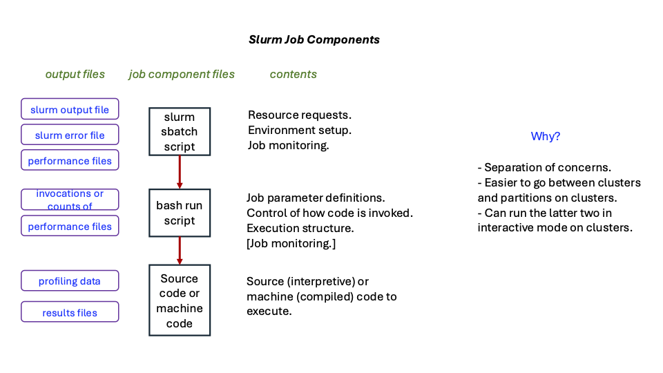

# Concurrency Tools

#### Link Back To Main

[Back to Main Page](../concurrency-main.md)

## Overview

Tools that we will cover (and some that we will not ... yet).

Please note that all implementations and examples were checked by running them on 
ARC resources at VT.
However, we make no claim that the compilations, environments, nor executions
are optimized for performance.
This is an issue for the individual developer of an individual code.

__If you have basic parallel setups for which you'd like to see examples, let us know.__

| ---------------- | -------------- | -------------- | -------------- |
| Programming Language    |   Construct        |  Implementation  |  Example in Workshop |
| ---------------- | -------------- | ------------- |-------------- |
|    Any language, via Slurm     | Multiple independent processes (embarrassingly parallel)  |   srun (with slurm) | v1, v2 |
|    ##############  | ############ | ###########################   | ###########  |
|    Any language, via Slurm     | Multiple independent processes  (embarrassingly parallel)  |   job arrays inside slurm |  v1  |
|    ##############  | ############ | ###########################   | ###########  |
|    Any language    | gnu-parallel |   Parallel execution of a code |  v1, v2  |
|    ##############  | ############ | ###########################   | ###########  |
|    C, C++     | Shared memory  |   POSIX shm |    not yet |
|    ##############  | ############ | ###########################   | ###########  |
|    Python     | Forking  |   Multiprocessing package |   v1 |
|    C, C++     | Forking  |   POSIX fork() |  not yet |
|    ##############  | ############ | ###########################   | ###########  |
|    C, C++ (Posix)    | Threading  | POSIX threads, pthreads  |  yes  |
|    Java       | Threading  |   Runnable, Subclassing Thread  |  yes  |
|    ##############  | ############ | ###########################   | ###########  |
|    C, C++, Fortran     | Threading |  OpenMP; parallelizing iterations of loops |  v1, v2 |
|    ##############  | ############ | ###########################   | ###########  |
|    C, C++ (Posix)      | Inter-Process Communication     |  Message queues  |    not yet              | 
|    Python, Fortran     | Inter-Process Communication     |  Message queues  |    not yet              | 
|    ##############  | ############ | ###########################   | ###########  |
|    C, C++ (Posix)     | Inter-Process Communication  |  Posix TCP Sockets   |    v1                  | 
|    C, C++ (Posix)    | Inter-Process Communication  |  Posix UDP Sockets   |    v1                  | 
|    Java       | Inter-Process Communication  |  Sockets  (TCP, UDP)   |     not yet               | 
|    Python     | Inter-Process Communication  |  Sockets  (TCP, UDP)   |     not yet               | 
|    ##############  | ############ | ###########################   | ###########  |
|    C, C++     | Inter-Process Communication     |  MPI  (OpenMPI)  |   v1, v2    | 
|    C, C++     | Inter-Process Communication     |  MPI  (MVAPICH)  |   not yet--need to install with MPICH    | 
|    C, C++     | Inter-Process Communication     |  MPI  (MPICH)  |   v1, v2     | 
|    C, C++     | Inter-Process Communication     |  MPI  (Intel)  |   v1, v2     | 
|    Python     | Inter-Process Communication  |  MPI4PY  |     v1              | 
|    Julia      | Inter-Process Communication  |  MPI     |     not yet               | 
|    ##############  | ############ | ###########################   | ###########  |
|    C, C++     | Inter-Process Communication  |  Charm++  |    not yet               | 
|    ##############  | ############ | ###########################   | ###########  |
|    C, C++     | Inter-Process Communication  |  Spark   |     not yet               |                  | 
|    ##############  | ############ | ###########################   | ###########  |
|    C, C++     | Inter-Process Communication  |  Chapel   |     not yet               |                  | 
|    ##############  | ############ | ###########################   | ###########  |
|    C, C++     | Inter-Process Communication (shared memory; PGAS) |  OpenShmem   |     not yet               |                  | 
|    ##############  | ############ | ###########################   | ###########  |
|    C, C++     | Inter-Process Communication (shared memory; PGAS) |  Unified Parallel C (UPC), UPC++   |     not yet               |                  | 
|    ##############  | ############ | ###########################   | ###########  |
|    Python     | SIMD and SIMT |  GPUs   |      yes (new)             | 
|    Python     | GPU and Inter-Process Communication  |  GPU + MPI4PY  |     yes (new) - CHECKME              | 
|    Matlab     | SIMD                                    |  GPUs   |      not yet              | 

## Form of a Job

In the codes in the following episodes, the structure of a job
and the components of the job are given.
There are some exceptions to this structure, but by-and-large it
is used.

[concept job components](figures/concept-job-components.pdf)



