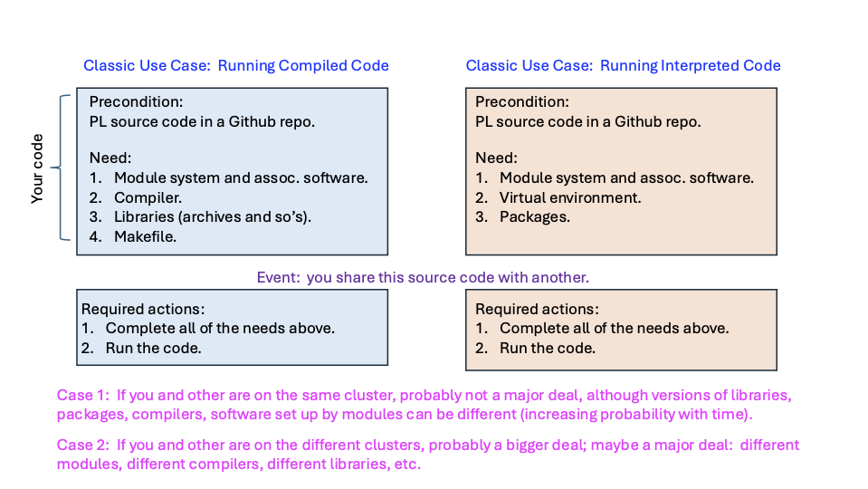
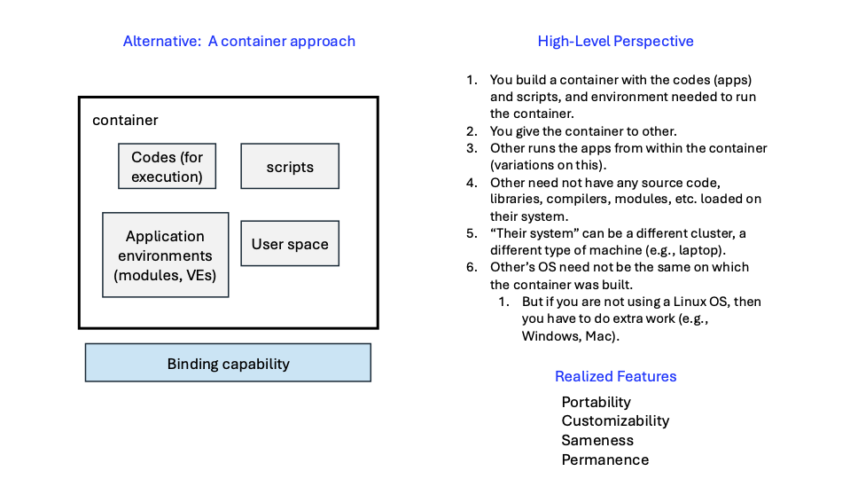
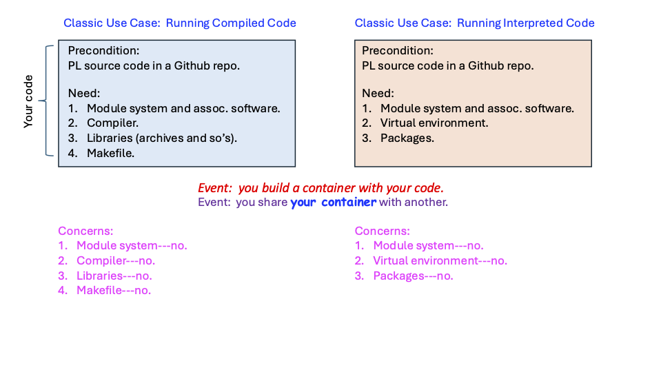

# Container Concepts (Informal)

##### Navigate

[Back to Main Page](./main-containers.md)

## Motivating Example

-------------------------------------------

-------------------------------------------

-------------------------------------------

-------------------------------------------

-------------------------------------------

-------------------------------------------

-------------------------------------------

-------------------------------------------

-------------------------------------------

## Container Overview

### Definition

- A **container** is a software file
  that houses
applications and
all supporting software needed to run those applications.
- Because a container also houses all supporting
software needed
to run the application, including the **user space** related to
an operating
system (OS), a container is
self-contained and stand-alone.
- So a major feature of containers is that they can
  be used
on computer systems that are completely unrelated to
the environment within the container, and the application(s)
within the container will still run.
- The default container construction process results in a
  read-only container, so it cannot be modified.
- A container---even ones where codes are inside---sometimes/often is
  used to run codes that are outside of the container.
  In these cases, the environment inside the container is used,
  so the "external" code is run within the container environment.

### Container Use

Among the many uses (and content) of containers,
here are some of the dominant ones:

  - One major application.
  - A collection of distinct stand-alone, but related, applications.
  - A series of commands/applications that essentially form a pipeline.
  - An environment (think modules, virtual environments, etc.) with
      no applications nor scripts.  In this case, codes are `bind`ed
      (bound) to the container.

### Container Invocation

You can run a container in at least these three ways:

1. Run the default command (the one under `%runscript`) with
   the `run` command.
2. Run a customized command with `exec` (overriding the 
   command(s) under `%runscript`)
3. Enter the container interactively for manual execution
   using the `shell` command.

### Additional Detail

- User Space (included in a container):
The container contains the file system, libraries, binaries, and
environment variables of a specific Linux distribution
(e.g., Ubuntu, CentOS, Alpine).
This allows you to run applications that require an OS environment
that is different from your host machine.
- Kernel (excluded): The container does not include the kernel.
  It uses the host's kernel to manage hardware, memory, and process scheduling.

Example:  You can create a container on a Linux OS machine
and move it to another Linux OS (including different flavor of
Linux).
 - Running apptainer on Windows does not work natively.
   The user would need to install WSL2 or a Linux VM to get an environment that could run apptainer.
 - Similarly for Macos, you need a Linux VM.
 - These requirements for Windows and Macos are because
   Apptainer requires a Linux kernel.

Since a container houses a complete environment,
a container file can be huge:  GBs is common.

Based on this information, you can readily see that
major strengths of containers include:
1. **portability**:  a container will run anywhere.
2. **customizability**:  you can tailor an environment for
   yourself and colleagues
3. **sameness**:  you and your colleagues are running the 
   _**exact**_ same code.
4. **permanence**:  because the environment (and apps)
   are inside the container, it will work into the future.

We will use `source` to denote the system on which the
container is built and `target` to denote a system on
which the container runs.
 
## ARC Docs Page On Containers (Apptainer)

- There is an [ARC Docs page](https://docs.arc.vt.edu/software/apptainer.html#container-runtimes-may-not-be-available-on-login-nodes)
that contains a lot of information.

- We will often refer to that page, but will refrain from repeating content to the maximum extent possible (for maintainability).

- We will use the example from that page.

## Approaches to Creating Containers

Two of industry and academic defacto standard ways to construct containers:
- using Docker
- using Apptainer (formerly Singularity)

Docker requires a person to have root access for its use on a target computer (system).
For cluster use, one does not have root privileges
because there are many users and hence security issues that preclude root privileges.
Hence, Singularity was born.
Singularity is now **Apptainer**.  (Is it?  No.)

There are many ways to build Apptainers.
Some of the starting points are listed [here](https://apptainer.org/docs/user/main/build_a_container.html#overview).
These "starting points" for building a container are 
called "targets."

The "build" command is the dominant command within
Apptainer to produce containers.
Containers are produced in two different formats:
- a compressed read-only Singularity Image File (SIF) format, suitable for production (default)
- a writable root directory called a sandbox, for interactive development ( --sandbox option)

## Terms

These are informal term descriptions intended to be a summary of 
some of the most common commands and switches used in building
and executing containers.

**app**:  switch to run an app (as opposed to a runscript) that is inside a 
container.  Used in with **run** and **exec**.

**apptainer**:  the single command that is used in the context of containers.
Switches (several of which are given below) are used in conjuction with
**apptainer** to complete some work.

**bind**:  switch to associate directories and files with an already-made container.

**build**:  switch to construct a container (e.g., from a definition file or sandbox).

**definition file**:  A specification (receipe) ASCII text file for building a container.

**exec**:  one way to use the contents (e.g., environment) of a container to 
run commands (e.g., codes) that are outside the container.  One often uses **bind**
in these invocations.

**fakeroot**:  switch (and a utility) that is used by Apptainer to provide a 
user with sufficient privileges to build and execute containers.

**run**:  switch that is one way to execute the contents of a container,
usually assocated with
running codes as specified in the container.

**sandbox**:  switch to specify that a sandbox is being built (versus, say a
container).  Used with switch **build**.

**SIF (Singularity Image File)**:  An Apptainer or Singularity container.
Apptainer builds containers that conform to
the SIF format, for compatibility.  The container's extension **is** `*.sif`.

**writable**:  switch that enables adding to (changing) the contents of a sandbox,
that is subsequently transformed into a container.

## Lessons

I typically put commands inside files, and in particular (bash) scripts,
and I prefix them with `run.`.
I do this so that if I go back to a directory later, I have all of the 
commands in files, and I know scripts are in all files prefixed with
`run.`.
So a file that starts `run.build.` builds some other file(s).
And a file that starts `run.app.` runs an app in a container
(i.e., it does not run a script).
This, to me, makes the directory self-contained.
If you choose not to do this, that is fine:  you can simply
paste the command on the command line.

## Structure and Anatomy of a Container

See a definition file.  There are some in these notes.

## Docker as a Starting Point for Apptainer

Often is it efficient and convenient to start an
Apptainer container using a Docker image that is
then automatically converted to an Apptainer instance.

But there are other ways:  [Bootstrap Agents](https://apptainer.org/docs/user/main/definition_files.html#preferred-bootstrap-agents)

