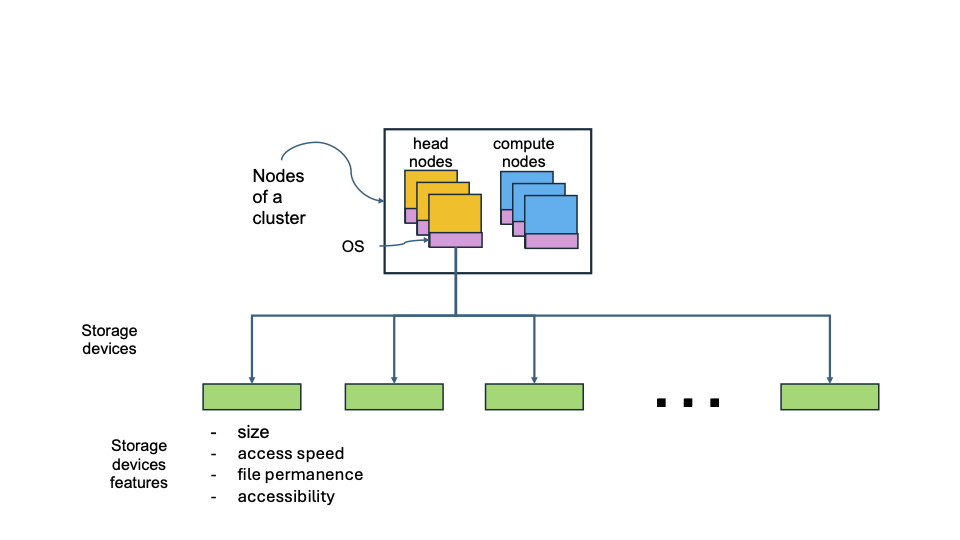
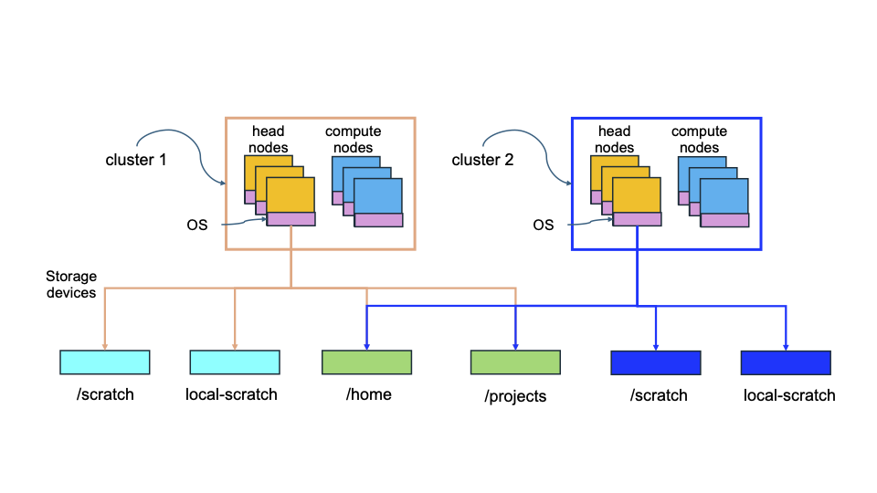
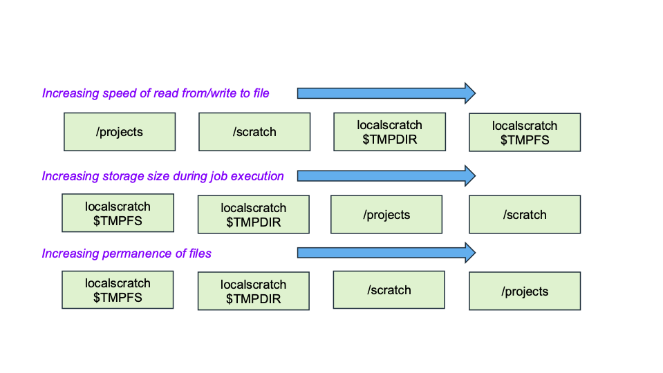

## File Systems

---

⬅️ [Previous: Main](01_main.md) | [Next: File and directory permissions ➡️](03_file_permissions.md)

### File Systems Introduction 

#### Conceptual View of ARC Storage

Graphic below shows schematically different storage devices
(in green) and some important features.

Illustration of how the Tinkercliffs (TC), Owl, and Falcon
clusters share some storage devices (e.g. `/home` and `/projects`)
but not others (e.g., `/scratch` and localscratch).

#### Partial Summary of Storage Options on ARC Clusters

|   Directory  |   File System  |  Size Limit   |  inode Limit   |   Permanence  | Accessibility  |  Qualitative Access Speed  |
|   ----       |    ----------  |   ----------- |   ---------    |   --------    |  ---------     |   -----        |
|    /home     | Qumulo         |    640 GB per user  |  1 M     |   permanent   |  Across all 3 clusters |  slow   |
|   /projects  |  General Parallel File System (GPFS)  |  50 TB per PI  |   10 M  |  permanent |  Across all 3 clusters |  slow   |
|  /scratch    |  VAST          |   "No limit"  |   "No limit"   |   90-day limit; then deleted | Individual, per cluster | fast | 
| "localscratch"*,$ |  NVMe drive or array | Generally smaller | NA  |  Only for life of job  |  Individual, per cluster  | faster  |

\* The actual location is job dependent, under the /tmp directory.

\$ NVMe (Non-Volatile Memory Express) is a high-performance storage protocol designed for solid state drives [that use flash memory] that uses the PCIe interface to provide high speed and low latency. It communicates directly with the CPU, etc.

#### Ranking Storage Options on Different Criteria

Different storage options have desirability based on what
criteria are important to you.

### Some Details for Each Storage Type

#### Home

Used for specifying your profile, .bashrc, aliases, and other system-based files.

Can put virtual environments here.

Not much use for research since the size limit of 640 GB per user is prohibitive.

#### Projects

Used to store files associated with PI (i.e., professor) research because
(1) there is adequate space (up to roughly 50 TB per PI) and
(2) this storage is permanent.

Can store VEs here (e.g., instead of in `/home`).

Directory structure is:  `/projects/<PI-specified-directory-name>`.
Then you and your advisor create directories and soforth under here.

(Slurm) jobs can access files in this file system, but a faster option is given next.

#### Scratch

Your scratch area is : `/scratch/<username>`.

You have this directory on each of the three clusters,
but unlike `/home` and `/projects`,
the same physical storage is not accessible from TC, Owl, and Falcon.
This is because there is a separate scratch mount for each cluster.
This is done to achieve greater I/O (input/output, read/write) speeds.

Your code will perform I/O faster with files in `/scratch` than
it will with files in `/projects`.

`/scratch` has essentially unlimited size in the short-term.

However, the critical thing to know about scratch is that when files reach
90 days in age, they are automatically deleted.
So this is NOT permanent storage.

A common use case is to:
1. Copy files from `/projects` to `/scratch`.
2. Construct an sbatch slurm script for a batch job.
3. Submit an sbatch slurm script to 
   run your code by accessing input files from `/scratch` and
   writing data to (output) files
   in `/scratch`.
4. When your slurm sbatch script (i.e., your slurm job) completes,
   move the output files from
   your area in `/scratch` to some directory under `/projects`.

#### Localscratch

Localscratch is not a dedicated physical drive, per se, as are the other 
file systems.

Rather, storage is allocated under `/tmp`.

The storage is right on the compute node, making it even faster than
`/scratch` for I/O operations during program execution.

However, the lifetime of files on localscratch are even less than the
90 days on scratch.

The lifetime of files in localscratch is the duration of a slurm job.

Therefore, if one looks at the steps of the use case in the previous subsection,
then to use localscratch instead of scratch:
1. Construct an sbatch slurm script for a batch job.
   1. _**ALL**_ of the steps in this list must be done _**inside**_
      the sbatch slurm script.
2. Copy files from `/projects` to `localscratch`.
3. Run your code or codes by accessing input files from `localscratch` and
   writing data to (output) files in `localscratch`.
4. For any files that you want to permanently save,
   move the output files from
   `localscratch` to some directory under `/projects`.

If you write new output files, and
wait until after the slurm job is over to move them, then they are
already gone because localscratch ends with the slurm job.

There is a video on how to construct slurm sbatch scripts for
running out of local scratch:  [section of videos doc page](https://docs.arc.vt.edu/usage/video.html#how-to-run-codes-your-own-or-commercial-open-software)
and select the video "**Batch jobs using volatile resources**".

It is recommended that you attempt to first run your job with
files in scratch, because it can store larger files.
Then, if you have heavy I/O needs, you can try localscratch
and can determine whether the files will fit into localscratch
(if not, you may get an OOM error [out of memory error]).
That is, get your job to run successfully first and then
focus on optimizations (in this case, by using localscratch).

### Tools for Exploring File Systems

#### Tools for Storage Usage

1. quota
   - ARC script (not shell command) to provide /home and /projects use.
   - Shows your allocations for storage and how much of that storage that you have used.
   - Shows your monthly job allocation and how much of that you have used.
2. du
   - “disk usage” 
   - Typically used to display metadata (e.g., size of all files in a directory).
   - Often used to identify “culprits”.
   - Default units are KiB (units of 1024-byte blocks)
   - Example:  du /home/ckuhlman/help-issues/
      - “help-issues” could be a file or directory name.
   - Example:  du
      - Shows all subdirectories of current location.
3. df
   - “disk filesystem”
   - Specifies how much storage has been used and is free on various file systems.
   - Example:  df
       - Shows all filesystems and their usage.
       - You will see a lot of the names of the file systems that we’ve mentioned above.
   

#### Tools for Files and Directories

1. stat
   - Displays information about files and file systems.
   - Example:  stat --file-system /projects
2. ls
   - List files, directories, and symlinks (symbolic links) in a directory.
   - Example:  ls -lrt
     - "long lists" the files, directories, and symlinks.
     - We will use this a lot to see permissions, to help us change them.
3. find
   - Locates files (i.e., if files exist, then it will give their full paths).
   - Example:  find .  -name “my_file.txt”
     - Start in the current directory and look here and in subdirectories to find “my_file.txt”.
   

---

⬅️ [Previous: Main](01_main.md) | [Next: File permissions ➡️](03_file_permissions.md)
