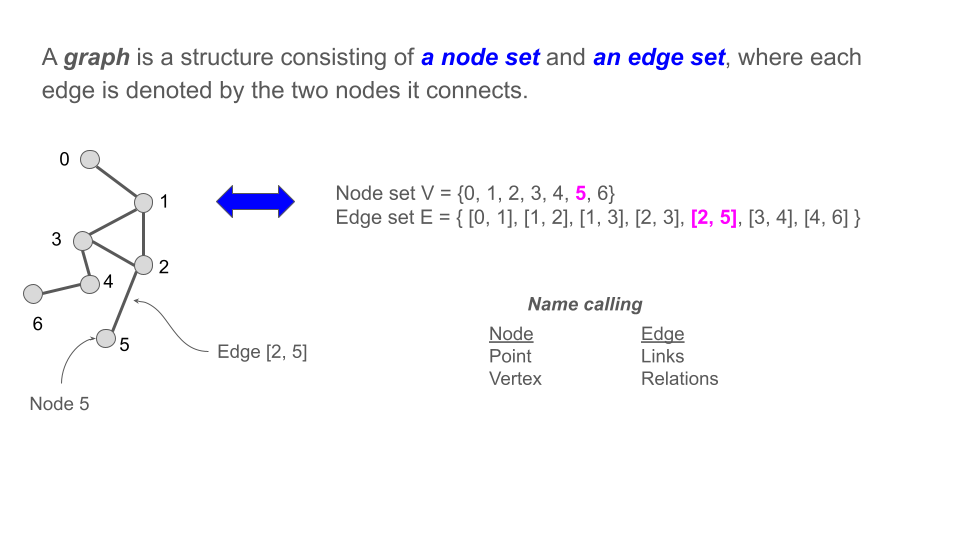
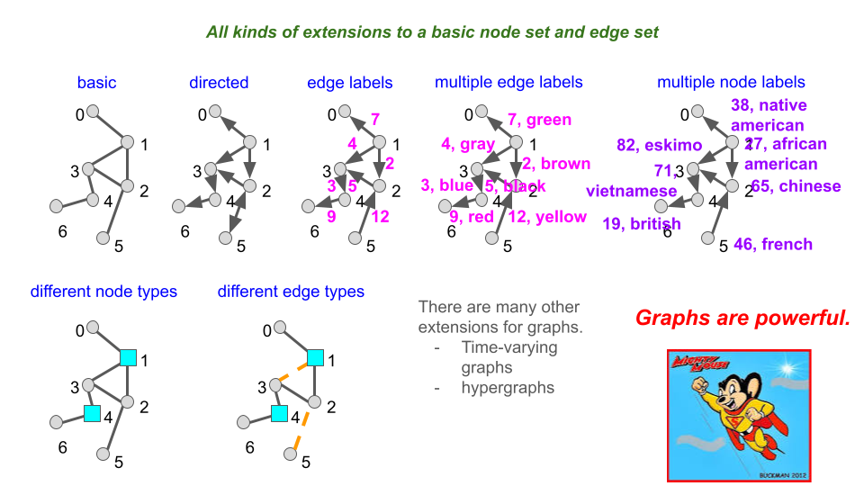
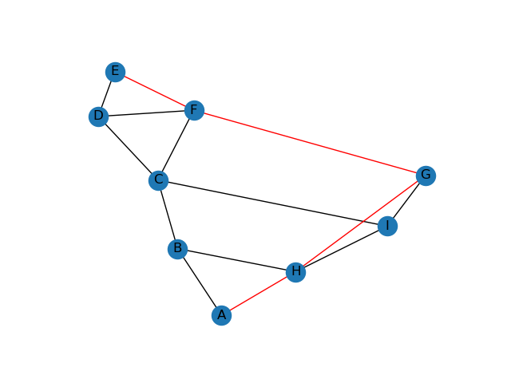
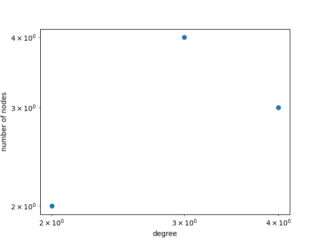

# Using Graph Libraries on ARC Clusters


## Ideas Behind This Workshop

1. Graphs are an abstraction and there
2. Running VS Code is allowable on head nodes IF
   1. You do not run with plugins, e.g., do not run with AI plugins.
   2. You do not run code:  no code execution, no major code debugging.
3. Why these restrictions?
   1. Because head nodes are communal resources that all users make use of _**simultaneously**_.
   2. (Compute nodes, on the other hand, _**ARE**_ used by a selected few users at a time according to Slurm scheduler operations.)
   3. So if you are consuming lots of resources on head nodes, then you are degrading 
          the performance of the head nodes for all other users.
       1. VS Code is a _**primary**_ way that users consume too many resources on head nodes.
   4. It is most useful to think of yourself and all other 1000 ARC users as being in the same boat:
         we need to be respectful of others, by following agreed upon procedures, so that everyone
         can work efficiently and get their work done.
4. To summarize:  I want to use VS Code to do my work and
   1. I want to debug and run my code.
   2. I want to use AI or other plugins.
5. How do I do this?
6. By running your instance of VS Code on a _**compute**_ node.
7. This workshop is all about running VS Code on compute nodes.


## Organization

### Applicability

1. These procedures apply to Tinkercliffs (TC), Owl, and Falcon clusters.


### Prerequisites

1.  ssh installed on your local machine (comes with most laptops). [SSH keys](sshkeys)
2.  If working remotely, have [VT VPN](https://www.nis.vt.edu/ServicePortfolio/Network/RemoteAccess-VPN.html) installed on your laptop (local machine).
3.  ARC [account](https://arc.vt.edu/account).
4.  Project for file storage.  Not absolutely critical for this workshop, but critical for your work.
5.  [allocation](allocations) to charge "jobs" to.
6.  

## Learning Objectives

1. List some of the major graph analysis libraries.
2. Learn how to customize your ARC work areas to use different graph libraries.
3. Learn the syntax.
4. Learn how to use modules and virtual environments.
5. Learn some best practices for creating VEs and composing slurm sbatch scripts.
6. Learn how to compute graphs and properties with these graph libraries.
7. Learn out to set up files, launch jobs, view results:  running in batch mode.


### Major Activities  TODO

1. VS Code
   1. Install VS Code (VSC) on your laptop.
   2. Install the `Remote-ssh` plugin in your VSC.
   3. Make sure you have a 
2. Laptop (or local machine)
   1. Alter the _config_ file under directory _.ssh_ as below


-----------------------------

-----------------------------

## Graph Overview


### Nomenclature

[Graph Nomenclature](figures/graph-analytics-workshop-march-2025-slide-1.pdf)


### Graph Classes

Some classes of graphs are given in the figure below.


[Graph Classes](figures/graph-analytics-workshop-march-2025-slide-2.pdf)



### Ubiquity of Graphs

Many, many systems can be represented as graphs.
Some examples are below.


[Graph Classes](figures/graph-analytics-workshop-march-2025-slide-3.pdf)


### Graph Operations

For this presentation, we confine ourselves to two basic categories
of operations.

1. _Graph construction_:  creating graphs and storing them to file.
2. _Analyzing graphs_:  computing properties of graphs.  Often these are structural properties,
but it can be almost anything, e.g., list the edges of a graph that have label _sky_.


### Graph Analytics Libraries

Graph analytics libraries are useful because they use the above
abstractions---the graphs---to compute information about graphs
that then can be mapped back into the problem space.

Example:  What does the node with the greatest degree mean in
each domain below?


|  Domain       | Meaning of Highest Degree Node |
| ------------- | ------------------ |
| Brain neural network | neuron that is most connected to other neurons; probably firing a lot. |
| Road network |   an intersection that is expected to have a lot of traffic and therefore congestion. |
| Citation network | this person has the most collaborators. |
| subway network   |  a person might want to get to this station to have a lot of options for where to go next. |
| class schedule network | the class with the most students. |

... and so on.
The graph computation is the same; the difference is in the interpretation
of the results based on the domain.


### Motivation for Using Graph Analysis Libraries

Hence, there is great motivation to develop graph analysis libraries because
they can be used to solve problems in so many fields.


Graph analysis libraries take a long time to develop, particularly distributed
codes.
This is because of irregularities.
Take a constrast.
Given the sizes (dimensions) of two matrices to multiply together,
I know immediately how many multiplies and additions will be performed
because the data and operations are regular or well-structured.
Each graph, in contrast, has both global and local structure and since graph
structures can vary widely, these problems are not regular
or well-structured.
Which means things like---for computations---load balancing,
partitioning a problem, and memory and CPU utilization are not
straight-forward to reason about.


### Overview of Graph Libraries

There is a range of graph libraries, and it is often difficult to compare them,
as the strengths and weaknesses in the table below indicate.
Most, if not all libraries, have pythong interfaces, although codes like SNAP and
NetworKit are C++ codes under the (Python) wrappers.


| Library Name     |   Pros         |    Cons       |
| ---------------- | -------------- | ------------- |
|    NetworkX      | (a) Many more (e.g., 275) operations on graphs than other libraries. (b) Community of users so multiple working threads. (c) Documentation good.  | Does not scale well (neiher in memory nor processing). |
|    SNAP      | Serial code, but build for scalability and larger graphs.   |  Roughly about 30-40 graph operations. |
|    Snappy      | Is a Python wrapper around SNAP.  (a) Performant serial code. (b) Documentation good. |  Roughly about 30-40 graph operations. |
|    NetworKit      | Concurrent code; via multithreading.  (Uses OpenMP.)  A larger number of graph operations.  |  Does not have the number of methods that NetworkX does. |
|    Gunrock      | GPU-based code.   |  A smaller number of graph operations. |
|    RAPIDS      | GPU-based code.   |  A smaller number of graph operations. Only works with Nvidia GPUs. |


NetworkX is the most general and flexible, but it does not scale.
You will see adverse performance effects when you graph size increases
in the range 10,000 to 100,000 nodes.
Beyond 100,000 nodes, it is very slow.

In fact, if you can readily implement your own library methods, using naive approaches,
and realize execution times from 1/2 to 1/10 the time of NetworkX methods, using
1/3 to 1/10 the memory.
But NetworkX is excellent for its intended use:  by social scientists on small graphs.

All other libraries scale in much more performant ways.

RAPIDS is Nvidia's code base, evolved from nvGraph into cuGraph.
cuGraph is now in RAPIDS.
(Sometimes termed RAPIDS cuGraph.)


### How Libraries are Provided Within ARC

Libraries are provided typically either as modules or as packages that you
can install into your virtual environments.
Modules are created by ARC.
Gunrock is an exception, being built in a more traditional way using makefiles.

Note that if you have a choice on whether to build a virtual environment
or use a module, ARC highly encourages you to build a virtual environment.
This is because with virtual environments, you as a user have much
more control (basically, total control) of what packages and capabilities
you need and want so you can build your VEs in a customized fashion.
You have much less capability with modules, e.g., a module may not "play
well" with a virtual environment that you also need.
It is a natural part of the VE build process to ensure compatability
across multiple packages.
It is for this reason that ARC may not install modules for these
libraries.


| Library Name     |   Environment      |
| ---------------- | -------------- |
|    NetworkX      | Virtual Environment.  See https://networkx.org/documentation/stable/install.html    |
|    NetworkX      | Module.  In easybuild:  https://github.com/easybuilders/easybuild-easyconfigs/tree/develop/easybuild/easyconfigs/n  |
|    SNAP      |   Module.  Easybuild:  https://github.com/easybuilders/easybuild-easyconfigs/tree/develop/easybuild/easyconfigs/s         |
|    Snappy     |   Virtual Environment.         |
|    Snappy     |   Module.  Easybuild:  https://github.com/easybuilders/easybuild-easyconfigs/tree/develop/easybuild/easyconfigs/s (separate from SNAP).          |
|    NetworKit      | Virtual Environment.  Python library.  See  https://networkit.github.io/ ( pip3 install networkit ) |
|    Gunrock      |   Prerequisite:  module---need to have:  CUDA v11.5.1 or higher.  Build using C++ makefile at website:  https://gunrock.github.io/gunrock/            |
|    RAPIDS      |   Virtual Environment.        |
|    RAPIDS      |   Module.  Easybuild:  https://github.com/easybuilders/easybuild-easyconfigs/tree/develop/easybuild/easyconfigs/r             |


###  Where to Find the Methods That Libraries Possess

Here are web pages for finding methods that the
libraries provide.
No library provides all methods.


| Library Name     |  ARC Cluster      |
| ---------------- | -------------- |
|    NetworkX      | https://networkx.org/documentation/stable/reference/index.html |
|    SNAP          |    https://snap.stanford.edu/ |
|    Snappy     |   https://snap.stanford.edu/snappy/doc/tutorial/tutorial.html#computing-structural-properties |
|    NetworKit      |  https://networkit.github.io/dev-docs/notebooks/User-Guide.html ;  https://networkit.github.io/dev-docs/python_api/modules.html |
|    Gunrock      |   https://gunrock.github.io/gunrock/   |
|    RAPIDS      |   https://github.com/rapidsai/cugraph?tab=readme-ov-file; https://docs.rapids.ai/api/cugraph/stable/api_docs/cugraph/    |


### Mapping Graph Libraries to ARC Clusters

Each library can be run on multiple clusters.

The mapping is dominated by the software architecture of
the graph library, and specifically, the question:

Is this a CPU-based library or a GPU-based library?

If it is CPU-based, it runs on TC and Owl (becasue these clusters have multicore comptue nodes).

If it is GPU-based, it runs on TC or Falcon (because these clusters have GPUs).

Note:  GPUs are coming to the Owl cluster, so RAPIDS will be
able to run there, too.


| Library Name     |  ARC Cluster      |
| ---------------- | -------------- |
|    NetworkX      | Tinkercliffs (TC), Owl |
|    SNAP      |    Tinkercliffs (TC), Owl |
|    Snappy     |   Tinkercliffs (TC), Owl |
|    NetworKit      |  Tinkercliffs (TC), Owl |
|    Gunrock      |   Tinkercliffs, Falcon    |
|    RAPIDS      |   Tinkercliffs, Falcon    |


## NetworkX Graph Library

### Example 1:  Creating a Virtual Environment for NetworkX 

#### Module

We are not using any networkx-specific module but we will use
modules in creating a virtual environment (VE).

We choose a virtual environment (VE) approach because it is more
flexible and versatile.


#### Virtual Environments


We use a NetworkX virtual environment (a conda virtual environment)
to run the NetworkX library.

Details on how to build virtual environments (VEs)
are given in a separate workshop.
The commands are given here.

It is common to also install pandas and matplotlib for data
manipulation and plotting, respectively.

These procedures were run on Owl cluster.
Should work on Tinkercliffs, too.

But to work on TC, you have to:
1. create a new VE on TC, analogous to that done here.
2. alter the sbatch slurm script for TC and for the VE built on TC.


The steps to create the VE are given below.

Note:  choose the resources for the `interact` command for the
type of compute nodes that you want to _**run your job on**_.
The type of compute node on which the VE is constructed _**MUST**_ match
the type of compute node on which the VE is used.
This is no different than having my own, say C++ code, and wanting
to run it on different types of compute nodes:
I have to compile that source code on every architecture that
I want to run that code on.

```bash
# Acquire resources.
interact --account=<account>  --partition=normal_q  --constraint=genoa  --nodes=1 --ntasks-per-node=1 --cpus-per-task=2 --time=2:00:00

# The interact command will PUT YOU on the compute node it provides.
# Go onto compute node that salloc returns.  Here we assume that it is owl084.
# ssh owl084

# List modules.
module list

# Load Miniforge to create VE.  Fully specify it.
module reset
module load Miniforge3/25.11.0-1

# Create VE.
# conda create -p ~/env/owl/normal_q/py312_mf_networkx
conda create -p ~/env-python/owl/normal_q/genoa/py314_mf_networkx

# Activate VE.
# source activate ~/env/owl/normal_q/py312_mf_networkx
source activate  ~/env-python/owl/normal_q/genoa/py314_mf_networkx

# Install packages.
# Will have to answer yes [y] many times.
conda install python=3.14
# Check python version, should be 3.14.
python --version
conda install pandas
conda install matplotlib
# Always try to do 'pip install' after all 'conda install'.
pip install networkx

# List what packages are in the VE.
conda list

# Do some checks.  Import some packages.
# Success is no feedback from python interpreter.
python
import pandas as pd
import matplotlib
import networkx as nx
exit()

# All done with building VE.  Deactivate the VE.
conda deactivate

# Get off of compute node.
exit

# Now back on login node of the ARC cluster.

# Release resources.
scancel <job ID of the salloc command>

```


Now a new VE should be:  ~/env-python/owl/normal_q/genoa/py314_mf_networkx


### Example 2:  Running a NetworkX Job in Batch Mode


#### Files

Put all files in the same directory.
Files are:
- slurm sbatch script.
- run bash script.
- python code.

The sbatch slurm script, named _run.01.slurm_, is:


```bash
#!/bin/bash

#SBATCH -J networkx

## Wall time.
#SBATCH --time=00:10:00 # 1 hour

## #SBATCH --account=personal
# Have to use your own account.
#SBATCH --account=arcadm

### This requests 1 node, 1 core.
#SBATCH --nodes=1
#SBATCH --ntasks-per-node=1
#SBATCH --cpus-per-task=1

#SBATCH --partition=normal_q
#SBATCH --constraint=genoa&avx512

## Use the compute node only for this job, and use all memory on this node.
## #SBATCH --exclusive
## #SBATCH --mem=0
## #SBATCH --mem=10G

## Slurm output and error files.
#SBATCH --output slurm.networkx.01.code.output.job.%j.out
#SBATCH --error slurm.networkx.01.code.output.job.%j.err

# #SBATCH --mail-type=BEGIN,END
# Have to use your own email.
# #SBATCH --mail-user=ckuhlman@vt.edu

# Print the ACTUAL resources provided by slurm to
# the output file.
echo " " 
echo " Hardware job run on"
echo " -------------------"
scontrol show job --details $SLURM_JOB_ID
echo " -------------------"
echo " "

# Load modules.
module load Miniforge3/25.11.0-1


# Activate a python env.
# Have to use your own VE (virtual environment); name and location can vary.
source activate  ~/env-python/owl/normal_q/genoa/py314_mf_networkx


# Start running background processes to gather data
# about:
#   - CPU usage.
#   - memory usage.
#   - I/O (input/output)
# When job is done (below), stop these processes.
echo " " 
echo " ------------"
echo "Running IOSTAT"

iostat 2 >iostat-stdout.txt 2>iostat-stderr.txt &

echo " ------------"
echo "Running MPSTAT"

mpstat -P ALL 2 >mpstat-stdout.txt 2>mpstat-stderr.txt &

echo " ------------"
echo "Running VMSTAT"

vmstat -t 2 >vmstat-stdout.txt 2>vmstat-stderr.txt &

echo " ------------"
echo "Running executable"

# Code to execute.
sh run.01

echo " ------------"
echo "Executable done"

echo " ------------"
echo "Killing IOSTAT"
kill %1

echo " ------------"
echo "Killing MPSTAT"
kill %2

echo " ------------"
echo "Killing VMSTAT"
kill %3


```


The run script, _run.01_, is:

```bash
# file: run.01

python short.path.01.py
```


This python code uses NetworkX to construct a graph and
then find a shortest path between two nodes, A and E.

The NetworkX python source code---file _short.path.01.py_---is:


```python
import networkx as nx
import matplotlib.pyplot as plt
import matplotlib
import time
import sys


## =======================================
def main():

    # Get start time.
    begin_time = time.time()


    # Create a graph with nodes and edges
    G = nx.Graph()
    G.add_nodes_from(["A", "B", "C", "D", "E", "F", "G", "H"])
    G.add_edge("A", "B", weight=4)
    G.add_edge("A", "H", weight=8)
    G.add_edge("B", "C", weight=8)
    G.add_edge("B", "H", weight=11)
    G.add_edge("C", "D", weight=7)
    G.add_edge("C", "F", weight=4)
    G.add_edge("C", "I", weight=2)
    G.add_edge("D", "E", weight=9)
    G.add_edge("D", "F", weight=14)
    G.add_edge("E", "F", weight=10)
    G.add_edge("F", "G", weight=2)
    G.add_edge("G", "H", weight=1)
    G.add_edge("G", "I", weight=6)
    G.add_edge("H", "I", weight=7)

    # Find the shortest path from node A to node E
    path = nx.shortest_path(G, "A", "E", weight="weight")
    print("A shortest path between nodes A and E is: ")
    print(path)

    # Create a list of edges in the shortest path
    path_edges = list(zip(path, path[1:]))

    # Create a list of all edges, and assign colors based on whether they are in the shortest path or not
    edge_colors = [
        "red" if edge in path_edges or tuple(reversed(edge)) in path_edges else "black"
        for edge in G.edges()
    ]

    # Visualize the graph
    pos = nx.spring_layout(G)

    fig = plt.figure()
    nx.draw(G, pos, edge_color=edge_colors, ax=fig.add_subplot())
    nx.draw_networkx_labels(G, pos)
    # Save plot to file
    matplotlib.use("Agg")
    fig.savefig("graph.png")

    ## ---------------------------
    # Get end time and duration.
    duration = time.time() - begin_time

    return duration


## =======================================
if __name__ == "__main__":
    ## Driver.
    duration = main()
    dur_hours = (float)(duration)/3600.0
    print("    total execution duration (s, hr): ",duration,dur_hours)
    print (" ----- good termination -----")

```


#### Submit Job to Slurm

Issue this command to submit the job to slurm.

```bash
sbatch run.01.slurm
```


#### Analysis (Summary)

Procedure to run a slurm batch job:

1. Copy each of the above file contents into files on Owl or Tinkercliffs.
2. Use the provided file names.
3. Put all files in the same directory.
4. cd to that directory on the appropriate cluster.
5. Issue this command:  sbatch run.01.slurm
6. The slurm batch job should run.

#### Results

The results are as follows.

The text output is written by python to screen.
Since this is a slurm job, slurm redirects all output that would go to screen
and puts it in the slurm-generated output file, here named:
_slurm.networkx.01.code.output.job.%j.out_
where "%j" is the slurm-generated unique JOB ID.

In that file, a shortest path is:

~~~
A shortest path between nodes A and E is:
['A', 'H', 'G', 'F', 'E']
~~~


The path is shown in the graphic below.
From the python file, we see that this graphic is in
file _graph.png_.





## Snappy Graph Library

### Example 1:  Creating a Virtual Environment for Snappy

#### Module

Nothing.


#### Virtual Environments


We use a Snappy virtual environment (a conda virtual environment)
to run the Python-wrapped SNAP network analysis library (called Snappy).


Also, we are giving instructions for snappy with python=3.7.
This is an old python version; it may not even be supported now.
We tried python=3.12 and then 3.10 and Stanford does not have a library
version snappy to handle these newer versions.
It might work with python 3.8 or 3.9.

The commands for building the VE are:

```bash
# Acquire resources.
interact   --account=<account>  --partition=normal_q   --constraint=genoa  --nodes=1 --ntasks-per-node=1 --cpus-per-task=2 --time=2:00:00

# Go onto compute node that salloc returns.
# Here it is compute node 84; for each instance, it will be different.
# ssh owl084

# List modules.
module list

# Load Miniforge to create VE.
module reset
module load Miniforge3/25.11.0-1

# Create VE.
conda create -p ~/env-python/owl/normal_q/genoa/py37_mf_snappy

# Activate VE.
source activate ~/env-python/owl/normal_q/genoa/py37_mf_snappy

# Install packages.
# Will have to answer yes [y] many times.
conda install python=3.7
# Check python version, should be 3.7.
python --version

# Install any other packages you desire.
conda install pandas
conda install matplotlib

# Always try to do 'pip install' after all 'conda install'.
# This is the one for snappy.
python -m pip install snap-stanford

# All done with building VE.
# You can list all packages.
# You can do "conda list" after every "conda install"
# to see the new packages added to the VE.
conda list

# Optional.
# Do some checks.  Import some packages.
# Success is no feedback from python interpreter.
python
import pandas as pd
import matplotlib
import snap as snp
exit()

# Deactivate the VE.
conda deactivate

# Get off of compute node.
exit

# Now back on login node of the ARC cluster.

# Release resources.
scancel <job ID of the salloc command>

```


### Example 2:  Running a Snappy Job in Batch Mode

The snappy code is used to generate a 10000-node G(n,m) graph
and compute the weakly connected component distribution,
the degree distribution,
and estimated graph diameter.

#### Files

Put all files in the same directory.
Files are:
- slurm sbatch script.
- run bash script.
- python code.

The slurm script, named _run.01.slurm_, is:

```bash
#!/bin/bash

#SBATCH -J snappy

## Wall time.
#SBATCH --time=00:30:00 # 1 hour

## #SBATCH --account=personal
#SBATCH --account=arcadm

### This requests 1 node, 1 core.
#SBATCH --nodes=1
#SBATCH --ntasks-per-node=1
#SBATCH --cpus-per-task=1

### Other queues are:  a100_normal_q,  dgx_normal_q
#SBATCH --partition=normal_q
#SBATCH --constraint=genoa&avx512

## Use the compute node only for this job, and use all memory on this node.
## #SBATCH --exclusive
## #SBATCH --mem=0
## #SBATCH --mem=10G

## Slurm output and error files.
#SBATCH -o slurm.snappy.01.code.job.%j.out
#SBATCH -e slurm.snappy.01.code.job.%j.err

## #SBATCH --mail-type=BEGIN,END
## #SBATCH --mail-user=ckuhlman@vt.edu
## #SBATCH --mail-user=hugo3751@gmail.com

# #SBATCH --gres=gpu:1 # use this directive if you're requesting a GPU on a GPU partition such as dgx_normal_q or t4_normal_q

# Print the ACTUAL resources provided by slurm to
# the output file.
echo " " 
echo " Hardware job run on"
echo " -------------------"
scontrol show job --details $SLURM_JOB_ID
echo " -------------------"
echo " "


# Load modules.
# module load Anaconda3/2020.11
# module load Python/3.11.5-GCCcore-13.2.0
module load Miniforge3/25.11.0-1


# Activate a python env.
## source activate ~/env/tc/cpu/py39_base
## source /home/ckuhlman/env/tc/cpu/py39_na_basic/bin/activate
## source /home/ckuhlman/env/tc/cpu/py311_pv_basic/bin/activate
# source activate ~/env/owl/normal_q/py37_mf_snappy
source activate ~/env-python/owl/normal_q/genoa/py37_mf_snappy


# Start running background processes to gather data
# about:
#   - CPU usage.
#   - memory usage.
#   - I/O (input/output)
# When job is done (below), stop these processes.
echo " " 
echo " ------------"
echo "Running IOSTAT"

iostat 2 >iostat-stdout.txt 2>iostat-stderr.txt &

echo " ------------"
echo "Running MPSTAT"

mpstat -P ALL 2 >mpstat-stdout.txt 2>mpstat-stderr.txt &

echo " ------------"
echo "Running VMSTAT"

vmstat -t 2 >vmstat-stdout.txt 2>vmstat-stderr.txt &

echo " ------------"
echo "Running executable"

# Code to execute.
sh run.01

echo " ------------"
echo "Executable done"

echo " ------------"
echo "Killing IOSTAT"
kill %1

echo " ------------"
echo "Killing MPSTAT"
kill %2

echo " ------------"
echo "Killing VMSTAT"
kill %3

```


The run script, _run.01_, is:

```bash
# file: run.01

## Use snappy to generate a
## graph and some properties of the graph.
python snap.var.properties.01.py
```


This python code uses Snappy to construct a graph and
then find a shortest path between two nodes, A and E.

The Snappy python source code---file _snap.var.properties.01.py_---is:


```python
import time
import sys
import snap
import matplotlib.pyplot as plt
import matplotlib


## =======================================
def main():

    begin_time = time.time()


    ## random G(n,m) graph with 10000 nodes and 1000 edges.
    g9 = snap.GenRndGnm(snap.TNGraph, 10000, 8000)

    ## Generate weakly connected component (wcc) sizes, distribution.
    print(" weakly connected component size distribution")
    CntV = g9.GetWccSzCnt()
    for p in CntV:
        print("size %d: count %d" % (p.GetVal1(), p.GetVal2()))

    ## Gen degree distribution (outdegree, count) pairs.
    print(" ")
    print(" ")
    print(" degree distribution")
    CntV = g9.GetOutDegCnt()
    for p in CntV:
        print("degree %d: count %d" % (p.GetVal1(), p.GetVal2()))

    ## Approximation of graph diameter.
    print(" ")
    print(" ")
    print(" approximate graph diameter")
    diam = g9.GetBfsFullDiam(10)

    print(" approximate graph diameter: ",diam)

    print(" ")
    print(" ")


    ## ---------------------------
    duration = time.time() - begin_time
    ## print("\n")
    ## print("    Total Execution Duration (s, hr): ",str(duration)," ", str((float)(duration)/3600.0) + "\n")
    ## print(" ----- good termination -----\n\n")

    return duration

## =======================================
if __name__ == "__main__":
    ## Driver.
    duration = main()
    dur_hours = (float)(duration)/3600.0
    print("    total execution duration (s, hr): ",duration,dur_hours)
    print (" ----- good termination -----")
```


#### Sbatch Slurm Job Submission


Submit the job to the slurm scheduler by entering:

```bash
sbatch run.01.slurm
```


### Analysis (Summary)

Procedure to run a slurm batch job:

1. Copy each of the above file contents into files on Owl or Tinkercliffs.
2. Use the provided file names.
3. Put all files in the same directory.
4. cd to that directory on the appropriate cluster.
5. Issue the command in the section on job submission.
6. The slurm batch job should run.

### Results


The results are as follows, and are written to the slurm-generated
output file, _slurm.snappy.01.code.job.82548.out_, since all output is text
written to standard out.
(The JOB ID is 82548 in this instance; yours will be different.)


```output
 weakly connected component size distribution
size 1: count 1950
size 2: count 367
size 3: count 106
size 4: count 58
size 5: count 35
size 6: count 16
size 7: count 9
size 8: count 2
size 9: count 4
size 10: count 1
size 11: count 3
size 13: count 1
size 16: count 1
size 17: count 1
size 21: count 1
size 6270: count 1


 degree distribution
degree 0: count 4475
degree 1: count 3610
degree 2: count 1457
degree 3: count 380
degree 4: count 59
degree 5: count 16
degree 6: count 2
degree 8: count 1


 approximate graph diameter
 approximate graph diameter:  31


    total execution duration (s, hr):  0.007993459701538086 2.2204054726494683e-06
 ----- good termination -----
```


## NetworKit Graph Library

### Example 1:  Creating a Virtual Environment for NetworKit

#### Module

Nothing.


#### Virtual Environments

We create a virtual environment (VE) with the commands above.
This is a conda VE (CVE); we use Miniforge3 module.


These procedures were run on Owl cluster.
Should work on Tinkercliffs, too, with suitable changes in paths
for the VE, and `--constraint=`.

```bash
# Acquire resources.
interact   --account=<account>  --partition=normal_q   --constraint=genoa  --nodes=1 --ntasks-per-node=1 --cpus-per-task=2 --time=2:00:00

# Go onto compute node that salloc returns.
# ssh owl084

# List modules.
module list

# Load Miniforge to create VE.
module reset
module load Miniforge3/25.11.0-1

# Create VE.
conda create -p ~/env-python/owl/normal_q/genoa/py314_mf_networkit

# Activate VE.
source activate ~/env-python/owl/normal_q/genoa/py314_mf_networkit

# Install packages.
# Will have to answer yes [y] many times.
conda install python=3.14
# Check python version, should be 3.12.
python --version
conda install pandas
conda install matplotlib
# Always try to do 'pip install' after all 'conda install'.
pip3 install networkit

# All done with building VE.
# You can list all packages.
# You can do "conda list" after every "conda install"
# to see the new packages added to the VE.
conda list

# Optional.
# Do some checks.  Import some packages.
# Success is no feedback from python interpreter.
python
import pandas as pd
import matplotlib
import networkit as nk
exit()

# All done with building VE.  Deactivate the VE.
conda deactivate

# Now get back in and test simply:  load packages.
# Use the python interpreter.
# Each import should give NO feedback; successful
# loads will give no error message, so that is what we want to see.
source activate ~/env/owl/normal_q/py312_mf_networkit
python
import matplotlib
import pandas
import networkit
exit()


# Get off of compute node.
exit

# Now back on login node of the ARC cluster.

# See what slurm job is our salloc command above.
squeue -u <username>

# Release resources.
scancel <job ID of the salloc command>

```


### Example 2:  Running a NetworKit Batch Job


This examples uses the OpenMP-based NetworKit to run
analyses in parallel for an inputted graph.

#### Input Files

The input graph file, named _graph.inp_, is below.
This is an edge list file:  two nodes one one line form an edge.
Note that in NetworKit, you can only have one
delimiting character between numbers
(here, one blank):

```
1 2 
1 8 
2 3 
2 8 
3 4 
3 6 
3 9
4 5
4 6
5 6
6 7
7 8
7 9
8 9
```

This sbatch slurm script, named _run.01.slurm_, uses two threads, so taking advantage of
NetworKit's concurrency.

```bash
#!/bin/bash

#SBATCH -J networkx

## Wall time.
#SBATCH --time=00:10:00 # 1 hour

## #SBATCH --account=personal
# Have to use your own account.
#SBATCH --account=arcadm

### This requests 1 node, 1 core.
#SBATCH --nodes=1
#SBATCH --ntasks-per-node=1
#SBATCH --cpus-per-task=2

#SBATCH --partition=normal_q

## Use the compute node only for this job, and use all memory on this node.
## #SBATCH --exclusive
## #SBATCH --mem=0
## #SBATCH --mem=10G

## Slurm output and error files.
#SBATCH -o slurm.networkx.01.code.output.job.%j.out
#SBATCH -e slurm.networkx.01.code.output.job.%j.err

#SBATCH --mail-type=BEGIN,END
# Have to use your own email.
#SBATCH --mail-user=hugo3751@gmail.com


# Load modules.
module load Miniforge3


# Activate a python env.
# Have to use your own VE (virtual environment); name and location can vary.
source activate ~/env/owl/normal_q/py312_mf_networkit


# Code to execute.
./run.01
```

The run script, named _run.01_, is:

```bash
# file: run.01

python deg.distro.01.py
```


This python code uses NetworKit to read in a
graph (in edge list format) and
then compute the degree distribution.

The NetworKit python source code---file _deg.distro.01.py_---is:


```python
import time
import sys
import matplotlib.pyplot as plt
import matplotlib
import networkit as nk
import numpy


## =======================================
def main():

    begin_time = time.time()


    # Read graph
    # https://networkit.github.io/dev-docs/python_api/graphio.html#networkit.graphio.EdgeListReader
    # networkit.graphio.EdgeListReader(self, separator, firstNode, commentPrefix='#', continuous=True, directed=False)
    isContinuousNodeNumbering=True
    isDirected=False
    nkGraphReader = nk.graphio.EdgeListReader(separator=' ',
                                              firstNode=1,
                                              commentPrefix='#',
                                              continuous=isContinuousNodeNumbering,
                                              directed=isDirected)
    graph = nkGraphReader.read("./graph.inp")

    # Compute degree distribution.
    dd = sorted(nk.centrality.DegreeCentrality(graph).run().scores(), reverse=True)
    degrees, numberOfNodes = numpy.unique(dd, return_counts=True)

    # Plot the degree distribution.
    fig = plt.figure()
    plt.xscale("log")
    plt.xlabel("degree")
    plt.yscale("log")
    plt.ylabel("number of nodes")
    plt.plot(degrees, numberOfNodes, linestyle="",marker="o")
    # plt.show()
    matplotlib.use("Agg")
    fig.savefig("deg.distro.png")

    # Output data to file.
    fhout = open("deg.distro.out","w")
    fhout.write("  degree  NumberOfNodes \n")
    lengthArray = len(degrees)
    print(" length of degrees array: ",lengthArray)
    for itime in range(0,lengthArray):
        fhout.write(str(degrees[itime]) + "       " + str(numberOfNodes[itime]) + "\n")
    fhout.close()


    ## ---------------------------
    duration = time.time() - begin_time

    return duration


## =======================================
if __name__ == "__main__":
    ## Driver.
    duration = main()
    dur_hours = (float)(duration)/3600.0
    print("    total execution duration (s, hr): ",duration,dur_hours)
    print (" ----- good termination -----")
```


####  Sbatch Slurm Job Submission

```
sbatch run.01.slurm
```


#### Analysis (Summary)

Procedure to run a slurm batch job:

1. Copy each of the above file contents into files on Owl or Tinkercliffs.
2. Use the provided file names.
3. Put all files in the same directory.
4. cd to that directory on the appropriate cluster.
5. Issue this command:  sbatch run.01.slurm
6. The slurm batch job should run.

#### Results


The results are as follows.

The degree distribution data in the python code are written to
screen.
Since this is a slurm-submitted job, slurm intercepts this write
and redirects the data to the slurm-generated output file,
which in this case is _slurm.networkx.01.code.output.job.%j.out_,
where "%j" is replaced with the slurm-generated unique JOB ID.

The degree distribution is:

```
  degree  NumberOfNodes
2.0       2
3.0       4
4.0       3
```

These data are plotted, and the plot is in file deg.distro.png,
per the python code above.

The plot is:




## RAPIDS


### Restriction

Rapids (cuGraph) can only be run on NVIDIA GPUs.

### Example 1:  Creating a Virtual Environment for RAPIDS

#### Module

Nothing.  We will use VEs instead.


##### Virtual Environments


We use a conda virtual environment (CVE).


It is common to also install pandas and matplotlib for data
manipulation and plotting, respectively.
But one does not have to.
Also, one can add additional packages not installed here.
A VE/CVE should be customized for your needs.

These procedures were run on Falcon cluster.
Should work on Tinkercliffs A100 or DGX nodes, too.
However, Rapids only works with Nvidia GPU nodes.

Here are the commands to build a conda virtual environment
containing Rapids for Nvidia GPUs.


This is why in the `conda create` command below, you see the name of the
CVE, with its path, being pretty verbose.
This is to fully describe the CVEs applicability.
Specifically, the path (`~/env/falcon/l40s_normal_q`) and CVE name (`py312_mf_nvidia_rapids-25.02`)
combined (using the `-p` switch) tell us this:

1. The CVE was built on falcon.
2. It uses the l40s_normal_q partition.
3. This means that this CVE can only be used on falcon and with the l40s_normal_q partition, to run jobs.
4. That the CVE uses python=3.12 (`py312`).
5. That the CVE was built with Miniforge3 and hence is a _conda_ virtual environment (CVE),
say, as opposed to a pip-venv-built VE (`mf`).
1. That this CVE can only be used with nvidia GPUs (`nvidia`).
2. That the "central" capability in this CVE is rapids (`rapids-25.02`).

All of this information can be obtained instantaneously by looking at the
path and CVE names.

In the `conda create` command below, the switches are:

- `-p` specify the path to and name of the new virtual environment.
- `-c` channels or locations on the internet to search for and obtain packages (can be
used multiple times).
- `-n` name of VE.


```bash
# Acquire resources.
salloc --account=<account>  --partition=l40s_normal_q --nodes=1 --ntasks-per-node=1 --cpus-per-task=2 --gres=gpu:1 --time=2:00:00

# Go onto compute node that salloc returns.
ssh fal051

# List modules.
module list

# Reset to base set of modules and then load Miniforge to create VE.
module reset
module load Miniforge3

# List modules to see new module added.
module list

# Create VE, this should also install rapids.
# Please use this one.
conda create -p ~/env/falcon/l40s_normal_q/py312_mf_nvidia_rapids-25.02 -c rapidsai -c conda-forge -c nvidia rapids=25.02 python=3.12 cuda-version=12.8

# Another way, which will create the CVE in your current directory, named rapids-25.02, is:
# Here, please do not use this one.
conda create -n rapids-25.02 -c rapidsai -c conda-forge -c nvidia rapids=25.02 python=3.12 cuda-version=12.8

# Activate VE.  We are assuming the long name here:  ~/env/falcon/l40s_normal_q/py312_mf_nvidia_rapids-25.02
source activate ~/env/falcon/l40s_normal_q/py312_mf_nvidia_rapids-25.02

# Check python version, should be 3.12.
python --version

# Install packages.  (Again, Rapids is already in the CVE; was put in on creation.)
# You do not need to install these two if you do not want.
# Install the ones you want.
conda install pandas
conda install matplotlib

# All done with building VE.  Deactivate the VE.
conda deactivate

# Get off of compute node.
exit

# Now back on login node of the ARC cluster.

# Release resources.
scancel <job ID of the salloc command>

```

During the CVE creation, you will see statements:

```
To enable CUDA support, UCX requires the CUDA Runtime library (libcudart).
The library can be installed with the appropriate command below:

* For CUDA 11, run:    conda install cudatoolkit cuda-version=11
* For CUDA 12, run:    conda install cuda-cudart cuda-version=12
```

### Example 2:  Running a RAPIDS Batch Job

In this example, we download a famous small graph, called the "Karate
network" and compute the pagerank of all nodes.
We then select the node with the greatest pagerank
as the most important node.
This type of analysis comes under the heading of "key player"
analysis.

We use the Rapids cuGraph graph analysis library, developed
by Nvidia, and run it on an Nvidia GPU.

#### Inputs


The slurm script, named _run.01.slurm_, is:

```python
#!/bin/bash

#SBATCH -J rapids

## Wall time.
#SBATCH --time=01:00:00 # 1 hour

## #SBATCH --account=personal
# Have to use your own account.
#SBATCH --account=arcadm

### This requests 1 node, 1 core.
#SBATCH --nodes=1
#SBATCH --ntasks-per-node=1
#SBATCH --cpus-per-task=2
#SBATCH --gres=gpu:1
#SBATCH --partition=l40s_normal_q

## Slurm output and error files.
#SBATCH -o slurm.rapids.01.code.output.job.%j.out
#SBATCH -e slurm.rapids.01.code.output.job.%j.err

## This is set up to send you an email when the job
## starts and when it ends.
## Be careful about using these:  if you run a lot of
## jobs, your email account will fill up with these
## messages.  Also, if you are on the cluster a lot,
## it is just as easy to check your job with the `squeue`
## command.
## I personally never use these, but am showing in case useful to you.
#SBATCH --mail-type=BEGIN,END
## Have to use your own email.
#SBATCH --mail-user=hugo3751@gmail.com

# Load modules.
module load Miniforge3

# Activate a python env.
# Have to use your own VE (virtual environment); name and location can vary.
source activate ~/env/falcon/l40s_normal_q/py312_mf_nvidia_rapids-25.02

# Code to execute.
python pagerank.01.py
```


This python code uses rapids to fetch the famous
Karate network (containing about 34 nodes, so it is small)
and
then find a shortest path between two nodes, A and E.
This is ordinarily a very expensive (i.e., time-consuming)
computation, but here, the graph is small.

The rapids python source code---file _pagerank.01.py_---is:

```
import matplotlib.pyplot as plt
import matplotlib
import time
import sys
from scipy.io import mmread

import cugraph
import cudf
from collections import OrderedDict
from cugraph.datasets import karate

## =======================================
def main():

    # Get start time.
    begin_time = time.time()

    G = karate.get_graph(download=True)

    # Call cugraph.pagerank to get the pagerank scores
    gdf_page = cugraph.pagerank(G)

    # Find the most important vertex using the scores
    # These methods should only be used for small graph
    bestScore = gdf_page['pagerank'][0]
    bestVert = gdf_page['vertex'][0]

    for i in range(len(gdf_page)):
        if gdf_page['pagerank'].iloc[i] > bestScore:
            bestScore = gdf_page['pagerank'].iloc[i]
            bestVert = gdf_page['vertex'].iloc[i]

    print("Best vertex is " + str(bestVert) + " with score of " + str(bestScore))

    duration = time.time() - begin_time

    return duration


## =======================================
if __name__ == "__main__":
    ## Driver.
    duration = main()
    dur_hours = (float)(duration)/3600.0
    print("    total execution duration (s, hr): ",duration,dur_hours)
    print (" ----- good termination -----")

```

#### Sbatch Slurm Job Submission

To submit the job to the slurm scheduler, do:


```bash
sbatch run.01.slurm
```


### Analysis (Summary)

Procedure to run a slurm batch job:

1. Copy each of the above file contents into files on Falcon or Tinkercliffs.
These directions are to create a CVE and input files and run the python code on
Falcon.
If you want to repeat this on Tinkercliffs (TC), then you have to:
(1) create a CVE for TC and for the particular GPU node type.
(2) run the code on TC with the newly-made CVE.
2. Use the provided file names.
3. Put all files in the same directory.
4. cd to that directory on the appropriate cluster.
5. Issue this command:  _sbatch run.01.slurm_.
6. The slurm batch job should run.

### Results

As we have discussed before, all output written by scripts and codes to screen
will be redirected to the slurm output file, when a job is submitted via
slurm batch mode (as is the case here).

Thus, if we open the file `slurm.rapids.01.code.output.job.%j.out`,
based on command `#SBATCH -o slurm.rapids.01.code.output.job.%j.out`,
where the JOB ID is 9681 in this case, we see the output:


```
Best vertex is 33 with score of 0.100917324
    total execution duration (s, hr):  1.2069733142852783 0.000335270365079244
 ----- good termination -----
```


## Best Practices

### General

1. When using modules, use the "fully qualified" module name,
   not just the default name.
   - Example:
       - Do NOT use `module load Miniforge`.
       - DO use `module load Miniforge3/25.11.0-1`. 
2. Virtual environments.
   - Organize your VEs.
      - Motivation:  you can reach Owl, Falcon, TC from any of
        these three clusters, so "seeing" a VE tells you nothing
        about where and how it was made.
          - You are asking for trouble in running a VE that
            you built on Falcon, say on an L40S node, and
            running it on the normal_q on, say, Owl. 
      - I organize mine in my $HOME area and the structure is:
         - PL (programming language)
             - cluster
                 - partition
                     -  (if partition has more than one type
                        compute node) compute node type.
         - This way, when I follow a path to a VE, I know 
           EXACTLY where I can execute code with that VE.
         - Structure:  $HOME/cluster-name/partition-name/compute-node-type-name/VE-name  
   - When working with VEs, construct VE on the same type of compute
   node as the type of nodes that you will run on.
       - If you want to run on four different types of compute node,
         perhaps even across clusters, then you need four different VEs.
   - Be careful to note when a partition has only one type of
      compute node and when it has different types.
       - If you care about what type of compute node your code
         runs on---and you WILL if you use VEs---then pay 
         attention to the compute node types in the partition.   
       - If a partition has only one type of compute node, then
         the partition name uniquely identifies the type of 
         compute node, and "you are golden." 
       - If the partition that you are using has different
         types of compute nodes---and this is done to increase
         the efficiency/performance of the cluster---then you
         must use constraints, i.e., `--constraint=`, 
         along with `--partition`, to
         uniquely specify the compute node type.
   - After installing all packages into a VE, before 
     exiting that VE, you might want to invoke the python
     interpreter and import the packages that you believe
     you have just installed to ensure that the packages are
     indeed there.
       - This also tests the name of the package---sometimes
         the name of the import is NOT the name of the package.
         Example:  snappy vs. snap.
       - Some packages come with the base (python) install,
         so you can check that you will be able to import
         them.  Example:  argparse.           
3. In your sbatch slurm script, consider:
   - Printing out the hardware that you are running on.
       - Use `scontrol show job $SLURM_JOB_ID`
   - Printing out performance data.
       - For CPU and node-based memory data, use
         `mpstat`, `vmstat`, and `iostat`.
       - For GPU data (with nvidia), use `nvidia-smi` to collect
         data on GPU performance, and use the CPU commands
         immediately above to also collect CPU data. 
4. Anal job construction
   - One file for each of:
       - sbatch slurm script.
       - run script.
       - code (source if interpretted, machine code if compiled).
   - This separates concerns:  coding principle---scope.
   - Also enables you to use the latter two in interactive jobs.
   - If running code on a different node type (and possibly 
     cluster), then only thing you change is the sbatch slurm
     script.  Note:  on different architecture and with compiled
     code, you will have to recompile your code.  
5. _**For the love of all you hold dear, if you are doing an
   interactive job, GIVE BACK the resources when you are done.**_
   - Commands to help you in this regard:
       - `squeue -u $USER` (or `squeue`)
       - `scancel <SLURM_JOB_ID>` 

### Graph Library Specific

1. There are modules for NetworkX, Snappy, and NetworKit.
   - You are better off using VEs to build the environment
     than using the provided modules because the VE approach
     is _**more flexible and more customizable and more versatile**_.
   - If you have some simple ditty to do, then you might
     use the module. 
2. NetworkX
   - Greatest number of graph algorithms and operations.
     By a mile; not even close. 
   - Handles all sorts of graph labels.
   - Can be slow.
   - Does not scale well to large networks (but with greater
     hardware ...)
3. Snappy.
   - Much more high performant.  Under a python wrapper is
     a C++ code.
   - Leskovec, Sosic, and students know what they are doing.
   - Serial code (mostly)
4.  NetworKit.
   - Concurrent code.
   - Uses multithreading (not distributed computing).
5.  RAPIDS
   - GPU-based.
   - Only runs on Nvidia hardware.

## Acknowledgments

_**Massive shout-out**_ to Ms. Sonal Jha for constructing
the RAPIDS example.  May she win the lottery.

