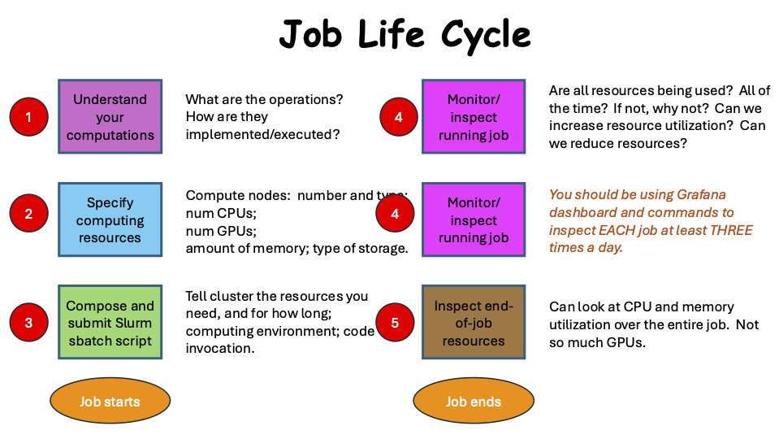

# How to Select (Compute) Resources for a (Slurm) Job

---

## Detailed Topics

1. [Motivation](./motivation.md)
2. [Resource differences across clusters](./cluster_resources.md)
3. [Reduce time your job spends in queue](./reduce_job_queued_time.md)
4. [Partitions](./partitions.md)
5. [Mapping job types to GPUs](./mapping_job_types_to_gpus.md)
6. [Storage](./storage.md)
7. [Longer running jobs](./longer-running-jobs.md)
8. [Interactive versus batch jobs](./interactive_vs_batch_jobs.md)
9. [Submitting batch jobs](./submit_job.md)
10. [Checking on in-progress jobs](./checking_on_in_progress_jobs.md)
11. [Checking on completed jobs](./checking_on_completed_jobs.md)

### Prerequisites

- You will need an ARC account to follow along and set up these tools.
- Access to a VT network (e.g., _eduroam_ on campus or _VPN_ off campus)

### Applicability

This content is applicable to all ARC compute clusters.

### Big Picture

The graphic below represents a job life cycle, from the models
you employ and the computations that result, to job completion
and evaluation of results.
For our purposes here, the results are computational efficiencies
of cluster hardware
(not application results, which are also paramount).

Our focus in this workshop is Step 2, specifying resources.

We have workshops on all of these steps, except Step 1, where
you have to understand your code, or the code that you are using.

The point is that to complete your work, there is not just one
step to take, and the information in workshops is broken down
to make the content manageable.

But one should keep in mind this entire process.

For example, once you compose and submit a job (Step 3), the
next step is _**NOT**_ to wait for it to complete.
Rather, there is a Step 4 that is vital for each user to 
execute in order to do their part in trying to ensure that the 
ARC system resources are used to the greatest extent possible.

One could equally call this graphic the 
_**User Responsibility Life Cycle**_.

Finally, this process is iterative.

---
[Next: Motivation ➡️](./motivation.md)
