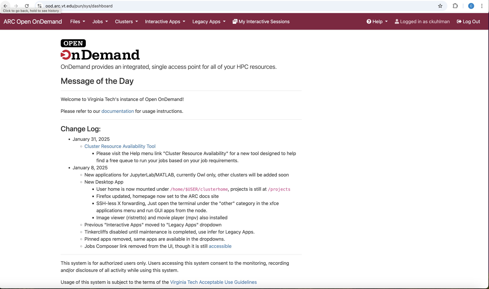

# Accessing OOD
April 17th, 2026

#### Link Back To Main

[Back to Main Page](./main-ood.md)

## Steps to Access OOD for VT ARC Cluster Use

To access and use OOD on VT clusters:
1. An installed web browser on your laptop.  Chrome, Firefox preferred.
2. You need to use
    (a) the university network [if you are on campus], or
    (b) VPN (i.e., VT Traffic over SSL VPN)
3. Once connected, go to: [https://ood.arc.vt.edu](https://ood.arc.vt.edu).
4. Then, you can log in using your VT credentials (PID and password).
   (If already logged into another VT site, you may not need to enter any credentials at all.)

You will be taken to the OOD landing (home) page.

## Landing Page

This is the landing page for OOD.

When we give directions for how to start an application or feature, we do it from
this page.

[VT OOD Landing Page](./figures/ood-files-n-jobs/ood-landing-page.pdf)

We will focus on main tabs:

1. Files
2. Jobs
3. Clusters
4. Interactive Apps

