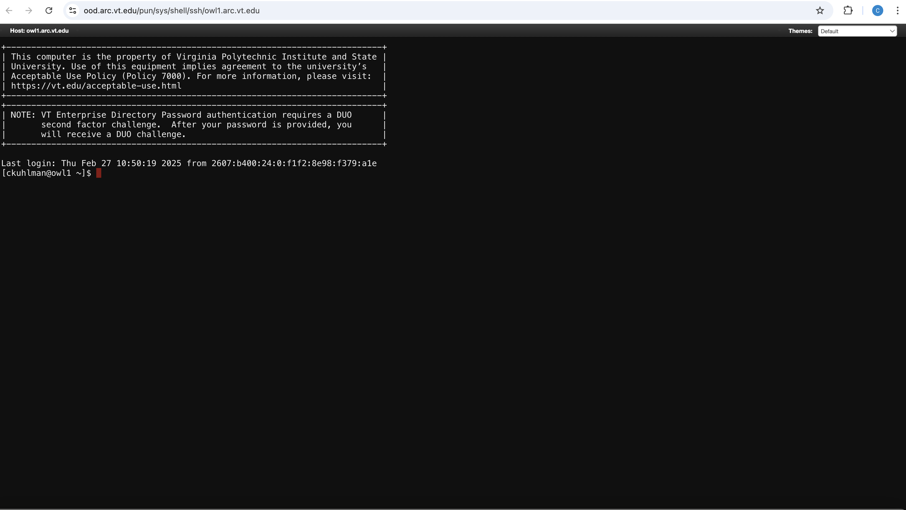

# Obtaining a Terminal Window and Shell

#### Link Back To Main

[Back to Main Page](./main-ood.md)

## Obtaining a Terminal Window and Shell on a Specified Cluster

On command bar at top of the landing page, click `Clusters` and 
then select the particular cluster on which to open the terminal
window.  Options are:

1. Tinkercliffs
2. Infer
3. Owl
4. Falcon

A new browser tab will be opened and a terminal window on the specified
cluster will appear in that browser window.

An example terminal screen, when selecting `Owl` above is shown below:

You can then issue commands from the command line, as normal.
Running commands via terminal windows in OOD will be a little slower
than using terminal windows directly on your laptop and ssh'ing into a 
cluster because the latter approach does not have OOD in the software stack.

