# Running Matlab

#### Link Back To Main

[Back to Main Page](./main-ood.md)

## Copying and Pasting with noVNC

In the instructions for this example, a lot of detail is shown
as to how to copy commands from terminal windows on ARC clusters
(including those within OOD) into the Matlab windows.

This more elaborate procedure is not an ARC issue:  it is a 
windowing issue over which VT ARC has no control.

## Launching Matlab

On command bar at top of the landing page, click `Interactive Apps` and 
then select `Matlab`.

Fill out the form in an analogous fashion to that shown below.
Note:  you will need a different account from `arcadm` which
is an administrator account.

Matlab is a taxing application, so consider specifying four cores per node.

[Matlab Launch](./figures/matlab/matlab-launch.pdf)
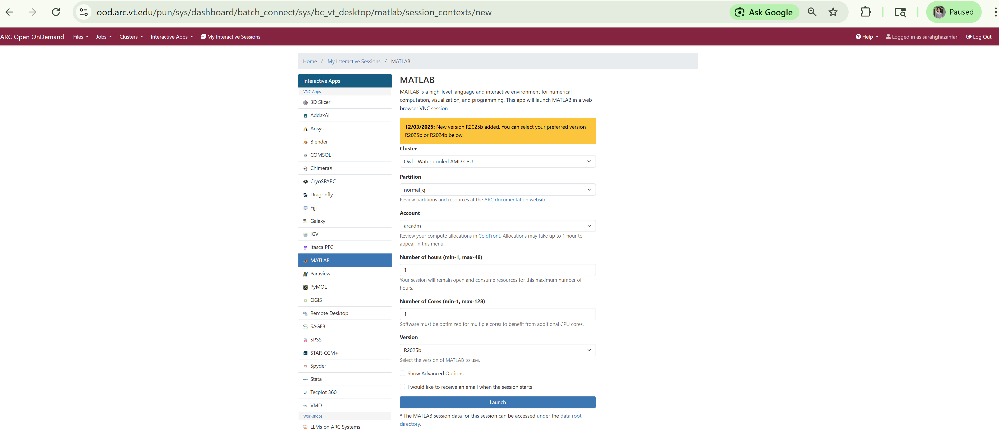

After clicking the `Launch` button,
you will see an information screen.
This is a transient screen while Slurm is trying to find 
resources for you to run on via `salloc`.
Then you will see a screen with
the compute node on which you are running (see `Host`).
You will also see a `Connect to Matlab` button.
Click that.

[Matlab To Connect](./figures/matlab/matlab-delete-at-end.pdf)
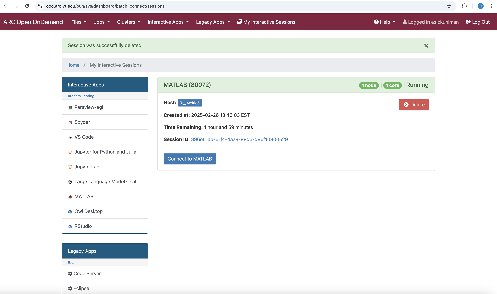

Give it some time to pull up the app.

Then you will see the familiar Matlab UI in a new browser window.

## Matlab UI

Be patient with Matlab.  It can sometimes take a bit for windows
to appear or commands to take effect.

When you come onto the Matlab UI, it will look as below.

[Matlab Landing Page](./figures/matlab/matlab-landing-page.pdf)
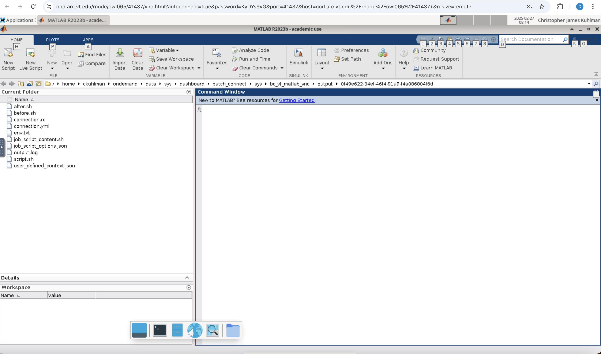

## Setting Preference to Windows Format

Copying and pasting text is a somewhat of a issue with Matlab
through OOD.
This is not a VT issue; it is a Google, Apple, Mozilla-induced
issue.
We show how to do this; we need to do this in
both approaches to running Matlab code below.

Here, we change a setup option to help us with this copying
and pasting.

At the top, roughly center to center-right of screen, click `preferences`.
You will see the screen below.

[Matlab Preferences Initial](./figures/matlab/matlab-preferences-01.pdf)
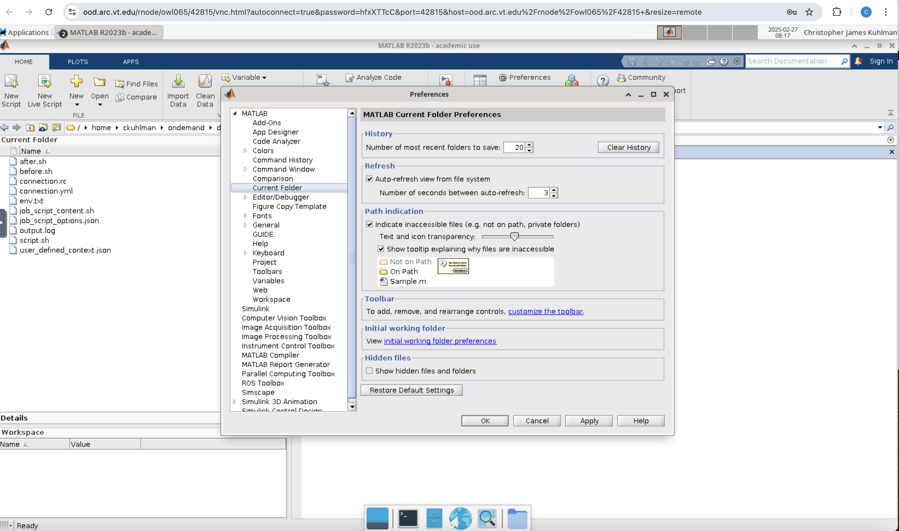

On the left side in the navigation pane, click `keyboard` and then
`shortcuts`.
See the figure below.
Look at the top field, `active settings`.
Change that to `Windows Default Set`.
Then click `OK` at the bottom of the form.

This process enables text pasted into the novnc clipboard 
(we will do this below) to remain commands or data, without
being converted to a string, which can be problematic.
If you do this once, you should never have to do this again,
even across sessions.

[Matlab Preferences Change](./figures/matlab/matlab-preferences-02.pdf)
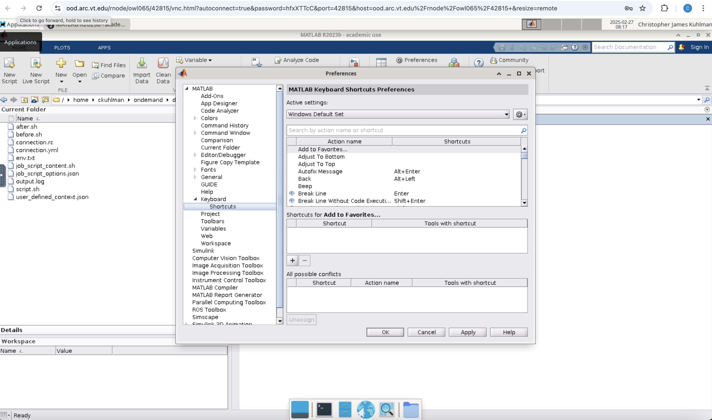

## Running Matlab:  Approach 1 of 2

As an aside, note that if you `ssh` into the cluster and issue
`squeue -u <username>` then the output will not show as Matlab
running, but rather as `sys/dash` running.

In the Matlab Command Window, you can specify `pwd` to see your
current working directory, and use
`cd()` to change the working directory.

Also, to see filenames, 
on the lower right pane, you can click the ellipsis (...) on the far right
and specify a directory to change to, such as `/projects`.
Then you can navigate to a working directory, like this one:

~~~bash
/projects/kuhlman-project-storage/workshops/y2025/2025-03-xx/ood/on-owl/matlab
~~~

where we assume that there is a file called _matlab.01.dat_ with five
data values for each of seven days.
Its contents are:

~~~bash
Day1  Day2  Day3  Day4  Day5  Day6  Day7
95.01 76.21 61.54 40.57  5.79 20.28  1.53
23.11 45.65 79.19 93.55 35.29 19.87 74.68
60.68  1.85 92.18 91.69 81.32 60.38 44.51
48.60 82.14 73.82 41.03  0.99 27.22 93.18
89.13 44.47 17.63 89.36 13.89 19.88 46.60
~~~

Also in that same (working) directory there needs to be the file
code01.m.
This code operates on the data.
Its contents are below:

~~~matlab
filename = 'matlab.01.dat';
delimiterIn = ' ';
headerlinesIn = 1;
myData = importdata(filename,delimiterIn,headerlinesIn);

for k = [3, 5]
   disp(myData.colheaders{1, k})
   disp(myData.data(:, k))
   disp(' ')
end
~~~

So we need two files in the working directory:  matlab.01.dat and code01.m.
You make these files on the ARC cluster by copying the contents
of the files from these web pages and pasting them directly into files
on the cluster.
(You can use the vi editor, for example.)
For this copying and pasting, you use `cntrl-c` and `cntrl-v`
on Windows and `cmd-c` and `cmd-v` on Mac OS, just as you 
normally do.

Now we have to copy and paste into the Matlab Command Window.
Because we are pasting directly into Matlab and we have a novnc
environment, each copy and paste operation involves multiple
steps.
In the Command Window of the Matlab UI we enter each of these commands
below, in turn.
Note that the path here that we are using is just an example.
You can put the two files---matlab.01.dat and code01.m---anywhere
in your home or projects area.
Whatever is the full path to these files for you in your file structure, that
is the path you use with the `cd()` command.

~~~matlab
% Change the working directory to the following:
% (Note in the above, you can use ANY working directory where
% the two files matlab.01.dat and code01.m are located.)
cd("/projects/kuhlman-project-storage/workshops/y2025/2025-03-xx/ood/on-owl/matlab")

% Execute the Matlab statements in file code01.m, by leaving off ".m".
code01
~~~

To do this, first highlight the `cd` command and use `cmd-c` on a Mac 
and `cntrl-c` on Windows to copy the text.
From here on, we only specify the Mac OS commands.

You see a small tab at the left side of the figure below, about one-half
way down the side.
You click that tab.

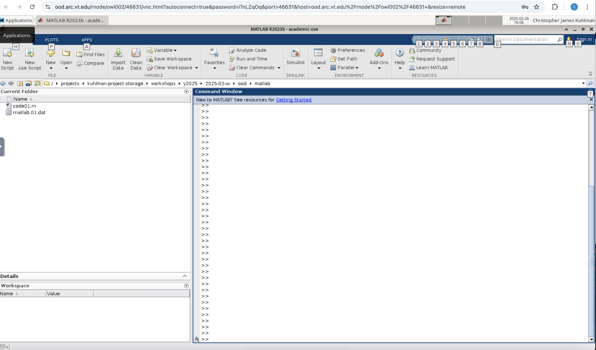

The result is shown below:  you see _novnc_ and six icons underneath
that.
The third icon down is the clipboard.
Click that icon.

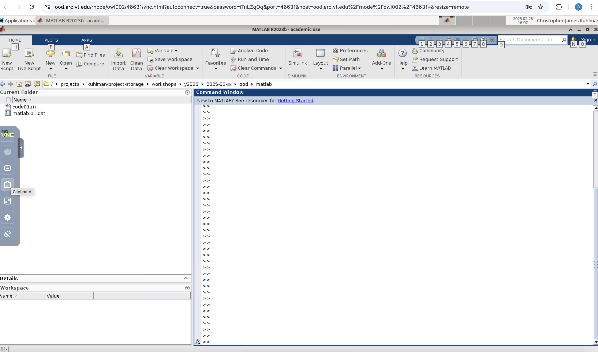

The result is that a clipboard popup appears, as below.

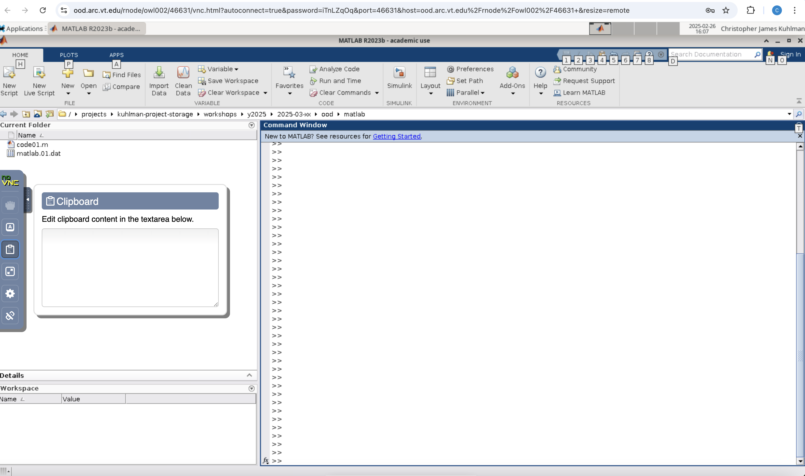

Use `cmd-v` (on Mac) or `cntrl-v` (on Windows)
to paste the `cd` command into the popup box.
The result is the next figure below, where the text is now in the
popup box.

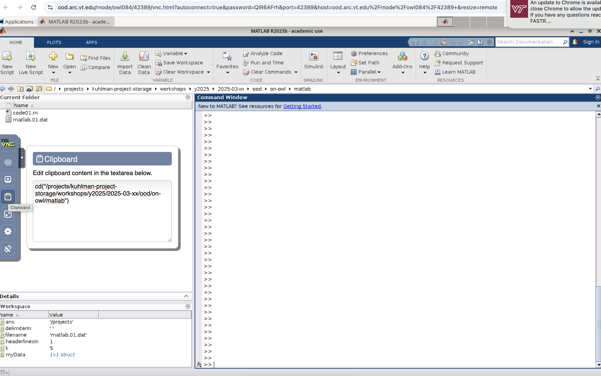

Click the tiny arrow to the left of `Clipboard` to retract the novnc
panel, as shown below.

Now move your cursor to the Command Window.
On your Mac laptop, tap your mouse with index and middle finger
simultaneously; this is the so-called
right click on a Mac.
The resulting popup box is shown below in the Command Window.
Select `Paste` to paste what is in the novnc clipboard into the
Matlab Command Window.
You can also use the shortcut `cntrl-v`.

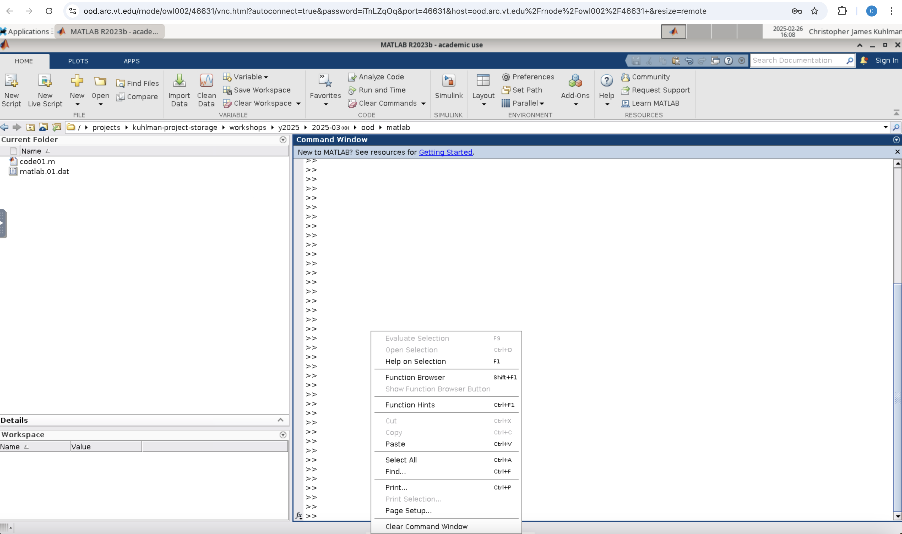

The `cd` command now appears in the Matlab Command Window below.
Hit the `Return` key to execute.
Then type `pwd` to confirm the directory is as you specified
with the `cd` command.

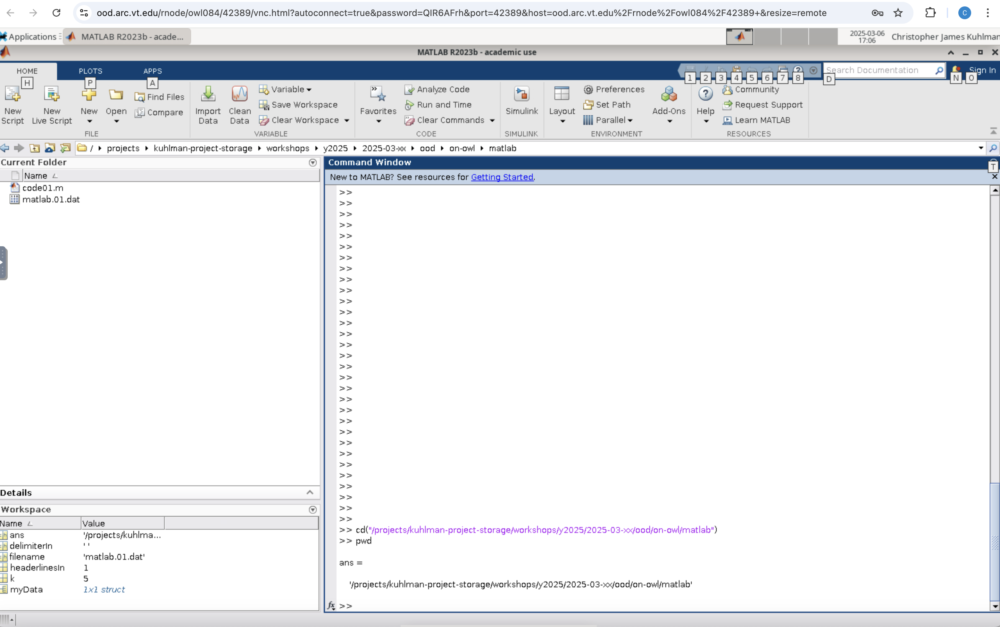

The entire above process is now repeated, but this time for the
`code01` command in the R code above.
(The six characters of `code01` are such that you can just enter
`code01` in the Matlab Command Window; we are talking of the general
case here where the text may be long.)
The end result is that `code01` is pasted into the Command Window
and after hitting return,
code01 is executed (i.e., the `code01` command here executes
the code that is in the `code01.m` Matlab source code file)
and the results below are generated.

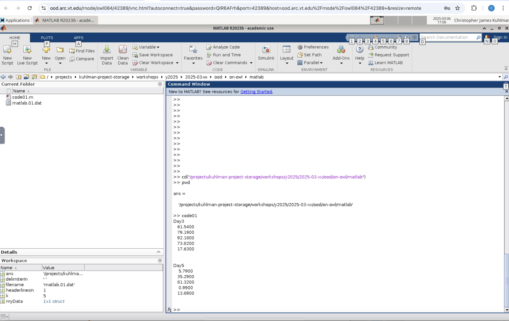

The result printed in the Matlab Command Window should be:

~~~bash
Day3
   61.5400
   79.1900
   92.1800
   73.8200
   17.6300

 
Day5
    5.7900
   35.2900
   81.3200
    0.9900
   13.8900
~~~

You can see that these data agree with the most recent screen capture.

You can continue at will with other analyses.

## Running Matlab:  Approach 2 of 2

This is going to be similar to the first approach, but this time,
we only make the data file `matlab.01.dat`, as before.
We are NOT making a Matlab source code file `code01.m`.

Instead of making that file, we are going to paste the
contents of the source file `code01.m` directly into the
novnc clipboard.

The figure below shows that we still have to copy and paste into the
novnc clipboard the `cd` command as before, because our data file
`matlab.01.dat` is still in that directory.

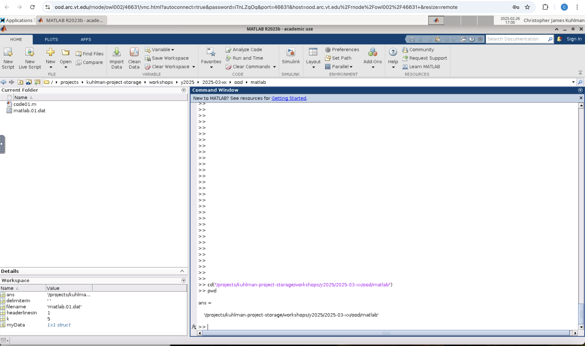

The figure below shows the code statements that we copied from above
`code01.m` file (above) and have pasted into the novnc clipboard.

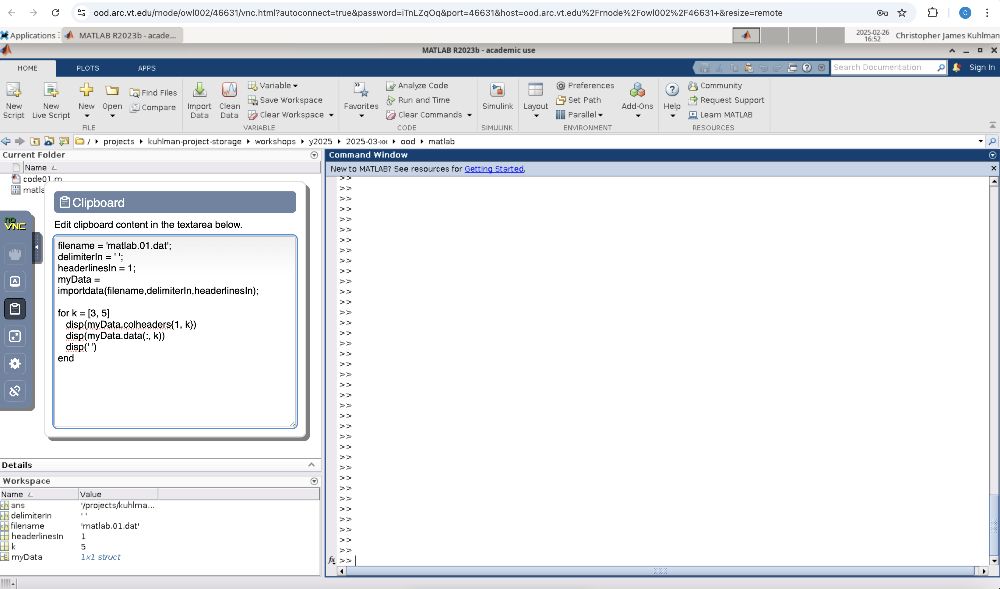

This figure shows the results of going to the Command Window
and tapping simultaneously with index and middle fingers to
simulate a right mouse click, and then select the `Paste` option
as we have done before.
The result is that the text of the `code01.m` file is now
pasted in the Command Window.

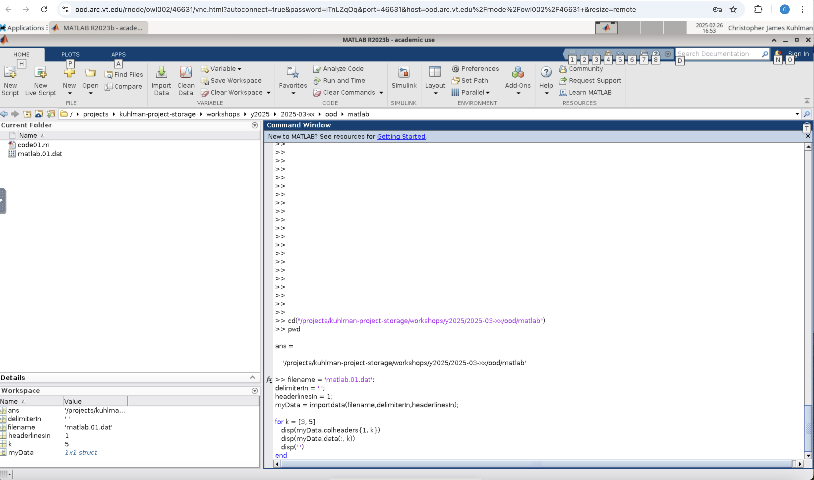

Hitting return executes the commands and generates the output,
which is the same as that above.

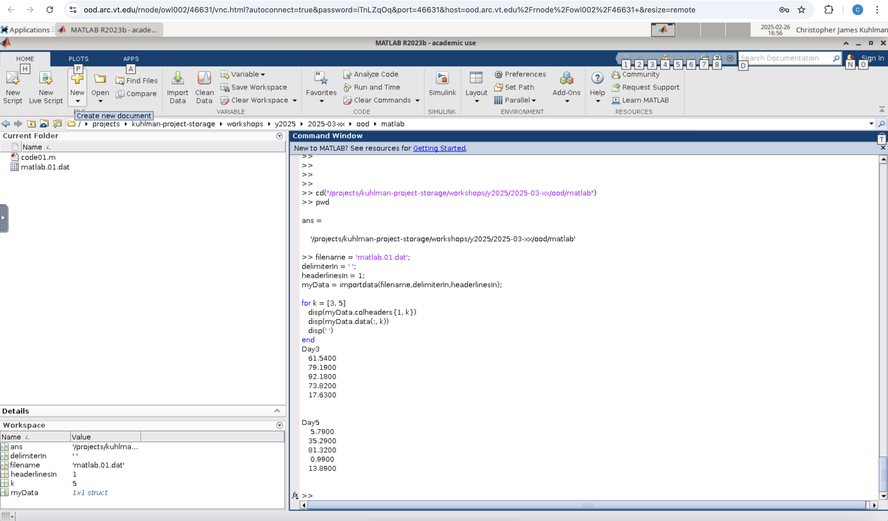

Incidentally, this pasting of code is why we set the `Active settings` to
`Windows Default Set` at the outset of this episode, for Matlab.
Otherwise, when we pasted the code of `code01.m` into the Command Window,
it would have been one long string instead of code, and would not have run.

Thus, you have options on how to work with Matlab, based on
your inclinations.

## Ending a Matlab Session

- Go to the browser window running Matlab.
- Close/delete the browser window (tab) containing Matlab.
- **Go back to the browser tab above, look for the Matlab card
  that has the red `Cancel` button, and
  click that to end the session.**
    - It is imperative that you click the `Cancel` button when you are finished.
    - _**If you do not click the `Cancel` button, then the resources allocated to you
      by Slurm to run your R task will remain with you, and since you are done,
      those RESOURCES WILL SIT IDLE UNTIL YOUR SELECTED TIME HAS EXPIRED 
      BECAUSE NO ONE CAN USE THEM.**_

> [!NOTE]
> Over all ARC systems, not `Cancel`ing (i.e., giving back) OOD resources when you
> are done with them is a HUGE source of wasted resources.

> [!NOTE]
> This is a waste of resources for you and for all users.

