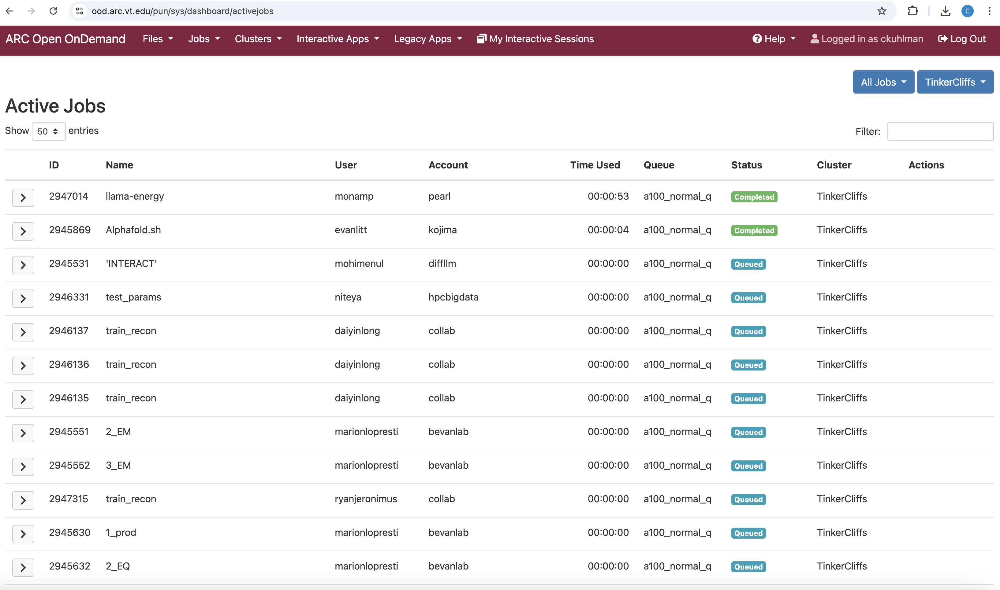

# Viewing Jobs

#### Link Back To Main

[Back to Main Page](./main-ood.md)

## Procedures for Viewing Jobs

On command bar at top of the landing page, click `Jobs` and
then click `Active Jobs`.
You will see a screen like the one below.

[Active Jobs](./figures/ood-files-n-jobs/ood-active-jobs.pdf)

Then, at the top right, select from the `All Jobs` list whether you
want to view all jobs or just your jobs.
(Users can only view their own jobs.)
Then, at the top right, select from the `All Clusters` list whether
you want all clusters or a particular one.

In the graphic above, all jobs on Tinkercliffs are listed.

The data provided are analogous to those obtained with `squeue` on
the command line.

