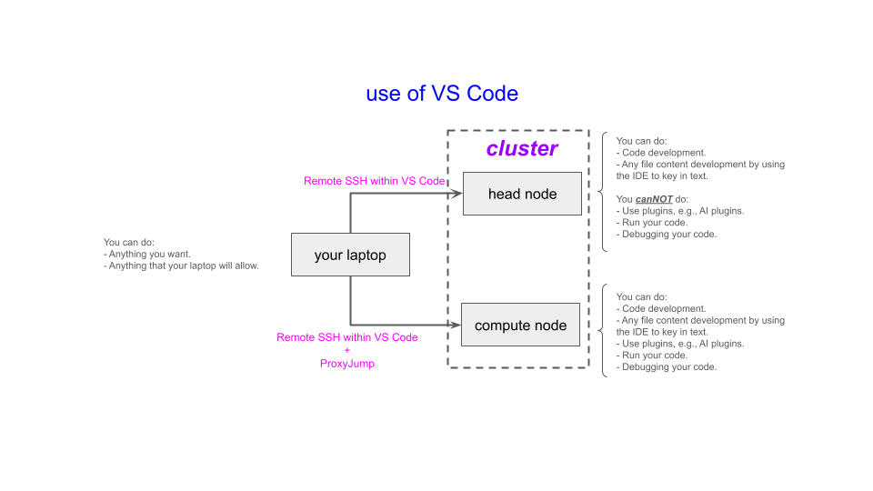

# Operating Visual Studio (VS) Code On Compute Nodes

## ARC Resources and Mechanisms for Assistance

A <a href="https://docs.arc.vt.edu/all-help.html" target="_blank">listing</a> of all ways to get help and access to information, and links to those resources, are provided.  Examples:

- determine and attend office hours
- submit help tickets (for errors, problems, or request a consultation)
- obtain listings of workshops (and video recordings and notes files)
- view video tutorials
- run example codes
- understand overall cluster status and performance, as well as those of your jobs, via dashboards
- more

## Ideas Behind This Workshop

1. VS Code (VSC) is a popular IDE for developing code and content
   for other files.
2. Running VS Code is allowable on login (head) nodes _**IF**_:
   1. You do not run with plugins, e.g., do not run with AI plugins.
   2. You do not run code:  no code execution, no major code debugging.
3. Why these restrictions?
   1. Because login nodes are communal resources that all users make use of _**simultaneously**_.
   2. Compute nodes, on the other hand, are used by a _**selected few**_ users at a time according to Slurm scheduler operations.
   3. So if you are consuming lots of resources on login nodes,
          then you are degrading 
          the performance of the login nodes for all other users.
       1. VS Code is a _**primary**_ way that users consume too many resources on login nodes.
   4. It is most useful to think of yourself and all other
         1000 ARC users as being in the same boat:
         we need to be respectful of others, by following agreed upon procedures, so that everyone
         can work efficiently and get their work done.
4. To summarize the purpose of this workshop:
   I want to use VS Code to do my work and
   1. I want to debug and run my code from within VSC, and/or
   2. I want to use AI or other plugins with VSC.
5. How do I do this?
6. By running your instance of VS Code on a _**compute**_ node 
   (and not a _**login**_ node).
7. This workshop focuses on how to run VSC on ARC compute nodes.

[VS Code Use](figures/vs-code-in-ways.png)

### Applicability

1. These procedures apply to Tinkercliffs (TC), Owl, and Falcon clusters.
2. If your code uses CPUs only, then you should run VSC on clusters 
   and partitions on them that are CPU-only.
3. If your code uses GPUs, then you should run VSC on clusters 
   and partitions on them that have GPUs.

### Prerequisites

1.  Have SSH installed on your local machine (comes with most laptops). [SSH keys](https://docs.arc.vt.edu/usage/sshkeys.html) is a great way to configure ssh and the clusters so that 
    login is fast.
2.  If working remotely, have [VT VPN](https://www.nis.vt.edu/ServicePortfolio/Network/RemoteAccess-VPN.html) installed on your laptop (local machine).
3.  Have an ARC [account](https://arc.vt.edu/account).
4.  Have an ARC Project for file storage.  Not absolutely critical for this
    workshop, because you can here use `/home/<username>` for this workshop, but critical for your work long-term.
      1. If you are a professor (i.e., PI), then create a project [here](https://docs.arc.vt.edu/pi_info/allocations.html).
      2. If you are a student, find a professor to work with.
5.  Have an [allocation](https://docs.arc.vt.edu/pi_info/allocations.html) to charge "jobs" to.

## Detailed Topics

1. [Summary of steps](./summary_of_steps.md)
2. [Step 1:  One-time setup](./step_1_setup.md)
3. [Step 2:  Use of VS Code on compute nodes](./step_2_every_session.md)
4. [Step 3:  Potential access issue and solution](./step_3_possible_error.md)

## Acknowledgment

1. Eslam Huessein for developing the [document in
   the ARC DOCS](https://docs.arc.vt.edu/usage/vscode_remote_ssh.html).
   This workshop is largely based on his information and document.
2. Matthew Brown and Ayat Mohammed are thanked for
   interpreting the authentication problem.

---

[Next: Summary of steps ➡️](summary_of_steps.md)