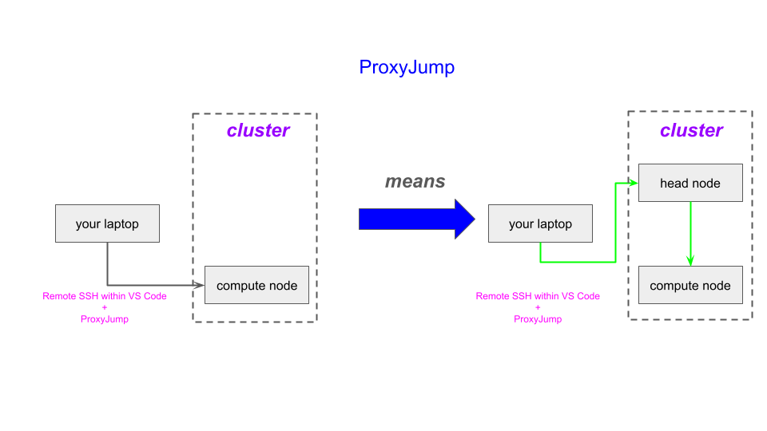

⬅️ [Previous: Main](vs-code-on-compute-nodes.md) | [Next: Step 1:  Setup ➡️](step_1_setup.md)

---

## Summary of Major Steps

We order the activities into setup steps that you execute
one time and steps that you repeat every time you use 
VSC on a compute node.

1. One-Time Setup Steps
   1. Laptop (or local machine)
      1. Alter the `config` file under directory `~/.ssh` as below.
      2. This will enable ProxyJump.
   2. VS Code
      1. Install VS Code (VSC) on your laptop.
      2. Install the `Remote-SSH` plugin in your VSC app.
      3. NOTE:  you may already have VSC installed and the `Remote - SSH` plugin installed.
2. Steps To Use for Every VS Code Session on Compute Node
   1. Request an interactive job on the ARC clusters.
      1. From a terminal window on your local machine, make an `ssh`
         connection to a login node whose compute nodes you want to
         run VSC on.
      2. From this login node, make a request of slurm, via the `interact` command,
      to provide you with your specified resources (on a compute node).
      3. Note `hostname` of the _**compute**_ node you are given.  You will need it below.
   2. From your laptop, using VSC, connect to the compute node via ProxyJump.
      1. You will need that hostname of the compute node.
3. Actions to take for authenticity problem, if you get the message
   in VSC:  "the authenticity of host cannot be established"

[ProxyJump on ARC Clusters](figures/proxy-jump.png)

---

⬅️ [Previous: Main](vs-code-on-compute-nodes.md) | [Next: Step 1:  Setup ➡️](step_1_setup.md)
