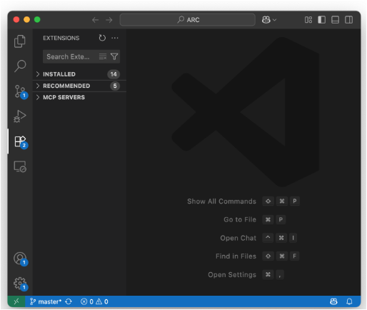
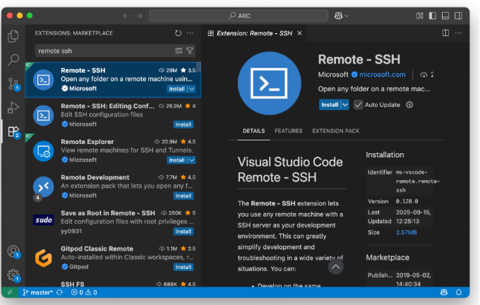
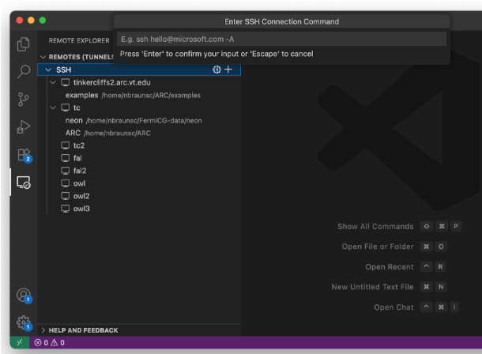
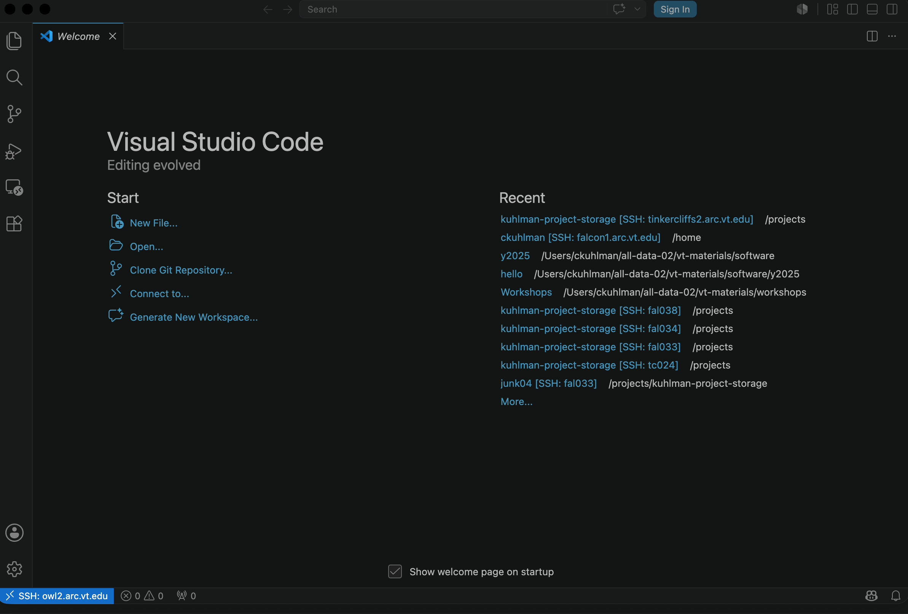

# Operating Visual Studio (VS) Code On Login Nodes

## ARC Resources and Mechanisms for Assistance

A <a href="https://docs.arc.vt.edu/all-help.html" target="_blank">listing</a> of all ways to get help and access to information, and links to those resources, are provided.

## Ideas Behind This Workshop

1. VS Code (VSC) is a popular IDE for developing code and content
   for other files.
2. Running VS Code is allowable on login nodes _**IF**_:
   1. You do not run with plugins, e.g., do not run with AI plugins.
   2. Do not debug code:  no (major) code debugging.
   3. You do not run code:  no (major) code execution.
3. Running VS Code on login nodes is for software/file construction.
4. Why these restrictions?
   1. Because login nodes are communal resources that all users make use of _**simultaneously**_.
   2. Resources on compute nodes, on the other hand, are 
      _**dedicated**_ to a particular user for a specified time; slurm does the resource assignments.
5. Hence, if you want to do all of the following, please see the
   workshop materials on _**running VS Code on compute nodes**_. 
   1. Construct source code.
   2. Use any number of plugins to help you develop code.
   3. Debugging your code.
   4. Run/executing your code.
6.  This workshop focuses on how to run VSC on ARC _**login**_ nodes.

[VS Code Use](figures/vs-code-in-ways.png)

---------------------------------------

---------------------------------------

## Organization

---------------------------------------

---------------------------------------

### Applicability

1. These procedures apply to Tinkercliffs (TC), Owl, and Falcon clusters.
2. If your code uses CPUs only, then you should run VSC on clusters 
   and partitions on them that are CPU-only.
3. If your code uses GPUs, then you should run VSC on clusters 
   and partitions on them that have GPUs.

### Prerequisites

1.  Have SSH installed on your local machine (comes with most laptops).
    [SSH keys](https://docs.arc.vt.edu/usage/sshkeys.html) is a great way to configure ssh and the clusters so that 
    login is fast.
    This is covered in detail in the workshop _ssh keys_.
2.  If working remotely, have [VT VPN](https://www.nis.vt.edu/ServicePortfolio/Network/RemoteAccess-VPN.html) installed on your laptop (local machine).
3.  Have an ARC [account](https://arc.vt.edu/account).
4.  Have an ARC Project for file storage.  Not absolutely critical for this
    workshop, because you can here use `/home/<username>` for this workshop, but critical for your work long-term.
      1. If you are a professor (i.e., PI), then create a project [here](https://docs.arc.vt.edu/pi_info/allocations.html).
      2. If you are a student, find a professor to work with.
5.  Have an [allocation](https://docs.arc.vt.edu/pi_info/allocations.html) to charge "jobs" to.  (Not critical for this workshop.)

### Overview:  Major Activities in this Workshop

We order the activities into setup steps that you execute
one time and steps that you repeat every time you use 
VSC on a login (head) node.
The third section contains some illustrative examples for
using VS Code on ARC cluster login nodes.

1. One-Time Setup Steps
   1. VS Code is installed on your laptop.
   2. Start VS Code.
   3. Install the "Remote - SSH" plugin on your laptop instance of VS Code.
2. Steps to repeat each time you want to use VS Code
   on a login node.
   1. Step #1 above must be completed.
   2. Using an instance of VS Code on your laptop,
      make an ssh connection to a login node of an ARC cluster of your choice.
   3. A new VS Code instance will start, and this new instance is
      connected to the cluster (i.e., is running on the cluster), as indicated in the blue box
      in the lower left of the 
      VS Code IDE.
   4. You can now work on the cluster using this VS Code IDE instance.
3. Representative actions using VS Code on the login node of an
   ARC cluster.  Examples are:
   1. Changing to a particular directory.
   2. Making a new directory.
   3. Creating a new file.

---------------------------------------

---------------------------------------

## One-Time Setup

---------------------------------------

---------------------------------------

### Install the `Remote-SSH` plugin in your VSC app.

1. Start VS Code on your laptop.
2. On the left command bar, click on the "Extensions" icon.
   (Hover over an icon with your cursor to see the
   name of the icon.)
3. In the new view, you will see "Extensions: Marketplace"
   at the top.
4. Just below this heading is a search field.  Enter "Remote SSH" into
   that field and hit return. 
5. Look for the resulting entry in the search results
   that has as a title 
   "Remote -- SSH".
6. When you locate this entry, look to the lower right of this
   entry for a blue box that says "install" and click that install
   button.
7. When the installation is completed, go back to the 
   search field and backspace over the characters until the field
   is blank.
8. At this point, you should see plugin headings "installed," 
   "recommended," and "enabled."
   1. You can scroll through each of these in the event there
      are many entries under a heading.
   2. You can thereby see all of the plugins you have.

Some details of the above ...

Extensions icon is fifth one down on left side.

Typing "Remote - SSH" in the search field brings up
multiple extensions that can be installed.
The highlighted one is the one we want.

---------------------------------------

---------------------------------------

## Using VS Code on an ARC Login Node

---------------------------------------

---------------------------------------

### To Begin Work on a Login Node of an ARC Cluster with VS Code

1. Start VS Code on your laptop.
2. On the left command bar, click on the "Remote Explorer" icon.
3. In the new view, you will see "Remotes (Tunnels/ssh)."
   Under this heading, click on the "SSH" heading.
4. Keeping your mouse/arrow hovering over the "SSH", on the far right of this
   clicked heading, you will see a 
   gear and a "+" sign.
5. Click the "+" sign.
6. A pop-up box will appear in the middle of the IDE and show the title
   "Enter SSH Connection Command."
   In that
   field you will type any of these ssh connection commands,
   depending on which login node you want to connect to
   (substitute your actual VT PID for `my_pid`):
   1. `ssh my_pid@tinkercliffs1.arc.vt.edu`
   2. `ssh my_pid@tinkercliffs2.arc.vt.edu`
   3. `ssh my_pid@owl1.arc.vt.edu`
   4. `ssh my_pid@owl2.arc.vt.edu`
   5. `ssh my_pid@owl3.arc.vt.edu`
   6. `ssh my_pid@falcon1.arc.vt.edu`
   7. `ssh my_pid@falcon2.arc.vt.edu`
   8. ssh to any other appropriate login node.
7. Hit return after entering the ssh command above.
8. Four options will be displayed.
   1. If you are on a mac, choose `/Users/<user ID>/.ssh/config`.
9. At the lower right of your VS Code screen, you will 
   see a box and some text inside.
   1. Some text might be: "Host added!"
   2. Other text might be:  "Source: Remote-SSH"
   3. There will be a button `connect`.  Click on it.
   4. A new instance of VS Code will appear. 

Some details of the above steps ...

Remote Explorer icon is the sixth one down on the left side.
Highlight "SSH" as shown in this image and then click the
"+" sign to produce the pop-up box where you enter
one of the `ssh` commands above for the particular login
node that you want.

The new instance of VS Code that has the ssh
connection to the ARC login node specified above.
This is confirmed by the blue box in the lower left corner,
which shows the ssh connection.

Notice in the lower left, in blue, is confirmation
that you have `ssh`ed into an ARC cluster login node;
in the image above, it is the owl2 login node.

You are now using your VS Code instance on your laptop
to access the content of a cluster login node.

You can now do your work.

When your is completed, make sure all of your files are saved,
because this next step will NOT prompt you if your files are
not saved---you will lose your work.
Click that blue box in the lower
left corner of the VS Code instance
(the one that displays the ssh connection), and a pop-up box
will appear at the top of the screen, with a drop-down list.
Click `Close Remote Connection` and your ssh connection
to the cluster login node will cease.

---------------------------------------

---------------------------------------

## Using VS Code on an ARC Login Node

---------------------------------------

---------------------------------------

### Navigating Directories

1. Click on Explorer icon in left pane.
2. Click on the blue box "Open..." or "Open Folder" hyperlink
   in the middle of the IDE.
3. Go to the top middle pop-up box and type the directory where you
   want to go.
   You can keep entering the path, or click your choice
   of next subdirectory (the subdirectories pop up).
   Files residing in that directory will appear on left.
   (You might want to choose the highest-level directory that
   you will access, as the directory chosen becomes the root
   of the Explorer directory structure.)
4. When done, click the blue box "OK."
5. The navigation pane will show the directory content, like "explorer."

### Creating a New Directory

1. Start with the directions for "Navigating Directories" above.
2. Either specify the entire path to the new directory,
   or part of it.
3. If you have specified only part of the path to the new 
   directory, you can go to the immediate left in the IDE
   and click directories from the Explorer view to reach the
   directory below which you want to put the new directory.
4. In the explorer pane, at the root directory of Explorer,
   click the directory icon with the "+" on it.
5. A new field will be shown in Explorer where you type the
   name of the new directory.

### Opening an Existing File

1. In the main, center pane, click `Open ...`.
2. This will open a pop-up at the top center and you can navigate
   to a directory as they are shown down the left side.
3. The explorer
   is along the left (i.e., directories are along the left) and when you click on a file, its contents show in the main pane.
4. Make changes to the file and save them.

### Creating a New File

Option 1

1. Click on `Open` and navigate to the directory where
   you want to place the new file by entering on the pop-up
   in the center top of the screen. (See instructions above
   for navigating directories.)
2. Click `New File` and enter the name of the file.
3. You will now be put inside a new file with the specified filename,
   in the specified directory.
 
Option 2

1. Follow the instructions for "Navigating Directories" to
   get to the directory where you want to create a new file.
2. In the explorer pane, at the root directory of Explorer,
   click the file icon with the "+" on it (hover over it for 
   clarity).
3. A new field will be shown in Explorer where you type the
   name of the new file.   

### Terminal pane within VS Code

Terminal screens are useful for loading modules
and
navigating to files
and directories, like virtual environments.

To obtain a terminal screen:

1. Click "Terminal" in the command bar.
2. Click "New Terminal."
3. The terminal pane will appear in the lower middle of the
   VS Code IDE.
4. You can now specify terminal commands.

### Transfering Files To Cluster

On a Mac.

1. Open a Finder Window and navigate to the directory
   containing the files that you want to move to the 
   cluster.
2. Have VS Code open on a compute node or login node.
3. Use the procedures in "Navigating Directories" to 
   move to the destination directory of the file
   transfer on the ARC cluster.
4. Simply highlight and move the file from Finder 
   to the directory in the VS Code Explorer.

On Windows

Use the file Explorer rather than Finder in the directions
above for a Mac.

## Acknowledgment

1. Sarah Ghazanfari for developing the notes for this workshop,
   using PowerPoint slides.
   This document is based massively on her work.
