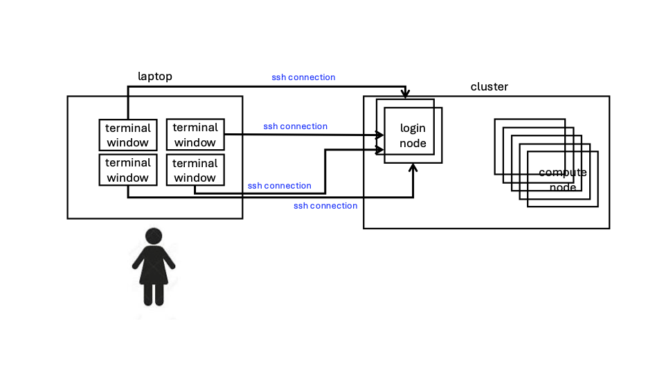
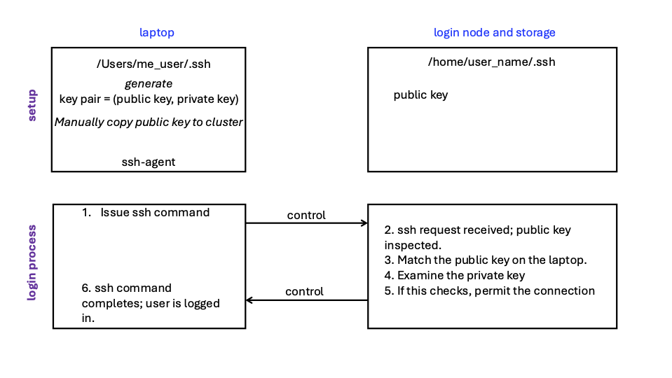

# Using Open OnDemand (OOD) on ARC Clusters

## ARC Resources and Mechanisms for Assistance

A <a href="https://docs.arc.vt.edu/all-help.html" target="_blank">listing</a> of all ways to get help from VT ARC and access to information, and links to those resources, are provided.  Examples:
- determine and attend office hours
- submit help tickets (for errors, problems, or request a consultation)
- obtain listings of workshops (and video recordings and notes files)
- view video tutorials
- run example codes
- understand overall cluster status and performance, as well as those of your jobs, via dashboards
- more

## SSH (Secure SHell)

####  What is ssh?

ssh is a method and a mechanism for securely accessing computing-related resources;
in our case, the ARC clusters and servers.

####  What can it do for me?

You must log in to the clusters---even for using OOD you must
log in to the VT network---and ssh is the way to log in to the clusters.

####  Is it a pain to use default procedures?

ssh includes the requirement for two-factor authentiation (2FA).  Hence, the two steps are:
1. Use ssh to specify (i) your PID and (ii) the machine you wish to reach.
   1. Example:  `ssh my_vt_pid@tinkercliffs2.arc.vt.edu`
2. Complete 2FA, typically via the Duo app.

If one only had to do this one time, it would not be a big issue.
But when working on ARC clusters, one may have more than a dozen terminals
open at one time (each terminal login requires the two steps above).
If you take your laptop home, and work from home in the morning/evening, and work at VT during the day,
you may have multiple sets of logins (across all of your terminals each day).
It gets old/tedious really fast.


####  What can I do to make its use easy and fast?

There are two (possibly three) major tasks to complete.
Two are one-time setups.  The third can be done periodically.
Then you use the results to streamline logging into ARC clusters in quite significant ways.
For example, you can log into, say, four different terminal screens in about 2-10 seconds.

##### Task 1

Using ssh keys and a setup procedure, you can set up your computer (e.g., laptop) so that
logins to clusters are fast (essentially instantaneous) and easy (involves about six key strokes).
From a practical perspective, this setup with ssh keys enables you to issue the `ssh` command and
have it validate you, as a user, automatically, thereby bypassing the "manual" 2FA process.

##### Task 2

Dpending on whether you specify a password when you generate keys, 
you may need to start an "ssh agent" to store your password for
a prescribed length of time, after which you will have to start
a new ssh agent.
So:
- If you specify a password with ssh key generation, you will need an ssh agent.
- If you do not specify a password with ssh key generation, you will not need an ssh agent.
  

##### Task 3

One can also set up aliases for the clusters so that you do not have to do this:  `ssh my_vt_pid@tinkercliffs1.arc.vt.edu`.
Instead, you can do something like this:  `ssh tc1`.

## Workshop Goals

The goals of this workshop are to demonstrate these procedures and have
you execute them yourself, so that at the end of the work, you have
these one-time setup procedures COMPLETED and you can access the ARC 
clusters quickly.
If you use a password with ssh key generation, you will periodically
have to start a new ssh agent to hold your password.


## Other Resources

### ARC Docs Page

This page [https://docs.arc.vt.edu/usage/sshkeys.html](https://docs.arc.vt.edu/usage/sshkeys.html) contains details for constructing ssh keys
on both Mac and Windows laptops.

Here, we focus on Macs.

### Video

There are two excellent videos on ssh keys linked on the ARC Video page [https://docs.arc.vt.edu/usage/video.html#general-connections](https://docs.arc.vt.edu/usage/video.html#general-connections).


## Prerequisites

One of two cases:
1. Physically be on the VT campus and connect to the _eduroam_ network.
2. Be off campus and use VPN to access the VT network.  Installing VPN instructions are at [https://www.nis.vt.edu/ServicePortfolio/Network/RemoteAccess-VPN.html](https://www.nis.vt.edu/ServicePortfolio/Network/RemoteAccess-VPN.html).


## Context of the Solution

We show below a laptop (which is your laptop [or tower]) and
your home directory (storage location) that is accessible across
the Tinkercliffs (TC or tc), Owl (or owl), and Falcon (or falcon)
clusters.



Our goal is to streamline the process of establishing these "ssh connections"
to a cluster, from your laptop.

## Solution Approach

1. We are going to set up some strings (or keys) using some tools.
2. These keys will be generated on your laptop.
3. You will copy one of the keys, the public key, to the destination
   device on which you want to work; here, the ARC clusters.
4. All of these keys will be placed in well-known directories on the
   two machines so that the files containing the keys can be easily accessed.
5. ssh will do the work in using the keys to verify you, as a valid
   user of ARC clusters, using a protocol that involves these keys.



## Task 1

We are going to use the RSA method for generating keys.
Other methods include ed25519.
These methods essentially work the same way.

1. On your laptop, `cd ~/.ssh`
2. Type `ls -l` to long list the files.
3. Look for files:
    - config (we will use this to create "aliases").
    - id_rsa (we will generate this private key).
    - id_rsa.pub (we will generate this public key; the "pub" is for public).
4. If you have id_rsa and id_rsa.pub files already, then you may be using these keys
   in different apps like github or other clusters, so it is your choice as
   to whether to create new keys.
    - If you want, you could consider moving these files to different names
      so that they do not get overwritten/destroyed.  Example:
        - `mv id_rsa is_rsa.back`
        - `mv id_rsa.pub id_rsa.pub.back`
5. Create your new key pair = (public key, private key).
   Read this entire step first before doing anything because you will
   be asked for responses, so you do not want to jump ahead inadvertently.
    - `ssh-keygen -b 4096 -t rsa`
        - You will be asked for two things:
            - whether you want to change the names of files from the default.
               - You do NOT want to change the default names; go with the default names.
            - whether you want to enter a passphrase; leave it empty for no passphrase.
               - If you use a passphrase, then you will need an extra step (which is
               Task 2 below).
               - If you do not use a passphrase, then you will not need Task 2 below.
               - The choice is yours.
        - Note that `-b 4096` is required to make your key sufficiently complex/safe.
        - Note that `-t rsa` specifies the method.
    - This will create two new files, using the default names:
        - id_rsa (the private key)
        - id_rsa.pub (the public key)
6. We are going to copy the contents of the public key.  One way to do that is:
    - Type `cat id_rsa`
    - Highlight the resulting text and copy it.
7. Log into the TC, Owl, or Falcon cluster, the old clunky way.
    - `ssh my_vt_pid@owl3.arc.vt.edu`
    - Go to directory .ssh by typing `cd ~/.ssh`.
    - Add the public key to the file authorized_keys by doing:
        - `echo "<paste in here the public key contents that you copied in the previous step>" >> authorized_keys`
        - The above command appends your new public key to the end of file authorized_keys.
8. Exit off of the cluster.
    - Types `exit`.
9. Log into the cluster.
    - `ssh my_vt_pid@owl3.arc.vt.edu`
    - If you chose to specify a passphrase in the steps above, enter that now.
    - If you chose not to specify a passphrase in the steps above, you should be logged in to the cluster.
    - At this point, either way, you should be logged into the cluster.
    - Note that there is no two factor authentication the "old way" (e.g., with Duo).


## Task 2

This is only needed if you entered a passphrase when making the key pair
(public key, private key) with the `ssh-keygen` command above.
If you did not enter a passphrase, skip this step.

On your laptop, you want to start an "ssh agent."

This agent will remember that passphrase for a specified length of time.

The command is: `ssh-add  -t1h ~/.ssh/id_rsa`

This command starts an ssh agent, uses the private key, and for this example,
the passphrase held by the agent for 1 hour (the `-t1h` switch).
For this duration of time, you will not have to enter the passphrase in 
Step 9 of Task 1 because the ssh agent will automatically supply it.


## Task 3

With Tasks 1 and 2 above, we have obviated the need for manually performing
two factor authentication (2FA), thus streamlining login to the clusters.

There is one more step that is useful.
Issuing statements like `ssh my_vt_pid@tinkercliffs2.arc.vt.edu`
also becomes tedious.
There is a way to "alias" the long cluster specification with a short
substitute, and this will ease the cluster login process, e.g., 
to something like `ssh tc2`.


The `config` file, which on a Mac resides under `Users/my_user_name/.ssh`,
can be altered to include the text below.

Note that one substitutes in their own VT PID for `vt_pid`.
This collection of lines deals with all login nodes on the three
main clusters:  tinkercliffs, owl, and falcon.

```
# Add shortcut to log into tinkercliffs1
Host tc1
  HostName tinkercliffs1.arc.vt.edu
  User vt_pid
# Add shortcut to log into tinkercliffs2
Host tc2
  HostName tinkercliffs2.arc.vt.edu
  User vt_pid
# Add shortcut to log into owl1
Host owl1
  HostName owl1.arc.vt.edu
  User vt_pid
# Add shortcut to log into owl2
Host owl2
  HostName owl2.arc.vt.edu
  User vt_pid
# Add shortcut to log into owl3
Host owl3
  HostName owl3.arc.vt.edu
  User vt_pid
# Add shortcut to log into falcon1
Host falcon1
  HostName falcon1.arc.vt.edu
  User vt_pid
# Add shortcut to log into falcon2
Host falcon2
  HostName falcon2.arc.vt.edu
  User vt_pid
```

Each set of three lines, starting with `Host` gives an alias for
a longer string.

For example, `falcon1` is textually the same as `vt_pid@falcon1.arc.vt.edu`
in so far as ssh is concerned.

Hence, `ssh user_name@falcon1.arc.vt.edu` can be replaced with `ssh falcon1`.
And this is indeed how we use ssh to make connections to
ARC clusters: in a terminal window, we type `ssh falcon1` or `ssh owl2` or
`ssh tc1`, as needed.

## Summary

With Tasks 1 and 3 complete, you can come to campus, make sure
you are on the eduroam network, and then simply type `ssh owl2` or
`ssh falcon1` or `ssh tc1`, etc., to log into any cluster you want
using a terminal window.
If you entered a passphrase as part of the `ssh-keygen` command sequence,
you will periodically have to repeat Task 2.

## Acknowledgments

Thanks to Nicole Braunscheidel for creating the ARC docs page referred to
above.

Thanks to Justin Krometis for constructing the video above.

## References


