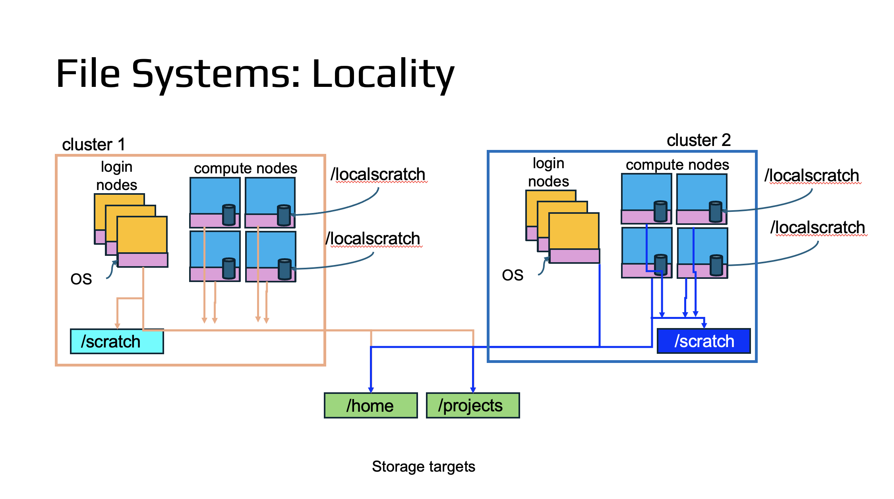

# Style reference

#### Block quotes and admonitions
`command`

#### Use language specifiers where they're useful:

"bash"
```bash
# start loop
for ii in `seq 5`
do
    # inside loop
    echo $ii out of 5
    sleep 1
done
```

"python"
```python
# Simple even/odd checker
n = int(input("Enter an integer: "))
print(f"{n} is {'even' if n % 2 == 0 else 'odd'}")
```

"R"
```R
args = commandArgs(trailingOnly=TRUE)

fmt_str = paste("This is coming from ", Sys.info()["nodename"], "...   Arguments: ")
for (a in args) {fmt_str <- paste(fmt_str, " ",  a)}
print(fmt_str)
```

"Java"
```java
<< place your Java source code here >>
```

"C"
```c
<< place your C source code here >>
```

"C++"
~~~cpp
<< place your C++ source code here >>
~~~

"Fortran"
~~~fortran
<< place your Fortran source code here >>
~~~

"Matlab"
~~~matlab
<< place your Matlab source code here >>
~~~


> [!NOTE]
> **Offsetting code/text**:
> If you open this raw file, you will see code sections set off by ` ``` ` at the
> beginning and end of the code/text block.
> Uniformity is good and this is the approach used here---so we should use
> it to the extent possible.
> However, there is another approach for offsetting text:
> using three tildes rather than the backtick,
> like so ` ~~~ `.
> Thus, if you inherit a file that uses ` ~~~ ` at the start and end of code/text
> blocks, it will work here. (See the "C++" block above.)

#### Use data specifiers where they're useful:

"JSON"
~~~json
{
  "SITE_DATA": {
    "URL": "example.com",
    "AUTHOR": "John Doe",
    "CREATED": "10/22/2017"
  }
}
~~~

#### Signals for types of information:

Tip:
> [!TIP]
> **Tip:** This is how to do a tip in GitHub markdown

> [!WARNING]
> **Warning:** Watch out for snakes!

> [!INFO]
> **Fact:** Three (also written as "3") is considered by most experts to be a number.

> [!NOTE]
> **Note:** You need to do some cleanup in your `/home`.

## Media
Include images:


## Media Files
All original files should also be pushed to github.
Example:  you make a file in Google Slides or MS PPTX.
Then include the PPTX file in the github repo so that if it needs editing,
one does not have to start from scratch.
